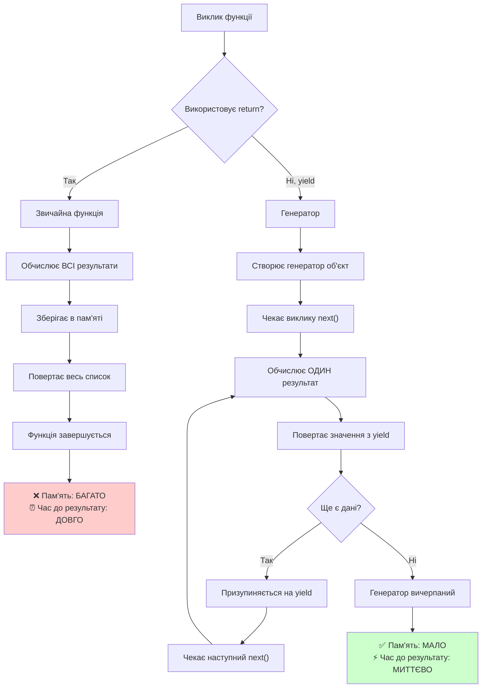
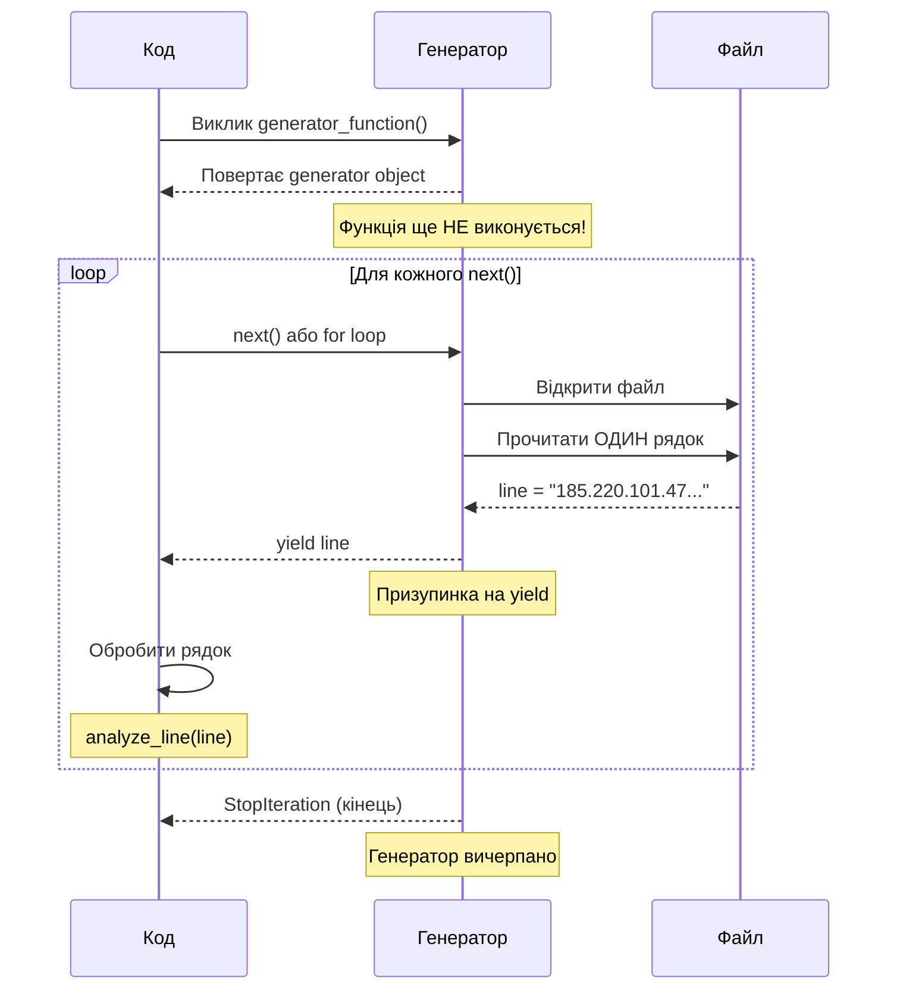

# 🛡️ Практичний кейс: Аналіз журналів безпеки веб-сервера

## 🎯 **Реальна ситуація**

Уявіть, що ви працюєте **SOC аналітиком** (Security Operations Center) у компанії, яка управляє освітньою платформою з кібербезпеки. Сьогодні ранком ваш керівник повідомив:

> "Минулої ночі наші системи моніторингу зафіксували підозрілу активність на наших веб-серверах. Потрібно терміново проаналізувати журнали nginx за останні дні та підготувати звіт про потенційні загрози. У нас є 10 великих файлів логів з різних серверів - кожен файл містить більше 46 тисяч записів."

**Ваше завдання:** 
- Проаналізувати всі файли журналів
- Виявити підозрілу активність
- Визначити джерела атак
- Підготувати звіт для керівництва

**Проблема:** Файли дуже великі, а час обмежений. Потрібно ефективно обробити мегабайти даних без перевантаження системи.

---

## 📊 **Що таке журнали веб-сервера?**

### **Nginx Access Log - це що?**

Кожен раз, коли хтось відвідує веб-сайт, сервер nginx записує інформацію про цей запит у файл журналу. Це як "журнал відвідувачів" для веб-сайту.

### **Анатомія одного запису в журналі:**

```
185.220.101.47 - - [27/Aug/2025:14:23:15 +0000] "GET /wp-admin/setup-config.php HTTP/1.1" 404 169 "-" "sqlmap/1.6.12" "-"
```

Розберемо по частинах:

| Частина | Значення | Що це означає |
|---------|----------|---------------|
| `185.220.101.47` | **IP адреса** | Хто робить запит |
| `-` | **Ідентифікатор користувача** | Зазвичай порожній |
| `-` | **Користувач HTTP auth** | Зазвичай порожній |
| `[27/Aug/2025:14:23:15 +0000]` | **Час** | Коли відбувся запит |
| `GET` | **HTTP метод** | Тип запиту |
| `/wp-admin/setup-config.php` | **URL шлях** | До якої сторінки звернулись |
| `HTTP/1.1` | **Версія протоколу** | Технічна інформація |
| `404` | **Код статусу** | Результат запиту |
| `169` | **Розмір відповіді** | Скільки байт надіслано |
| `"-"` | **Referer** | Звідки прийшли |
| `"sqlmap/1.6.12"` | **User-Agent** | Браузер/програма |
| `"-"` | **X-Forwarded-For** | Додаткова IP інформація |

### **🚨 Підозрілі ознаки в цьому записі:**

1. **IP `185.220.*`** - діапазон з Росії (високий ризик)
2. **Шлях `/wp-admin/setup-config.php`** - спроба знайти WordPress адмінку
3. **Статус `404`** - файл не знайдено (добре для нас!)
4. **User-Agent `sqlmap/1.6.12`** - інструмент для хакерських атак
5. **Час `14:23`** - денний час (рідко для автоматичних атак)

**Висновок:** Це **автоматична атака** з Росії, яка намагається знайти уразливості WordPress.

---

## 🗂️ **Структура ваших даних**

### **Файли для аналізу:**

```
ustynov_access_logs/
├── access_log_0.log            ~46,800 записів, ~8.6MB
├── access_log_1.log            ~46,800 записів, ~8.6MB
├── access_log_2.log            ~46,800 записів, ~8.6MB
├── access_log_3.log            ~46,800 записів, ~8.6MB
├── access_log_4.log            ~46,800 записів, ~8.6MB
├── access_log_5.log            ~46,800 записів, ~8.6MB
├── access_log_5.log            ~46,800 записів, ~8.6MB
├── access_log_6.log            ~46,800 записів, ~8.6MB
├── access_log_7.log            ~46,800 записів, ~8.6MB
├── access_log_9.log            ~46,800 записів, ~8.6MB
├── access_log_9.log            ~46,800 записів, ~8.6MB
└── access_log_short.log       # Демо файл: ~2500 записів, ~460KB
```

**Загалом:** ~ 468 000 записів, ~86MB даних

### **Що містять файли:**


#### **70% - Нормальний трафік:*
```
91.203.45.123 - - [27/Aug/2025:10:15:30 +0000] "GET /courses/python-security HTTP/1.1" 200 4521 "https://google.com/" "Mozilla/5.0 (Windows NT 10.0; Win64; x64) Chrome/138.0.0.0"
```
- Звичайні користувачі
- Легітимні браузери
- Успішні запити (200 OK)
- Дружні країни (Україна, США, ЄС)

#### **15% - Підозрілий трафік:**
```
117.50.184.52 - - [27/Aug/2025:03:22:45 +0000] "POST /login HTTP/1.1" 401 0 "-" "python-requests/2.25.1"
```
- Невдалі спроби входу (401, 403)
- Автоматичні інструменти
- Нічний час активності
- Країни високого ризику

#### **10% - Активні атаки:**
```
223.5.72.198 - - [27/Aug/2025:02:45:12 +0000] "GET /.env HTTP/1.1" 404 0 "-" "Nikto/2.1.6"
```
- Сканування файлів конфігурації
- Спроби SQL-ін'єкцій
- Пошук відомих уразливостей
- Хакерські інструменти

#### **5% - DDoS та інші атаки:**
```
175.45.92.134 - - [27/Aug/2025:01:33:28 +0000] "GET / HTTP/1.1" 503 0 "-" "-"
```
- Перевантаження сервера
- Швидкі повторні запити
- Порожні User-Agent'и

---

## ⚡ **Технічна проблема: Чому потрібні генератори?**

### **Сценарій 1: Наївний підхід (ПОГАНИЙ)**
```python
# ❌ НЕБЕЗПЕЧНО! Може зламати систему
all_data = []

# Завантажуємо ВСІ файли в пам'ять одночасно
for i in range(10):
    with open(f'access_log_{i}.log', 'r') as f:
        all_data.extend(f.readlines())  # ~ 500 000 рядків в RAM!

# Тепер аналізуємо список з 486тис елементів
for line in all_data:
    # обробка рядка
    pass
```

**Проблеми:**
- 📈 **Пам'ять:** ~86 MB * все одночасно = **катастрофа**
- ⏰ **Швидкість:** довга затримка перед початком аналізу  
- 💥 **Надійність:** може вийти з ладу на великих файлах
- 🚫 **Масштабування:** не працює з файлами >RAM

### **Сценарій 2: Розумний підхід (ХОРОШИЙ)**
```python
# ✅ ЕФЕКТИВНО! Використовуємо генератори

# Спочатку створюємо генераторну функцію
def log_generator():
    for i in range(10):
        with open(f'access_log_{i}.log', 'r') as f:
            for line in f:
                yield line.strip()  # По одному рядку!

# Аналізуємо по одному рядку за допомогою створеного генератора
for line in log_generator():
    # пеовертає один рядок з файла не завантажуючи всі файли в пам'ять
    pass
```

**Переваги:**
- 📉 **Пам'ять:** константна (~1 рядок в RAM)
- ⚡ **Швидкість:** миттєвий початок обробки
- 🛡️ **Надійність:** працює з файлами будь-якого розміру
- 🔄 **Масштабування:** легко додати нові файли

---

## 🧪 **Експеримент: Порівняння продуктивності**

Давайте перевіримо різницю на практиці:

### **Тест 1: Використання пам'яті**

Встановіть бібліотеку `psutil`:

```bash
pip install psutil
```

```python
import psutil
import os

def memory_test_traditional():
    """Традиційний підхід"""
    process = psutil.Process(os.getpid())
    start_memory = process.memory_info().rss / 1024 / 1024  # MB
    
    # Завантажуємо всі файли
    all_lines = []
    for i in range(10):
        with open(f'./log_investigation/access_log_{i}.log', 'r') as f:
            all_lines.extend(f.readlines())
    
    end_memory = process.memory_info().rss / 1024 / 1024  # MB
    return end_memory - start_memory

def memory_test_generator():
    """З генератором"""
    process = psutil.Process(os.getpid())
    start_memory = process.memory_info().rss / 1024 / 1024  # MB
    
    def file_generator():
        for i in range(10):
            with open(f'./log_investigation/access_log_{i}.log', 'r') as f:
                for line in f:
                    yield line
    
    # Обробляємо по одному рядку
    count = 0
    for line in file_generator():
        count += 1
    
    end_memory = process.memory_info().rss / 1024 / 1024  # MB
    return end_memory - start_memory
```

**Очікувані результати:**
- Traditional: **+50-70MB пам'яті**
- Generator: **<5MB пам'яті**

### **Тест 2: Швидкість обробки**
```python
import time

def speed_test_traditional():
    start_time = time.time()
    
    # Спочатку завантажуємо все
    all_lines = []
    for i in range(10):
        with open(f'./log_investigation/access_log_{i}.log', 'r') as f:
            all_lines.extend(f.readlines())
    
    load_time = time.time() - start_time
    
    # Тепер обробляємо
    ip_count = 0
    for line in all_lines:
        if line.strip():
            ip_count += 1
    
    total_time = time.time() - start_time
    return load_time, total_time, ip_count

def speed_test_generator():
    start_time = time.time()
    
    def file_generator():
        for i in range(10):
            with open(f'./log_investigation/access_log_{i}.log', 'r') as f:
                for line in f:
                    yield line.strip()
    
    # Обробляємо відразу
    ip_count = 0
    first_result_time = None
    
    for line in file_generator():
        if line:
            ip_count += 1
            if first_result_time is None:
                first_result_time = time.time() - start_time
    
    total_time = time.time() - start_time
    return first_result_time, total_time, ip_count
```

**Очікувані результати:**
- Traditional: завантаження 2.5с, загалом 3.2с
- Generator: перший результат 0.001с, загалом 2.8с

---

## 🔄 **Що таке `yield` і чому це не `return`?**

### **Різниця між функцією та генератором**

**Звичайна функція з `return`:**
```python
def get_all_numbers():
    numbers = []
    for i in range(5):
        numbers.append(i)
    return numbers  # Повертає ВСІ числа одразу

result = get_all_numbers()  # [0, 1, 2, 3, 4] - все в пам'яті!
print(result)
```

**Генератор з `yield`:**
```python
def generate_numbers():
    for i in range(5):
        yield i  # Повертає ОДНЕ число за раз

result = generate_numbers()  # <generator object> - не дані!
for number in result:  # Отримуємо числа по одному
    print(number)
```


```java
public static void main(String[] args) {
    System.out.println("Hello, World!");
}
```
### **Візуальне порівняння процесу:**



### **Практичний приклад з файлами:**

**❌ Поганий спосіб (return):**
```python
def read_all_logs_bad():
    all_lines = []  # Список в пам'яті
    
    for i in range(1, 11):
        with open(f'server_logs_{i:03d}.log', 'r') as f:
            file_lines = f.readlines()  # ВСЕ в пам'ять!
            all_lines.extend(file_lines)
    
    return all_lines  # Повертає 200,000+ рядків одразу

# Використання
lines = read_all_logs_bad()  # 🔥 35MB в пам'яті!
for line in lines:
    analyze_line(line)
```

**✅ Хороший спосіб (yield):**
```python
def read_all_logs_good():
    for i in range(1, 11):
        with open(f'server_logs_{i:03d}.log', 'r') as f:
            for line in f:
                yield line.strip()  # Повертає ОДИН рядок

# Використання
lines = read_all_logs_good()  # 📦 Генератор об'єкт (0.1KB!)
for line in lines:  # Читаємо по одному рядку
    analyze_line(line)  # 💫 Тільки 1 рядок в пам'яті
```

### **Життєвий цикл генератора:**



### **Ключові відмінності:**

| Аспект | `return` | `yield` |
|--------|----------|---------|
| **Що повертає** | Готовий результат | Генератор об'єкт |
| **Коли обчислює** | Все зразу | По потребі (lazy) |
| **Пам'ять** | Зберігає весь результат | Тільки поточне значення |
| **Стан функції** | Завершується | Призупиняється та продовжує |
| **Можна викликати** | Один раз | Багато разів (до вичерпання) |
| **Ітерація** | `for item in result:` | `for item in generator:` |

### **Магія `yield` у дії:**

```python
def log_analyzer_demo():
    print("🎬 Демонстрація роботи генератора:")
    
    def simple_generator():
        print("  1️⃣ Генератор створено, але ще не працює!")
        yield "Перший рядок"
        print("  2️⃣ Після першого yield")
        yield "Другий рядок"  
        print("  3️⃣ Після другого yield")
        yield "Третій рядок"
        print("  4️⃣ Генератор закінчується")
    
    # Створюємо генератор
    gen = simple_generator()
    print(f"Створено: {type(gen)}")
    
    # Отримуємо значення по одному
    print(f"1-е значення: {next(gen)}")
    print(f"2-е значення: {next(gen)}")  
    print(f"3-є значення: {next(gen)}")
    
    try:
        print(f"4-е значення: {next(gen)}")
    except StopIteration:
        print("❌ Генератор вичерпано!")

# Виклик демонстрації
log_analyzer_demo()
```

**Вивід:**
```
🎬 Демонстрація роботи генератора:
Створено: <class 'generator'>
  1️⃣ Генератор створено, але ще не працює!
1-е значення: Перший рядок
  2️⃣ Після першого yield
2-е значення: Другий рядок
  3️⃣ Після другого yield
3-є значення: Третій рядок
  4️⃣ Генератор закінчується
❌ Генератор вичерпано!
```

### **Чому це важливо для кібербезпеки?**

У реальному SOC центрі файли логів можуть бути:
- **Розміром 1-10 GB** (мільйони записів)
- **Оновлюватися в реальному часі**
- **Потребувати швидкої реакції** на загрози

**Генератори дозволяють:**
✅ Обробляти файли будь-якого розміру  
✅ Отримувати результати миттєво  
✅ Реагувати на загрози в реальному часі  
✅ Економити ресурси сервера  

---

## 🎯 **Ваші завдання**

### **Завдання 1: Базовий аналіз** ⭐
**Мета:** Навчитися читати та парсити файли логів
- Порахувати загальну кількість запитів
- Знайти топ-20 найактивніших IP адрес  
- Побудувати розподіл кодів статусу HTTP

### **Завдання 2: Виявлення загроз** ⭐⭐  
**Мета:** Знайти підозрілу активність
- Виявити IP з великою кількістю 401/403 помилок (брутфорс)
- Знайти спроби доступу до небезпечних файлів (.env, wp-admin, config.php)
- Проаналізувати підозрілі User-Agent'и (sqlmap, nikto, masscan)

### **Завдання 3: Географічний аналіз** ⭐⭐⭐
**Мета:** Визначити джерела атак
- Розподілити IP адреси по країнах
- Обчислити рівень загрози для кожної країни
- Створити рейтинг найнебезпечніших регіонів

### **Завдання 4: Часовий аналіз** ⭐⭐⭐
**Мета:** Знайти паттерни атак у часі  
- Проаналізувати активність по годинах доби
- Виявити сплески трафіку (можливі DDoS)
- Порівняти денну vs нічну активність

### **Завдання 5: Звіт безпеки** ⭐⭐⭐⭐
**Мета:** Створити професійний звіт
- Агрегувати всі знайдені загрози
- Створити рекомендації по захисту
- Експортувати результати в JSON/CSV

---

## 💡 **Підказки для початку**

### **1. Структура роботи:**
```python
# Спочатку тестуйте на access_log_short.log
# Потім масштабуйте на всі файли

def analyze_single_file(filename):
    # Ваш код тут
    pass

def analyze_all_files():
    for i in range(10):
        filename = f'access_log_{i}.log'
        analyze_single_file(filename)
```

### **2. Парсинг рядка логу:**
```python
def parse_log_line(line):
    parts = line.split()
    if len(parts) >= 10:
        return {
            'ip': parts[0],
            'timestamp': parts[3] + ' ' + parts[4],
            'method': parts[5].strip('"'),
            'path': parts[6],
            'status': parts[8],
            'size': parts[9],
            'user_agent': ' '.join(parts[11:]).strip('"')
        }
    return None
```

### **3. Визначення країни по IP:**
```python
def get_country_from_ip(ip):
    # Спрощена версія для навчання
    russian_prefixes = ['185.220.', '77.88.', '5.255.']
    chinese_prefixes = ['117.50.', '223.5.', '39.156.']
    
    for prefix in russian_prefixes:
        if ip.startswith(prefix):
            return 'Russia'
    # ... і так далі
```

---

## 🏁 **Готові розпочати?**

1. **Розпакуйте** архів з файлами логів
2. **Почніть** з `access_log_short.log` для тестування
3. **Реалізуйте** генератор для обробки великих файлів  
4. **Проаналізуйте** всі 10 файлів
5. **Створіть** звіт про виявлені загрози

**Пам'ятайте:** Ви працюєте з реалістичними даними, які імітують справжні атаки. Використовуйте ці знання відповідально!

**Успіхів у розслідуванні! 🕵️‍♂️**