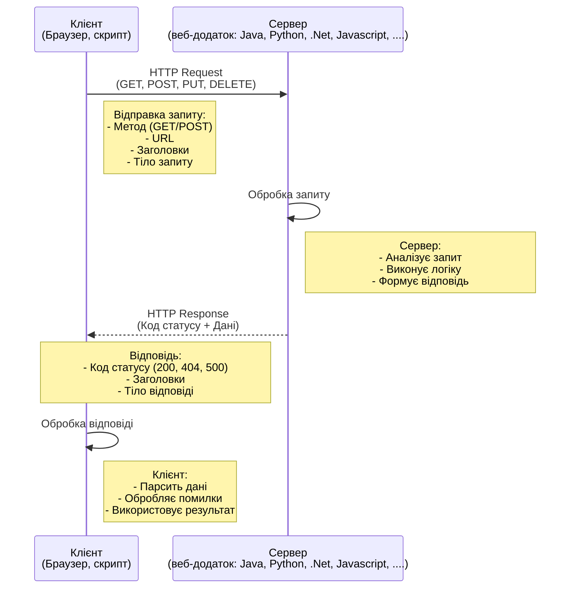

# Лекція 4-1: Основи роботи з веб-ресурсами

**Змістовий модуль 4. Мережеве програмування та збір даних**  
**Автор:** викладач кафедри Компютерних інформаційних технологій майор Дмитро Устинов  
**Тривалість:** 2 години

---

## Вступ

Сучасний світ кібербезпеки неможливо уявити без роботи з веб-ресурсами. Більшість систем взаємодіють через HTTP протокол, а вразливості веб-додатків залишаються одними з найпоширеніших. У цій лекції ми розглянемо, як Python допомагає автоматизувати роботу з веб-ресурсами та застосувати ці знання в практиці кібербезпеки.

### Чому це важливо для кібербезпеки?

1. **Reconnaissance (Розвідка)** - збір інформації про цілі
2. **Vulnerability Assessment** - автоматизована перевірка вразливостей
3. **Threat Intelligence** - збір даних про загрози з різних джерел
4. **Security Monitoring** - моніторинг систем та сервісів
5. **Incident Response** - автоматизація реагування на інциденти

---

## Частина 1: Протокол HTTP - основа веб-комунікації

### 1.1. Що таке HTTP?

**HTTP (HyperText Transfer Protocol)** - це протокол прикладного рівня для передачі даних у Всесвітній павутині.

#### Історична довідка про еволюцію HTTP

**HTTP/0.9 (1991)** - "Протокол одного рядка"
- Розроблено Тімом Бернерсом-Лі в CERN
- Підтримував лише метод GET
- Не було заголовків
- Тільки HTML документи
- Формат: `GET /index.html`
- Відповідь: тільки HTML без метаданих

**HTTP/1.0 (1996)** - Стандартизація
- RFC 1945
- Додано методи: HEAD, POST
- Введено заголовки (headers)
- Коди статусу (200, 404, 500)
- Підтримка різних типів контенту (MIME types)
- Проблема: нове TCP з'єднання для кожного запиту

**HTTP/1.1 (1999)** - Покращення продуктивності
- RFC 2616 (оновлено в RFC 7230-7235)
- **Persistent connections** - повторне використання з'єднань
- **Pipelining** - відправка кількох запитів без очікування
- Додано методи: PUT, DELETE, OPTIONS, TRACE, CONNECT
- Chunked transfer encoding
- Host header (обов'язковий) - підтримка віртуальних хостів
- Cache control механізми
- Досі найпопулярніша версія (до появи HTTP/2)

**HTTP/2 (2015)** - Революція продуктивності
- RFC 7540
- Базується на протоколі SPDY (Google)
- **Multiplexing** - паралельні запити в одному з'єднанні
- **Binary protocol** - бінарний формат замість текстового
- **Header compression** - стиснення заголовків (HPACK)
- **Server Push** - сервер може відправляти ресурси без запиту
- Пріоритизація запитів
- Проблема: Head-of-line blocking на рівні TCP

**HTTP/3 (2022)** - Нова транспортна основа
- RFC 9114
- Використовує **QUIC** замість TCP
- QUIC працює поверх UDP
- Вбудоване шифрування (TLS 1.3)
- Усунуто head-of-line blocking
- Швидше встановлення з'єднання (0-RTT)
- Краща робота в мобільних мережах
- Підтримка: Chrome, Firefox, Safari

#### Порівняльна таблиця версій HTTP

| Версія | Рік | Транспорт | Ключова фіча | Використання |
|--------|-----|-----------|--------------|--------------|
| HTTP/0.9 | 1991 | TCP | Тільки GET | Історія |
| HTTP/1.0 | 1996 | TCP | Заголовки, методи | Рідко |
| HTTP/1.1 | 1999 | TCP | Persistent connections | ~40% |
| HTTP/2 | 2015 | TCP | Multiplexing | ~50% |
| HTTP/3 | 2022 | QUIC/UDP | 0-RTT, No blocking | ~10% (зростає) |

#### Значення для кібербезпеки

Розуміння версій HTTP важливе для:
- **Fingerprinting** - визначення типу та версії веб-сервера
- **Vulnerability scanning** - різні версії мають різні вразливості
- **Traffic analysis** - аналіз мережевого трафіку
- **Protocol downgrade attacks** - атаки на понижування протоколу
- **HTTP/2 specific attacks** - HPACK bombing, stream multiplexing abuse
- **QUIC security** - нові можливості для обходу фаєрволів

#### Модель клієнт-сервер

```
Клієнт (Python скрипт)  ----[HTTP Request]---->  Сервер (веб-додаток)
                        <----[HTTP Response]----
```




**Приклад запиту:**
```http
GET /api/users HTTP/1.1
Host: example.com
User-Agent: Python-requests/2.28.0
Accept: application/json
```

**Приклад відповіді:**
```http
HTTP/1.1 200 OK
Content-Type: application/json
Content-Length: 85

{"users": [{"id": 1, "name": "John"}, {"id": 2, "name": "Jane"}]}
```

### 1.2. Структура URL

URL (Uniform Resource Locator) складається з кількох частин:

```
https://api.example.com:443/v1/users?role=admin&active=true#section1
└─┬─┘   └────┬────────┘└┬┘ └───┬───┘└──────────┬──────────┘└───┬──┘
схема     домен      порт   шлях         параметри          якір
```

**Компоненти:**
- **Схема** (scheme): `http`, `https`, `ftp`
- **Домен** (domain): `api.example.com`
- **Порт** (port): `80` (HTTP), `443` (HTTPS)
- **Шлях** (path): `/v1/users`
- **Параметри** (query): `?role=admin&active=true`
- **Якір** (fragment): `#section1`

#### Приклад парсингу URL в Python:

```python
from urllib.parse import urlparse, parse_qs

url = "https://api.example.com:443/v1/users?role=admin&active=true#section1"
parsed = urlparse(url)

print(f"Схема: {parsed.scheme}")        # https
print(f"Домен: {parsed.netloc}")        # api.example.com:443
print(f"Порт: {parsed.port}")           # 443
print(f"Шлях: {parsed.path}")           # /v1/users
print(f"Параметри: {parsed.query}")     # role=admin&active=true
print(f"Якір: {parsed.fragment}")       # section1

# Парсинг параметрів
params = parse_qs(parsed.query)
print(f"Role: {params['role'][0]}")     # admin
print(f"Active: {params['active'][0]}") # true
```

### 1.3. HTTP методи

HTTP визначає набір методів, які вказують на бажану дію над ресурсом:

| Метод | Призначення | Ідемпотентний? | Безпечний? |
|-------|-------------|----------------|------------|
| **GET** | Отримання даних | Так | Так |
| **POST** | Створення ресурсу | Ні | Ні |
| **PUT** | Повна заміна ресурсу | Так | Ні |
| **PATCH** | Часткове оновлення | Ні | Ні |
| **DELETE** | Видалення ресурсу | Так | Ні |
| **HEAD** | Отримання заголовків | Так | Так |
| **OPTIONS** | Опції комунікації | Так | Так |

**Визначення:**
- **Ідемпотентний** - повторний виклик не змінює результат
- **Безпечний** - не змінює стан сервера

#### Практичний приклад для кібербезпеки:

```python
import requests

# GET - безпечний, для отримання інформації
response = requests.get('https://api.shodan.io/shodan/host/8.8.8.8')

# HEAD - отримати тільки заголовки (економія трафіку)
response = requests.head('https://example.com')
print(f"Сервер: {response.headers.get('Server')}")
print(f"Розмір: {response.headers.get('Content-Length')}")

# OPTIONS - дізнатися про можливості API
response = requests.options('https://api.example.com/v1/users')
print(f"Дозволені методи: {response.headers.get('Allow')}")
```

### 1.4. HTTP заголовки (Headers)

Заголовки передають метадані про запит або відповідь.

#### Основні заголовки запиту:

```python
headers = {
    'User-Agent': 'Mozilla/5.0 (Security Scanner v1.0)',
    'Accept': 'application/json',
    'Accept-Language': 'uk-UA,uk;q=0.9',
    'Authorization': 'Bearer YOUR_TOKEN_HERE',
    'Content-Type': 'application/json',
    'Referer': 'https://example.com/login',
    'Cookie': 'session_id=abc123; user_pref=dark_mode'
}

response = requests.get('https://api.example.com', headers=headers)
```

#### Заголовки безпеки:

```python
# Перевірка security headers
security_headers = {
    'Strict-Transport-Security': 'Захист від SSL stripping',
    'X-Frame-Options': 'Захист від clickjacking',
    'X-Content-Type-Options': 'Захист від MIME-sniffing',
    'Content-Security-Policy': 'Захист від XSS',
    'X-XSS-Protection': 'Додатковий захист від XSS',
    'Referrer-Policy': 'Контроль передачі referrer'
}

response = requests.get('https://example.com')

print("=== Аналіз Security Headers ===")
for header, description in security_headers.items():
    value = response.headers.get(header, '❌ Відсутній')
    status = '✅' if value != '❌ Відсутній' else '⚠️'
    print(f"{status} {header}")
    print(f"   Значення: {value}")
    print(f"   Призначення: {description}\n")
```

### 1.5. Коди статусу HTTP

Коди статусу вказують на результат обробки запиту:

#### 1xx - Інформаційні
- **100 Continue** - сервер готовий прийняти дані

#### 2xx - Успіх
- **200 OK** - запит успішно оброблено
- **201 Created** - ресурс створено
- **204 No Content** - успіх, але немає тіла відповіді

#### 3xx - Перенаправлення
- **301 Moved Permanently** - постійне перенаправлення
- **302 Found** - тимчасове перенаправлення
- **304 Not Modified** - ресурс не змінювався

#### 4xx - Помилки клієнта
- **400 Bad Request** - невірний синтаксис запиту
- **401 Unauthorized** - потрібна автентифікація
- **403 Forbidden** - доступ заборонено
- **404 Not Found** - ресурс не знайдено
- **429 Too Many Requests** - перевищено ліміт запитів

#### 5xx - Помилки сервера
- **500 Internal Server Error** - внутрішня помилка сервера
- **502 Bad Gateway** - помилка проксі-сервера
- **503 Service Unavailable** - сервіс тимчасово недоступний

#### Приклад обробки статусів:

```python
import requests

def check_url_security(url):
    """
    Перевірка доступності та безпеки URL
    """
    try:
        response = requests.get(url, timeout=5, allow_redirects=False)
        
        if response.status_code == 200:
            print(f"✅ {url} - доступний")
            
            # Перевірка HTTPS
            if url.startswith('https://'):
                print("✅ Використовується HTTPS")
            else:
                print("⚠️ Небезпечно: HTTP без шифрування!")
                
            # Перевірка редиректу на HTTPS
        elif response.status_code in [301, 302]:
            location = response.headers.get('Location', '')
            print(f"↪️ Редирект на: {location}")
            if location.startswith('https://'):
                print("✅ Редирект на безпечний HTTPS")
                
        elif response.status_code == 401:
            print("🔒 Потрібна автентифікація")
            print(f"WWW-Authenticate: {response.headers.get('WWW-Authenticate')}")
            
        elif response.status_code == 403:
            print("⛔ Доступ заборонено")
            
        elif response.status_code == 404:
            print("❌ Сторінка не знайдена")
            
        elif response.status_code >= 500:
            print(f"💥 Помилка сервера: {response.status_code}")
            
    except requests.exceptions.SSLError:
        print("❌ SSL сертифікат недійсний!")
    except requests.exceptions.Timeout:
        print("⏱️ Тайм-аут з'єднання")
    except requests.exceptions.ConnectionError:
        print("❌ Неможливо встановити з'єднання")

# Тестування
check_url_security('https://google.com')
check_url_security('http://example.com')
check_url_security('https://expired.badssl.com/')
```


---

## Частина 2: Бібліотека requests - потужний інструмент для HTTP

### 2.1. Чому requests?

Python має вбудовану бібліотеку `urllib`, але `requests` набагато зручніша:

```python
# urllib - складніше
import urllib.request
import json

req = urllib.request.Request('https://api.github.com/users/python')
req.add_header('User-Agent', 'Python Script')
response = urllib.request.urlopen(req)
data = json.loads(response.read().decode())

# requests - простіше і читабельніше
import requests

response = requests.get('https://api.github.com/users/python')
data = response.json()
```

### 2.2. Встановлення

```bash
pip install requests
```

### 2.3. Базові операції

#### GET запит

```python
import requests

# Простий GET запит
response = requests.get('https://httpbin.org/get')

# GET з параметрами
params = {
    'search': 'python security',
    'limit': 10,
    'offset': 0
}
response = requests.get('https://api.example.com/search', params=params)

# URL буде: https://api.example.com/search?search=python+security&limit=10&offset=0

print(response.url)  # Побудований URL
print(response.status_code)  # Код статусу
print(response.text)  # Текст відповіді
```

#### POST запит

```python
import requests

# POST з form data
data = {
    'username': 'admin',
    'password': 'P@ssw0rd123'
}
response = requests.post('https://example.com/api/login', data=data)

# POST з JSON
json_data = {
    'alert_type': 'intrusion_detected',
    'severity': 'high',
    'source_ip': '192.168.1.100',
    'timestamp': '2025-10-26T10:30:00Z'
}
response = requests.post(
    'https://siem.example.com/api/alerts',
    json=json_data
)

# POST з файлом
files = {
    'malware_sample': open('suspicious.exe', 'rb')
}
response = requests.post('https://virustotal.com/api/scan', files=files)
```

#### Інші методи

```python
# PUT - повна заміна ресурсу
requests.put('https://api.example.com/users/123', json=user_data)

# PATCH - часткове оновлення
requests.patch('https://api.example.com/users/123', json={'status': 'active'})

# DELETE - видалення ресурсу
requests.delete('https://api.example.com/users/123')

# HEAD - тільки заголовки
response = requests.head('https://example.com')
```

### 2.4. Робота з заголовками

```python
import requests

# Встановлення заголовків запиту
headers = {
    'User-Agent': 'SecurityScanner/1.0',
    'Accept': 'application/json',
    'Authorization': 'Bearer YOUR_API_TOKEN'
}

response = requests.get('https://api.example.com/data', headers=headers)

# Читання заголовків відповіді
print("=== Заголовки відповіді ===")
for header, value in response.headers.items():
    print(f"{header}: {value}")

# Доступ до конкретного заголовка
server = response.headers.get('Server', 'Невідомо')
print(f"\nВеб-сервер: {server}")

# Перевірка типу контенту
content_type = response.headers.get('Content-Type')
if 'application/json' in content_type:
    data = response.json()
elif 'text/html' in content_type:
    html = response.text
```

### 2.5. Робота з cookies

```python
import requests

# Відправка cookies
cookies = {
    'session_id': 'abc123def456',
    'user_token': 'xyz789'
}
response = requests.get('https://example.com/dashboard', cookies=cookies)

# Отримання cookies з відповіді
response = requests.get('https://example.com/login')
print(response.cookies)  # RequestsCookieJar

# Використання сесій (зберігає cookies автоматично)
session = requests.Session()
session.post('https://example.com/login', data={'user': 'admin', 'pass': '123'})
# Cookies збережені в сесії
response = session.get('https://example.com/dashboard')
```

### 2.6. Таймаути та обробка помилок

```python
import requests
from requests.exceptions import (
    Timeout, 
    ConnectionError, 
    HTTPError,
    RequestException
)

def safe_request(url, timeout=5, max_retries=3):
    """
    Безпечне виконання HTTP запиту з повторними спробами
    """
    for attempt in range(max_retries):
        try:
            response = requests.get(url, timeout=timeout)
            response.raise_for_status()  # Викинути виключення для 4xx/5xx
            return response
            
        except Timeout:
            print(f"⏱️ Спроба {attempt + 1}: Тайм-аут")
            if attempt == max_retries - 1:
                raise
                
        except ConnectionError:
            print(f"❌ Спроба {attempt + 1}: Помилка з'єднання")
            if attempt == max_retries - 1:
                raise
                
        except HTTPError as e:
            print(f"❌ HTTP помилка: {e.response.status_code}")
            raise
            
        except RequestException as e:
            print(f"❌ Загальна помилка: {e}")
            raise

# Використання
try:
    response = safe_request('https://api.example.com/data', timeout=10)
    print(f"✅ Успіх: {response.status_code}")
except Exception as e:
    print(f"💥 Не вдалося виконати запит: {e}")
```

### 2.7. SSL/TLS та сертифікати

```python
import requests
import warnings
from requests.packages.urllib3.exceptions import InsecureRequestWarning

# За замовчуванням requests перевіряє SSL
response = requests.get('https://example.com')  # ✅ Безпечно

# Вимкнення перевірки SSL (НЕБЕЗПЕЧНО! Тільки для тестування)
warnings.simplefilter('ignore', InsecureRequestWarning)
response = requests.get('https://self-signed.badssl.com/', verify=False)

# Використання власного CA сертифіката
response = requests.get(
    'https://example.com',
    verify='/path/to/ca-bundle.crt'
)

# Використання клієнтського сертифіката
response = requests.get(
    'https://example.com',
    cert=('/path/to/client.cert', '/path/to/client.key')
)
```

### 2.8. Аутентифікація

#### Basic Authentication

```python
import requests
from requests.auth import HTTPBasicAuth

# Спосіб 1: Через параметр auth
response = requests.get(
    'https://api.example.com/data',
    auth=HTTPBasicAuth('username', 'password')
)

# Спосіб 2: Коротша форма
response = requests.get(
    'https://api.example.com/data',
    auth=('username', 'password')
)
```

#### Bearer Token (OAuth 2.0)

```python
import requests

# API токен
token = 'your_api_token_here'

headers = {
    'Authorization': f'Bearer {token}'
}

response = requests.get('https://api.example.com/data', headers=headers)
```

#### API Key

```python
import requests

# API ключ у заголовках
headers = {
    'X-API-Key': 'your_api_key_here'
}
response = requests.get('https://api.example.com/data', headers=headers)

# API ключ у параметрах
params = {
    'api_key': 'your_api_key_here'
}
response = requests.get('https://api.example.com/data', params=params)
```

### 2.9. Практичний приклад: Security Headers Scanner

```python
import requests
from datetime import datetime
from typing import Dict, List

class SecurityHeadersScanner:
    """
    Сканер заголовків безпеки веб-додатків
    """
    
    SECURITY_HEADERS = {
        'Strict-Transport-Security': {
            'severity': 'high',
            'description': 'HSTS - примусове використання HTTPS'
        },
        'Content-Security-Policy': {
            'severity': 'high',
            'description': 'CSP - захист від XSS атак'
        },
        'X-Frame-Options': {
            'severity': 'medium',
            'description': 'Захист від clickjacking'
        },
        'X-Content-Type-Options': {
            'severity': 'medium',
            'description': 'Захист від MIME-sniffing'
        },
        'Referrer-Policy': {
            'severity': 'low',
            'description': 'Контроль передачі Referer'
        },
        'Permissions-Policy': {
            'severity': 'low',
            'description': 'Контроль можливостей браузера'
        }
    }
    
    def __init__(self, timeout: int = 10):
        self.timeout = timeout
        
    def scan(self, url: str) -> Dict:
        """
        Сканування URL на наявність заголовків безпеки
        """
        result = {
            'url': url,
            'timestamp': datetime.now().isoformat(),
            'status': 'unknown',
            'server': 'unknown',
            'headers_found': [],
            'headers_missing': [],
            'score': 0,
            'max_score': 100
        }
        
        try:
            response = requests.get(
                url,
                timeout=self.timeout,
                allow_redirects=True
            )
            
            result['status'] = response.status_code
            result['server'] = response.headers.get('Server', 'unknown')
            
            # Перевірка кожного заголовка
            for header, info in self.SECURITY_HEADERS.items():
                if header in response.headers:
                    result['headers_found'].append({
                        'header': header,
                        'value': response.headers[header],
                        'severity': info['severity'],
                        'description': info['description']
                    })
                else:
                    result['headers_missing'].append({
                        'header': header,
                        'severity': info['severity'],
                        'description': info['description']
                    })
            
            # Розрахунок балу
            total_headers = len(self.SECURITY_HEADERS)
            found_headers = len(result['headers_found'])
            result['score'] = int((found_headers / total_headers) * 100)
            
        except requests.exceptions.RequestException as e:
            result['error'] = str(e)
        
        return result
    
    def print_report(self, result: Dict):
        """
        Вивід звіту про сканування
        """
        print("\n" + "="*70)
        print(f"🔍 Security Headers Scan Report")
        print("="*70)
        print(f"URL: {result['url']}")
        print(f"Timestamp: {result['timestamp']}")
        print(f"Status Code: {result['status']}")
        print(f"Server: {result['server']}")
        print(f"Security Score: {result['score']}/{result['max_score']}")
        
        if result['score'] >= 80:
            grade = "A (Excellent)"
        elif result['score'] >= 60:
            grade = "B (Good)"
        elif result['score'] >= 40:
            grade = "C (Fair)"
        else:
            grade = "F (Poor)"
        
        print(f"Grade: {grade}")
        print()
        
        # Знайдені заголовки
        if result['headers_found']:
            print("✅ Headers Found:")
            for header in result['headers_found']:
                severity_icon = {
                    'high': '🔴',
                    'medium': '🟡',
                    'low': '🟢'
                }.get(header['severity'], '⚪')
                
                print(f"  {severity_icon} {header['header']}")
                print(f"     Value: {header['value'][:60]}...")
                print(f"     Info: {header['description']}")
        
        # Відсутні заголовки
        if result['headers_missing']:
            print("\n⚠️  Headers Missing:")
            for header in result['headers_missing']:
                severity_icon = {
                    'high': '🔴',
                    'medium': '🟡',
                    'low': '🟢'
                }.get(header['severity'], '⚪')
                
                print(f"  {severity_icon} {header['header']} ({header['severity'].upper()})")
                print(f"     Info: {header['description']}")
        
        print("="*70)

# Використання
scanner = SecurityHeadersScanner()

# Сканування одного сайту
result = scanner.scan('https://google.com')
scanner.print_report(result)

# Сканування кількох сайтів
urls = [
    'https://google.com',
    'https://github.com',
    'https://example.com'
]

for url in urls:
    result = scanner.scan(url)
    scanner.print_report(result)
```


---

## Частина 3: Формати даних - JSON та XML

### 3.1. JSON (JavaScript Object Notation)

JSON - найпопулярніший формат обміну даними в сучасних веб-API.

#### Базовий синтаксис JSON

```json
{
  "vulnerability": {
    "id": "CVE-2025-1234",
    "severity": "critical",
    "cvss_score": 9.8,
    "affected_systems": ["Windows 10", "Windows 11"],
    "published": "2025-10-26T10:30:00Z",
    "description": "Remote code execution vulnerability",
    "is_exploited": true,
    "references": [
      "https://nvd.nist.gov/vuln/detail/CVE-2025-1234"
    ],
    "mitigation": null
  }
}
```

#### Робота з JSON в Python

```python
import json
import requests

# 1. Парсинг JSON з рядка
json_string = '''
{
  "alert": {
    "type": "malware_detected",
    "severity": "high",
    "details": {
      "file": "suspicious.exe",
      "hash": "a1b2c3d4e5f6",
      "detection_time": "2025-10-26T12:00:00Z"
    }
  }
}
'''

data = json.loads(json_string)
print(f"Тип алерту: {data['alert']['type']}")
print(f"Файл: {data['alert']['details']['file']}")

# 2. Конвертація Python об'єкта в JSON
security_incident = {
    'id': 'INC-2025-001',
    'type': 'data_breach',
    'severity': 'critical',
    'affected_records': 10000,
    'detected_at': '2025-10-26T09:15:00Z',
    'attacker_ip': ['192.168.1.100', '10.0.0.50'],
    'is_contained': False
}

# Конвертація в JSON рядок
json_output = json.dumps(security_incident, indent=2, ensure_ascii=False)
print(json_output)

# Збереження в файл
with open('incident.json', 'w', encoding='utf-8') as f:
    json.dump(security_incident, f, indent=2, ensure_ascii=False)

# Читання з файлу
with open('incident.json', 'r', encoding='utf-8') as f:
    loaded_data = json.load(f)

# 3. Робота з JSON API
response = requests.get('https://api.github.com/users/python')
if response.status_code == 200:
    user_data = response.json()  # Автоматичний парсинг
    print(f"Name: {user_data['name']}")
    print(f"Repos: {user_data['public_repos']}")
```

#### Робота з вкладеними структурами

```python
import json

# Складна вкладена структура
cve_data = {
    "CVE-2025-1234": {
        "description": "Critical vulnerability in web server",
        "cvss": {
            "version": "3.1",
            "base_score": 9.8,
            "vector": "CVSS:3.1/AV:N/AC:L/PR:N/UI:N/S:U/C:H/I:H/A:H"
        },
        "affected_products": [
            {
                "vendor": "Example Corp",
                "product": "WebServer Pro",
                "versions": ["1.0", "1.1", "1.2"]
            }
        ],
        "references": [
            {
                "type": "advisory",
                "url": "https://example.com/advisory/2025-001"
            }
        ]
    }
}

# Безпечний доступ до вкладених даних
def safe_get(data, *keys, default=None):
    """
    Безпечне отримання вкладених значень
    """
    for key in keys:
        try:
            data = data[key]
        except (KeyError, TypeError, IndexError):
            return default
    return data

# Використання
cvss_score = safe_get(cve_data, "CVE-2025-1234", "cvss", "base_score", default=0)
print(f"CVSS Score: {cvss_score}")

first_version = safe_get(
    cve_data, 
    "CVE-2025-1234", 
    "affected_products", 
    0, 
    "versions", 
    0,
    default="Unknown"
)
print(f"Перша вразлива версія: {first_version}")
```

### 3.2. XML (eXtensible Markup Language)

XML широко використовується в корпоративних системах та для конфігураційних файлів.

#### Приклад XML документа

```xml
<?xml version="1.0" encoding="UTF-8"?>
<security_scan>
    <scan_info>
        <id>SCAN-2025-001</id>
        <timestamp>2025-10-26T10:00:00Z</timestamp>
        <scanner>Nmap 7.94</scanner>
    </scan_info>
    <target>
        <ip>192.168.1.100</ip>
        <hostname>server.example.com</hostname>
    </target>
    <open_ports>
        <port number="22" protocol="tcp">
            <service>ssh</service>
            <version>OpenSSH 8.2</version>
            <state>open</state>
        </port>
        <port number="80" protocol="tcp">
            <service>http</service>
            <version>Apache 2.4.41</version>
            <state>open</state>
        </port>
        <port number="443" protocol="tcp">
            <service>https</service>
            <version>Apache 2.4.41</version>
            <state>open</state>
        </port>
    </open_ports>
    <vulnerabilities>
        <vulnerability severity="high">
            <cve>CVE-2021-41773</cve>
            <description>Path traversal vulnerability</description>
            <affected_service>Apache</affected_service>
        </vulnerability>
    </vulnerabilities>
</security_scan>
```

#### Парсинг XML в Python

```python
import xml.etree.ElementTree as ET

# Парсинг з рядка
xml_data = '''<?xml version="1.0"?>
<scan>
    <target ip="192.168.1.100">
        <port number="22">ssh</port>
        <port number="80">http</port>
    </target>
</scan>'''

root = ET.fromstring(xml_data)

# Доступ до елементів
target = root.find('target')
print(f"IP: {target.get('ip')}")

# Пошук всіх портів
for port in root.findall('.//port'):
    number = port.get('number')
    service = port.text
    print(f"Port {number}: {service}")

# Парсинг з файлу
tree = ET.parse('scan_results.xml')
root = tree.getroot()

# XPath вирази
# Знайти всі порти з номером більше 80
for port in root.findall(".//port[@number>'80']"):
    print(port.get('number'))
```

#### Створення XML документів

```python
import xml.etree.ElementTree as ET
from xml.dom import minidom

def create_vulnerability_report(vulnerabilities):
    """
    Створення XML звіту про вразливості
    """
    # Кореневий елемент
    root = ET.Element('vulnerability_report')
    root.set('version', '1.0')
    root.set('generated', '2025-10-26T10:00:00Z')
    
    # Додавання вразливостей
    vulns_elem = ET.SubElement(root, 'vulnerabilities')
    vulns_elem.set('count', str(len(vulnerabilities)))
    
    for vuln in vulnerabilities:
        vuln_elem = ET.SubElement(vulns_elem, 'vulnerability')
        vuln_elem.set('severity', vuln['severity'])
        
        cve_elem = ET.SubElement(vuln_elem, 'cve')
        cve_elem.text = vuln['cve']
        
        desc_elem = ET.SubElement(vuln_elem, 'description')
        desc_elem.text = vuln['description']
        
        if 'cvss' in vuln:
            cvss_elem = ET.SubElement(vuln_elem, 'cvss_score')
            cvss_elem.text = str(vuln['cvss'])
    
    # Форматування для читабельності
    xml_string = ET.tostring(root, encoding='unicode')
    dom = minidom.parseString(xml_string)
    pretty_xml = dom.toprettyxml(indent='  ')
    
    return pretty_xml

# Використання
vulnerabilities = [
    {
        'cve': 'CVE-2025-1234',
        'severity': 'critical',
        'description': 'Remote code execution',
        'cvss': 9.8
    },
    {
        'cve': 'CVE-2025-5678',
        'severity': 'high',
        'description': 'SQL injection',
        'cvss': 8.5
    }
]

xml_report = create_vulnerability_report(vulnerabilities)
print(xml_report)

# Збереження в файл
with open('vulnerability_report.xml', 'w', encoding='utf-8') as f:
    f.write(xml_report)
```

### 3.3. JSON vs XML - порівняння

| Характеристика | JSON | XML |
|---------------|------|-----|
| **Читабельність** | Висока | Середня |
| **Розмір** | Компактний | Більший |
| **Парсинг** | Швидкий | Повільніший |
| **Типи даних** | Обмежені | Розширені |
| **Коментарі** | Ні | Так |
| **Схема валідації** | JSON Schema | XSD, DTD |
| **Використання** | API, конфіги | Документи, legacy |

#### Конвертація між форматами

```python
import json
import xml.etree.ElementTree as ET
import xmltodict  # pip install xmltodict

# JSON -> XML
def json_to_xml(json_data, root_name='root'):
    """
    Конвертація JSON в XML
    """
    def build_xml(data, parent):
        if isinstance(data, dict):
            for key, value in data.items():
                child = ET.SubElement(parent, key)
                build_xml(value, child)
        elif isinstance(data, list):
            for item in data:
                child = ET.SubElement(parent, 'item')
                build_xml(item, child)
        else:
            parent.text = str(data)
    
    root = ET.Element(root_name)
    build_xml(json_data, root)
    return ET.tostring(root, encoding='unicode')

# XML -> JSON (з xmltodict)
xml_string = '''
<vulnerability>
    <cve>CVE-2025-1234</cve>
    <severity>critical</severity>
    <cvss>9.8</cvss>
</vulnerability>
'''

json_data = xmltodict.parse(xml_string)
print(json.dumps(json_data, indent=2))
```

### 3.4. Практичний приклад: CVE Parser

```python
import requests
import json
from typing import List, Dict

class CVEParser:
    """
    Парсер даних про вразливості з NVD (National Vulnerability Database)
    """
    
    def __init__(self, api_key: str = None):
        self.base_url = 'https://services.nvd.nist.gov/rest/json/cves/2.0'
        self.api_key = api_key
        self.headers = {}
        
        if api_key:
            self.headers['apiKey'] = api_key
    
    def search_cve(self, keyword: str, results_per_page: int = 10) -> List[Dict]:
        """
        Пошук CVE за ключовим словом
        """
        params = {
            'keywordSearch': keyword,
            'resultsPerPage': results_per_page
        }
        
        try:
            response = requests.get(
                self.base_url,
                params=params,
                headers=self.headers,
                timeout=10
            )
            
            if response.status_code == 200:
                data = response.json()
                return self.parse_vulnerabilities(data)
            else:
                print(f"Error: {response.status_code}")
                return []
                
        except Exception as e:
            print(f"Exception: {e}")
            return []
    
    def parse_vulnerabilities(self, data: Dict) -> List[Dict]:
        """
        Парсинг даних про вразливості
        """
        vulnerabilities = []
        
        if 'vulnerabilities' not in data:
            return vulnerabilities
        
        for item in data['vulnerabilities']:
            cve = item.get('cve', {})
            cve_id = cve.get('id', 'Unknown')
            
            # Опис
            descriptions = cve.get('descriptions', [])
            description = next(
                (d['value'] for d in descriptions if d.get('lang') == 'en'),
                'No description'
            )
            
            # CVSS score
            metrics = cve.get('metrics', {})
            cvss_score = 0.0
            
            if 'cvssMetricV31' in metrics:
                cvss_data = metrics['cvssMetricV31'][0]['cvssData']
                cvss_score = cvss_data.get('baseScore', 0.0)
            
            # Дата публікації
            published = cve.get('published', 'Unknown')
            
            vulnerabilities.append({
                'cve_id': cve_id,
                'description': description[:200] + '...' if len(description) > 200 else description,
                'cvss_score': cvss_score,
                'severity': self.get_severity(cvss_score),
                'published': published
            })
        
        return vulnerabilities
    
    @staticmethod
    def get_severity(cvss_score: float) -> str:
        """
        Визначення severity за CVSS score
        """
        if cvss_score >= 9.0:
            return 'CRITICAL'
        elif cvss_score >= 7.0:
            return 'HIGH'
        elif cvss_score >= 4.0:
            return 'MEDIUM'
        elif cvss_score > 0:
            return 'LOW'
        else:
            return 'NONE'
    
    def print_report(self, vulnerabilities: List[Dict]):
        """
        Вивід звіту про вразливості
        """
        if not vulnerabilities:
            print("Вразливості не знайдено")
            return
        
        print("\n" + "="*80)
        print(f"Знайдено вразливостей: {len(vulnerabilities)}")
        print("="*80)
        
        for vuln in vulnerabilities:
            severity_icon = {
                'CRITICAL': '🔴',
                'HIGH': '🟠',
                'MEDIUM': '🟡',
                'LOW': '🟢',
                'NONE': '⚪'
            }.get(vuln['severity'], '⚪')
            
            print(f"\n{severity_icon} {vuln['cve_id']} - {vuln['severity']}")
            print(f"   CVSS: {vuln['cvss_score']}")
            print(f"   Published: {vuln['published']}")
            print(f"   Description: {vuln['description']}")
        
        print("\n" + "="*80)

# Використання
parser = CVEParser()

# Пошук вразливостей Apache
print("Пошук вразливостей Apache...")
vulnerabilities = parser.search_cve('apache', results_per_page=5)
parser.print_report(vulnerabilities)

# Експорт в JSON
with open('cve_report.json', 'w', encoding='utf-8') as f:
    json.dump(vulnerabilities, f, indent=2, ensure_ascii=False)

print("\n✅ Звіт збережено у cve_report.json")
```


---

## Частина 4: REST API - архітектура сучасних веб-сервісів

### 4.1. Що таке REST?

**REST (REpresentational State Transfer)** - архітектурний стиль для розподілених гіпермедійних систем.

#### Принципи REST

1. **Client-Server** - розділення інтерфейсу користувача та зберігання даних
2. **Stateless** - кожен запит містить всю необхідну інформацію
3. **Cacheable** - відповіді можуть кешуватися
4. **Uniform Interface** - уніфікований інтерфейс між компонентами
5. **Layered System** - ієрархічна структура
6. **Code on Demand** (опціонально) - можливість завантаження коду

### 4.2. Ресурси та ендпоінти

В REST все є ресурсом, який має унікальний URI:

```
# Колекції (множини)
GET    /api/users           # Отримати всіх користувачів
POST   /api/users           # Створити користувача

# Конкретні ресурси (одиничні)
GET    /api/users/123       # Отримати користувача #123
PUT    /api/users/123       # Оновити користувача #123
PATCH  /api/users/123       # Частково оновити
DELETE /api/users/123       # Видалити користувача #123

# Вкладені ресурси
GET    /api/users/123/posts # Пости користувача #123
GET    /api/posts?userId=123 # Альтернативний варіант
```

#### Приклади для кібербезпеки

```
# Security Incidents API
GET    /api/incidents                    # Список інцидентів
POST   /api/incidents                    # Створити інцидент
GET    /api/incidents/INC-2025-001       # Деталі інциденту
PATCH  /api/incidents/INC-2025-001       # Оновити статус
GET    /api/incidents/INC-2025-001/logs  # Логи інциденту

# Vulnerability Management API
GET    /api/vulnerabilities              # Список вразливостей
GET    /api/vulnerabilities?severity=high # Фільтрація
GET    /api/vulnerabilities/CVE-2025-1234 # Деталі CVE
POST   /api/vulnerabilities/scan         # Запустити сканування

# Threat Intelligence API
GET    /api/threats/ip/8.8.8.8           # Інфо про IP
GET    /api/threats/hash/abc123          # Інфо про хеш
POST   /api/threats/ioc                  # Додати IOC
```

### 4.3. CRUD через HTTP методи

CRUD операції відображаються на HTTP методи:

| CRUD | HTTP Method | Ендпоінт | Опис |
|------|-------------|----------|------|
| **Create** | POST | /api/users | Створити новий ресурс |
| **Read** | GET | /api/users | Отримати список |
| **Read** | GET | /api/users/123 | Отримати один ресурс |
| **Update** | PUT | /api/users/123 | Повна заміна |
| **Update** | PATCH | /api/users/123 | Часткове оновлення |
| **Delete** | DELETE | /api/users/123 | Видалити ресурс |

### 4.4. Коди статусу в REST

```python
# 2xx - Success
200 OK              # GET, PUT, PATCH - успішно
201 Created         # POST - ресурс створено
204 No Content      # DELETE - успішно видалено

# 4xx - Client Errors
400 Bad Request     # Невірний формат даних
401 Unauthorized    # Потрібна автентифікація
403 Forbidden       # Немає прав доступу
404 Not Found       # Ресурс не знайдено
409 Conflict        # Конфлікт (напр. duplicate)
422 Unprocessable   # Семантична помилка

# 5xx - Server Errors
500 Internal Error  # Помилка сервера
503 Unavailable     # Сервіс недоступний
```

### 4.5. Пагінація, фільтрація, сортування

```python
import requests

# Пагінація
params = {
    'page': 1,
    'per_page': 20
}
response = requests.get('https://api.example.com/vulnerabilities', params=params)

# Альтернативно: offset/limit
params = {
    'offset': 0,
    'limit': 20
}

# Фільтрація
params = {
    'severity': 'critical',
    'status': 'open',
    'created_after': '2025-01-01'
}
response = requests.get('https://api.example.com/incidents', params=params)

# Сортування
params = {
    'sort': 'created_at',
    'order': 'desc'
}
response = requests.get('https://api.example.com/logs', params=params)

# Комбінація всього
params = {
    'page': 1,
    'per_page': 50,
    'severity': ['critical', 'high'],
    'sort': 'cvss_score',
    'order': 'desc',
    'status': 'open'
}
```

### 4.6. Версіонування API

```python
# Версія в URL (найпопулярніше)
GET https://api.example.com/v1/users
GET https://api.example.com/v2/users

# Версія в заголовку
headers = {
    'Accept': 'application/vnd.example.v2+json'
}

# Версія в параметрі
GET https://api.example.com/users?version=2
```

### 4.7. Документація API

#### Swagger/OpenAPI приклад

```yaml
openapi: 3.0.0
info:
  title: Security Incidents API
  version: 1.0.0
  description: API для управління інцидентами безпеки

paths:
  /api/incidents:
    get:
      summary: Отримати список інцидентів
      parameters:
        - name: severity
          in: query
          schema:
            type: string
            enum: [low, medium, high, critical]
        - name: status
          in: query
          schema:
            type: string
            enum: [open, investigating, resolved]
      responses:
        '200':
          description: Успішно
          content:
            application/json:
              schema:
                type: array
                items:
                  $ref: '#/components/schemas/Incident'
```

### 4.8. Практичний приклад: REST API Client для VirusTotal

```python
import requests
import time
import hashlib
from typing import Dict, Optional

class VirusTotalClient:
    """
    Клієнт для роботи з VirusTotal API v3
    """
    
    def __init__(self, api_key: str):
        self.api_key = api_key
        self.base_url = 'https://www.virustotal.com/api/v3'
        self.headers = {
            'x-apikey': api_key,
            'Accept': 'application/json'
        }
    
    def _request(self, method: str, endpoint: str, **kwargs) -> Dict:
        """
        Базовий метод для виконання запитів
        """
        url = f"{self.base_url}/{endpoint}"
        
        try:
            response = requests.request(
                method,
                url,
                headers=self.headers,
                timeout=30,
                **kwargs
            )
            
            # Обробка rate limiting
            if response.status_code == 429:
                retry_after = int(response.headers.get('Retry-After', 60))
                print(f"⏳ Rate limit. Очікування {retry_after} секунд...")
                time.sleep(retry_after)
                return self._request(method, endpoint, **kwargs)
            
            response.raise_for_status()
            return response.json()
            
        except requests.exceptions.RequestException as e:
            print(f"❌ Помилка запиту: {e}")
            return {}
    
    def get_file_report(self, file_hash: str) -> Dict:
        """
        Отримати звіт про файл за хешем
        """
        endpoint = f"files/{file_hash}"
        return self._request('GET', endpoint)
    
    def scan_file(self, file_path: str) -> Dict:
        """
        Завантажити файл на сканування
        """
        with open(file_path, 'rb') as f:
            files = {'file': f}
            url = f"{self.base_url}/files"
            
            response = requests.post(
                url,
                headers={'x-apikey': self.api_key},
                files=files,
                timeout=120
            )
            
            if response.status_code == 200:
                return response.json()
            else:
                print(f"❌ Помилка: {response.status_code}")
                return {}
    
    def get_url_report(self, url: str) -> Dict:
        """
        Отримати звіт про URL
        """
        # VirusTotal використовує base64 URL як ID
        import base64
        url_id = base64.urlsafe_b64encode(url.encode()).decode().strip('=')
        
        endpoint = f"urls/{url_id}"
        return self._request('GET', endpoint)
    
    def scan_url(self, url: str) -> Dict:
        """
        Запустити сканування URL
        """
        endpoint = "urls"
        data = {'url': url}
        return self._request('POST', endpoint, data=data)
    
    def get_ip_report(self, ip_address: str) -> Dict:
        """
        Отримати інформацію про IP адресу
        """
        endpoint = f"ip_addresses/{ip_address}"
        return self._request('GET', endpoint)
    
    def get_domain_report(self, domain: str) -> Dict:
        """
        Отримати інформацію про домен
        """
        endpoint = f"domains/{domain}"
        return self._request('GET', endpoint)
    
    @staticmethod
    def calculate_file_hash(file_path: str) -> str:
        """
        Розрахунок SHA-256 хешу файлу
        """
        sha256_hash = hashlib.sha256()
        with open(file_path, 'rb') as f:
            for byte_block in iter(lambda: f.read(4096), b''):
                sha256_hash.update(byte_block)
        return sha256_hash.hexdigest()
    
    def print_file_analysis(self, data: Dict):
        """
        Вивід результатів аналізу файлу
        """
        if 'data' not in data:
            print("❌ Дані недоступні")
            return
        
        attributes = data['data']['attributes']
        stats = attributes.get('last_analysis_stats', {})
        
        print("\n" + "="*70)
        print("📊 VirusTotal File Analysis Report")
        print("="*70)
        print(f"File: {attributes.get('meaningful_name', 'Unknown')}")
        print(f"SHA-256: {attributes.get('sha256', 'Unknown')}")
        print(f"Size: {attributes.get('size', 0):,} bytes")
        print(f"Type: {attributes.get('type_description', 'Unknown')}")
        
        print("\n🔍 Detection Statistics:")
        total = sum(stats.values())
        malicious = stats.get('malicious', 0)
        suspicious = stats.get('suspicious', 0)
        undetected = stats.get('undetected', 0)
        
        print(f"  Malicious: {malicious}/{total}")
        print(f"  Suspicious: {suspicious}/{total}")
        print(f"  Undetected: {undetected}/{total}")
        
        # Визначення загрози
        if malicious > 0:
            threat = "🔴 MALICIOUS"
        elif suspicious > 5:
            threat = "🟡 SUSPICIOUS"
        else:
            threat = "🟢 CLEAN"
        
        print(f"\n⚠️  Threat Level: {threat}")
        
        # Топ детекції
        last_analysis = attributes.get('last_analysis_results', {})
        malicious_engines = [
            (engine, result['result'])
            for engine, result in last_analysis.items()
            if result['category'] == 'malicious'
        ]
        
        if malicious_engines:
            print("\n🚨 Malicious Detections:")
            for engine, detection in malicious_engines[:10]:
                print(f"  • {engine}: {detection}")
        
        print("="*70)

# Використання
# Попередження: Для використання потрібен API ключ з virustotal.com
api_key = 'YOUR_API_KEY_HERE'
vt = VirusTotalClient(api_key)

# Приклад 1: Перевірка файлу за хешем
file_hash = 'a1b2c3d4e5f6...'  # SHA-256 хеш
report = vt.get_file_report(file_hash)
vt.print_file_analysis(report)

# Приклад 2: Сканування файлу
# report = vt.scan_file('/path/to/suspicious.exe')
# print(f"Scan ID: {report['data']['id']}")

# Приклад 3: Перевірка URL
url_report = vt.get_url_report('https://example.com')
# vt.print_url_analysis(url_report)

# Приклад 4: Інформація про IP
ip_report = vt.get_ip_report('8.8.8.8')
if 'data' in ip_report:
    attributes = ip_report['data']['attributes']
    print(f"\nIP: 8.8.8.8")
    print(f"Country: {attributes.get('country', 'Unknown')}")
    print(f"ASN: {attributes.get('asn', 'Unknown')}")
    print(f"Owner: {attributes.get('as_owner', 'Unknown')}")
```

### 4.9. Практичний приклад: AbuseIPDB Client

```python
import requests
from typing import Dict, List
from datetime import datetime, timedelta

class AbuseIPDBClient:
    """
    Клієнт для роботи з AbuseIPDB API
    API для перевірки репутації IP адрес
    """
    
    def __init__(self, api_key: str):
        self.api_key = api_key
        self.base_url = 'https://api.abuseipdb.com/api/v2'
        self.headers = {
            'Key': api_key,
            'Accept': 'application/json'
        }
    
    def check_ip(self, ip_address: str, max_age_days: int = 90) -> Dict:
        """
        Перевірити репутацію IP адреси
        """
        endpoint = f"{self.base_url}/check"
        
        params = {
            'ipAddress': ip_address,
            'maxAgeInDays': max_age_days,
            'verbose': True
        }
        
        try:
            response = requests.get(
                endpoint,
                headers=self.headers,
                params=params,
                timeout=10
            )
            
            response.raise_for_status()
            return response.json()
            
        except requests.exceptions.RequestException as e:
            print(f"❌ Помилка: {e}")
            return {}
    
    def report_ip(self, ip_address: str, categories: List[int], comment: str = '') -> Dict:
        """
        Повідомити про зловмисну IP адресу
        
        Категорії:
        3 - Fraud Orders
        4 - DDoS Attack
        9 - Hacking
        10 - Bad Web Bot
        14 - Port Scan
        15 - Brute-Force
        18 - SSH
        19 - IoT Targeted
        21 - Web Spam
        22 - Email Spam
        """
        endpoint = f"{self.base_url}/report"
        
        data = {
            'ip': ip_address,
            'categories': ','.join(map(str, categories)),
            'comment': comment
        }
        
        try:
            response = requests.post(
                endpoint,
                headers=self.headers,
                data=data,
                timeout=10
            )
            
            response.raise_for_status()
            return response.json()
            
        except requests.exceptions.RequestException as e:
            print(f"❌ Помилка: {e}")
            return {}
    
    def blacklist(self, confidence_minimum: int = 90, limit: int = 10000) -> Dict:
        """
        Отримати blacklist IP адрес
        """
        endpoint = f"{self.base_url}/blacklist"
        
        params = {
            'confidenceMinimum': confidence_minimum,
            'limit': limit
        }
        
        try:
            response = requests.get(
                endpoint,
                headers=self.headers,
                params=params,
                timeout=30
            )
            
            response.raise_for_status()
            return response.json()
            
        except requests.exceptions.RequestException as e:
            print(f"❌ Помилка: {e}")
            return {}
    
    def print_ip_report(self, data: Dict):
        """
        Вивід звіту про IP адресу
        """
        if 'data' not in data:
            print("❌ Дані недоступні")
            return
        
        info = data['data']
        
        print("\n" + "="*70)
        print("🌐 AbuseIPDB IP Reputation Report")
        print("="*70)
        print(f"IP Address: {info['ipAddress']}")
        print(f"IP Version: IPv{info['ipVersion']}")
        
        if info.get('isWhitelisted'):
            print("✅ Status: WHITELISTED")
        else:
            print(f"⚠️  Abuse Confidence Score: {info['abuseConfidenceScore']}%")
            print(f"📊 Total Reports: {info['totalReports']}")
            print(f"📅 Last Reported: {info.get('lastReportedAt', 'Never')}")
        
        # Визначення рівня загрози
        score = info['abuseConfidenceScore']
        if score >= 75:
            threat = "🔴 HIGH RISK"
        elif score >= 50:
            threat = "🟡 MEDIUM RISK"
        elif score > 0:
            threat = "🟢 LOW RISK"
        else:
            threat = "✅ CLEAN"
        
        print(f"\n🎯 Threat Level: {threat}")
        
        # Географічна інформація
        if info.get('countryCode'):
            print(f"\n🌍 Location:")
            print(f"  Country: {info.get('countryCode', 'Unknown')}")
            print(f"  Usage Type: {info.get('usageType', 'Unknown')}")
            print(f"  ISP: {info.get('isp', 'Unknown')}")
            print(f"  Domain: {info.get('domain', 'Unknown')}")
        
        # Останні звіти
        if info.get('reports'):
            print(f"\n📋 Recent Reports ({len(info['reports'])}):")
            for report in info['reports'][:5]:
                reported_at = report.get('reportedAt', 'Unknown')
                comment = report.get('comment', 'No comment')[:50]
                print(f"  • {reported_at}: {comment}")
        
        print("="*70)

# Використання
# Попередження: Для використання потрібен API ключ з abuseipdb.com
api_key = 'YOUR_API_KEY_HERE'
abuse_db = AbuseIPDBClient(api_key)

# Перевірка IP адреси
ip_report = abuse_db.check_ip('8.8.8.8')
abuse_db.print_ip_report(ip_report)

# Повідомлення про зловмисну IP
# report = abuse_db.report_ip(
#     '192.168.1.100',
#     categories=[14, 15],  # Port Scan, Brute-Force
#     comment='Multiple failed SSH login attempts'
# )
```


---

## Висновки

У цій лекції ми розглянули:

1. **HTTP Протокол**
   - Структуру запитів та відповідей
   - HTTP методи та їх призначення
   - Коди статусу та заголовки
   - Security headers та їх важливість

2. **Бібліотека requests**
   - Виконання різних типів HTTP запитів
   - Робота з параметрами, заголовками, cookies
   - Обробка помилок та таймаутів
   - SSL/TLS та аутентифікація

3. **Формати даних**
   - JSON - структура, парсинг, створення
   - XML - структура, парсинг, створення
   - Конвертація між форматами
   - Робота з вкладеними структурами

4. **REST API**
   - Принципи REST архітектури
   - CRUD операції через HTTP
   - Пагінація, фільтрація, сортування
   - Версіонування та документація

### Застосування в кібербезпеці

Отримані знання дозволяють:

- ✅ Автоматизувати збір інформації (OSINT)
- ✅ Інтегруватися з платформами threat intelligence
- ✅ Перевіряти конфігурації безпеки веб-додатків
- ✅ Автоматизувати процеси incident response
- ✅ Створювати інструменти для vulnerability assessment
- ✅ Моніторити безпеку систем в реальному часі

---

## Практичні завдання

Див. окремий файл.

---

## Додаткові матеріали

### Корисні API для кібербезпеки

| API | Призначення | URL |
|-----|-------------|-----|
| **VirusTotal** | Аналіз файлів, URL, IP | https://www.virustotal.com/gui/home/upload |
| **AbuseIPDB** | Репутація IP адрес | https://www.abuseipdb.com/ |
| **Shodan** | Пошук підключених пристроїв | https://www.shodan.io/ |
| **AlienVault OTX** | Threat intelligence | https://otx.alienvault.com/ |
| **GreyNoise** | Інтернет сканування | https://www.greynoise.io/ |
| **URLhaus** | Malware URL | https://urlhaus.abuse.ch/ |
| **Have I Been Pwned** | Leaked credentials | https://haveibeenpwned.com/API/v3 |
| **NVD** | CVE база даних | https://nvd.nist.gov/developers |
| **CIRCL CVE Search** | CVE пошук | https://cve.circl.lu/ |
| **IPInfo** | IP геолокація | https://ipinfo.io/ |

### Книги та ресурси

#### Книги

1. **"Python for Cybersecurity"** - Howard E. Poston III
   - Практичні приклади для специфічних задач
   
2. **"Black Hat Python"** - Justin Seitz, Tim Arnold
   - Розробка інструментів для тестування безпеки
   
3. **"Violent Python"** - TJ O'Connor
   - Автоматизація безпеки через Python
   
4. **"RESTful Web APIs"** - Leonard Richardson
   - Глибоке розуміння REST архітектури

#### Online курси

- **SANS SEC573**: Automating Information Security with Python
- **Cybrary**: Python for Cybersecurity Professionals
- **TryHackMe**: Python Basics for Pentesters

#### Документація

- Python requests: https://docs.python-requests.org/
- HTTP Status Codes: https://httpstatuses.com/
- OWASP API Security: https://owasp.org/www-project-api-security/
- REST API Tutorial: https://restfulapi.net/

### Інструменти

#### HTTP клієнти
- **curl** - командний рядок
- **Postman** - GUI для тестування API
- **Insomnia** - альтернатива Postman
- **HTTPie** - user-friendly curl

#### Прокси та інтерцептори
- **Burp Suite** - веб-прокси для пентестингу
- **OWASP ZAP** - безкоштовна альтернатива
- **mitmproxy** - Python-based прокси

#### Моніторинг
- **Wireshark** - аналіз мережевого трафіку
- **tcpdump** - захоплення пакетів

---

## Підготовка до наступного заняття

**Групове заняття 4/2: Робота з API та веб-сервісами**

### Що потрібно зробити:

1. **Встановити необхідні бібліотеки:**
```bash
pip install requests
pip install python-dotenv  # для безпечного зберігання API ключів
```

2. **Зареєструватися та отримати API ключі:**
   - VirusTotal (https://www.virustotal.com/gui/sign-in)
   - AbuseIPDB (https://www.abuseipdb.com/register)
   - Один на вибір: Shodan, AlienVault OTX, або URLhaus

3. **Створити файл .env для API ключів:**
```bash
VIRUSTOTAL_API_KEY=your_key_here
ABUSEIPDB_API_KEY=your_key_here
SHODAN_API_KEY=your_key_here
```

4. **Прочитати документацію:**
   - Базова документація requests
   - Документація одного з обраних API
   - Огляд OWASP API Security Top 10

### Що буде на наступному занятті:

- Практична робота з реальними API
- Створення утиліт для кібербезпеки
- Обробка великих обсягів даних
- Rate limiting та оптимізація запитів
- Інтеграція кількох API в один інструмент
- Best practices для роботи з API

### Домашнє завдання:

Виконати **Завдання 1: HTTP Methods Explorer** та підготувати код для перегляду на наступному занятті.

---

## Контрольні питання для самоперевірки

1. Які основні HTTP методи використовуються в REST API?
2. Що означає код статусу 401 та чим він відрізняється від 403?
3. Які security headers допомагають захистити від XSS атак?
4. В чому різниця між PUT та PATCH методами?
5. Як правильно обробляти SSL помилки в requests?
6. Що таке Bearer токен та як його використовувати?
7. Чим JSON відрізняється від XML?
8. Що таке rate limiting і як з ним працювати?
9. Які принципи REST архітектури ви знаєте?
10. Як реалізувати повторні спроби при помилках з'єднання?

### Практичні питання:

11. Як перевірити, чи використовує сайт HTTPS?
12. Як витягти всі заголовки відповіді?
13. Як відправити JSON дані в POST запиті?
14. Як встановити таймаут для запиту?
15. Як працювати з cookies в requests?

---

## Глосарій

**API (Application Programming Interface)** - інтерфейс програмування додатків

**REST (REpresentational State Transfer)** - архітектурний стиль для розподілених систем

**HTTP (HyperText Transfer Protocol)** - протокол передачі гіпертексту

**JSON (JavaScript Object Notation)** - формат обміну даними

**XML (eXtensible Markup Language)** - розширювана мова розмітки

**Endpoint** - точка входу API, URL ресурсу

**Header** - заголовок HTTP запиту/відповіді

**Status Code** - код статусу HTTP відповіді

**Bearer Token** - токен доступу (OAuth 2.0)

**Rate Limiting** - обмеження кількості запитів

**SSL/TLS** - протоколи шифрування

**CRUD** - Create, Read, Update, Delete

**CVSS** - Common Vulnerability Scoring System

**CVE** - Common Vulnerabilities and Exposures

**IOC** - Indicators of Compromise

**OSINT** - Open Source Intelligence

**Threat Intelligence** - інформація про загрози

---

**Дата створення:** 26 жовтня 2025  
**Версія:** 1.0  
**Автор:** Устинов Дмитро  

---