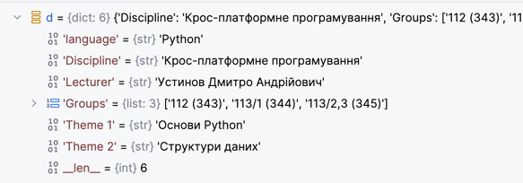

# Dictionary under the hood

Як влаштовані словарі в Python

```python
import sys

d = {}

print('Size of empty dictionary:', sys.getsizeof(d), 'bytes')

d['language'] = 'Python'
print(f'Size  dictionary with {len(d)} elements:', sys.getsizeof(d), 'bytes')

d['Discipline'] = 'Крос-платформне програмування'
print(f'Size  dictionary with {len(d)} elements:', sys.getsizeof(d), 'bytes')

d['Lecturer'] = 'Устинов Дмитро Андрійович'
print(f'Size  dictionary with {len(d)} elements:', sys.getsizeof(d), 'bytes')

d['Groups'] = ['112 (343)', '113/1 (344)', '113/2,3 (345)',]
print(f'Size  dictionary with {len(d)} elements:', sys.getsizeof(d), 'bytes')

d['Theme 1'] = 'Основи Python'
print(f'Size  dictionary with {len(d)} elements:', sys.getsizeof(d), 'bytes')
d['Theme 2'] = 'Структури даних'
print(f'Size  dictionary with {len(d)} elements:', sys.getsizeof(d), 'bytes')
```

Вигляд словаря при перегляді в дебаг режимі (debug mode):



Вивод буде таким:
```
Size of empty dictionary: 64 bytes
Size  dictionary with 1 elements: 184 bytes
Size  dictionary with 2 elements: 184 bytes
Size  dictionary with 3 elements: 184 bytes
Size  dictionary with 4 elements: 184 bytes
Size  dictionary with 5 elements: 184 bytes
Size  dictionary with 6 elements: 272 bytes
```

_- Але чому такі "дивні" результати?_:

- пустий словарь не нуль байт
- додавання елементів не змінює його обсяг, незалежно від обʼєктів які додаються
- раптово він стає більше лише на 6му елементі.

- Насправді нічого дивного не відбувається, зараз розберем чому такі цифри ми отримали.

**Пояснення операцій з словниками та управління пам'яттю**

Аналіз результатів:
1. Початковий розмір (64 байти):

```d = {}  		# 64 bytes```
Порожній словник містить тільки метадані:
- Заголовок об'єкта Python
- Тип (dict)
- Лічильник посилань
- Покажчик на хеш-таблицю (поки що порожню)


Ось як влаштований словарь:

**1. Метадані словника:**

   - ~48 байтів на заголовок об'єкта, лічильники, розмір тощо

**2. Розріджений індекс (Sparse Index):**
 
   - 8 слотів × 1 байт = 8 байтів

   - Містить покажчики на позиції в щільному масиві

**3. Щільний масив записів (Dense Array):**
 
   - Попередньо виділена пам'ять: ~128 байтів
 
   - Кожен запис містить 3 компоненти:
 
   - Хеш ключа (8 байтів) - кешується для швидкості
 
   - Посилання на ключ (8 байтів) - покажчик на об'єкт ключа
 
   - Посилання на значення (8 байтів) - покажчик на об'єкт значення
 
   - Записи зберігаються послідовно (без пропусків)
 
   - 24 байти на запис
   

#### Додаванння першого елемента
```python 
d['language'] = 'Python'  
```

Обчислюється хеш ключа:
```
hash('language') % 8  = 4 	 – 4-й слот
```

Сама функція хеш повертає _integer_ великого розміру, набагато більше 1 байта. Зберігати його в такій формі неефективно, тому замість цього обчислюється який слот з 8 він займе. Це робиться поділом з остатком від ділення на 8 (на кількість слотів в розрідженому індексі, на даний момент їх 8).

```
┌───────────────────────────────────────────────┐
│ Метадані словника                             │ ~48 байтів
├───────────────────────────────────────────────┤  
│ Розріджений індекс   [-1,-1,-1,-1,0,-1,-1,-1] │   8 байтів
│ (хеш-слоти 0-7)                   ↑           │
│                                слот 4 → dense[0]
├───────────────────────────────────────────────┤
│ Щільний масив - dense array:                  │ ~128байтів (попередньо виділено) 
│ [0]: (hash('language'), 'language', 'Python') │ 24 байти - 1-й запис
│ [1]: (порожньо)                               │  
│ [2]: (порожньо)                               │  
│ [3]: (порожньо)                               │
│ [4]: (порожньо)                               │
│ [5]: (порожньо)                               │
│ [6]: (порожньо)                               │
│ [7]: (порожньо)                               │
└───────────────────────────────────────────────┘
```
**Загалом: ~184 байти**


Після додавання другого елемента:
```python 
d['Discipline'] = 'Python'  
```
Так само обчислюється хеш ключа і визначається який слот в розрідженому індексі займе новий елемент:

```
hash('Discipline') % 8 = 2  	– 2-й слот
```

```
┌─────────────────────────────────────────────────┐
│ Метадані словника                               │~48 байтів
├─────────────────────────────────────────────────┤  
│ Розріджений індекс    [-1,-1, 1,-1, 0,-1,-1,-1] │ 8 байтів: 
│ (хеш-слоти 0-7)               ↑     ↑           │
│                              [1]   [0]          │
├─────────────────────────────────────────────────┤
│ Щільний масив - dense array:                    │ ~128байтів 
│ [0]: (hash('language'), 'language', 'Python')   │ 24 байти - 1-й запис
│ [1]: (hash('Discipline'), 'Dis..', 'Крос-п...') │ 24 байти - 2-й запис
│ [2]: (порожньо)                                 │  
│ [3]: (порожньо)                                 │
│ [4]: (порожньо)                                 │
│ [5]: (порожньо)                                 │
│ [6]: (порожньо)                                 │
│ [7]: (порожньо)                                 │
└─────────────────────────────────────────────────┘
```
**Загалом: ~184 байти (без змін!)**


Наповнюємо далі – третій запис :

```d['Lecturer'] = 'Устинов Дмитро …'```

Цей запис попаде аналогічним чином в 1й слот
```
┌─────────────────────────────────────────────────┐
│ Метадані словника                               │ ~48 байтів
├─────────────────────────────────────────────────┤  
│ Розріджений індекс  [-1, 2,  1, -1, 0,-1,-1,-1] │ 8 байтів
│ (хеш-слоти 0-7)          ↑   ↑      ↑           │
│                         [2] [1]    [0]          │
├─────────────────────────────────────────────────┤
│ Щільний масив - dense array:                    │ ~128байтів
│ [0]: (hash('language'), 'language', 'Python')   │ 24 байти - 1-й запис
│ [1]: (hash('Discipline'), 'Dis..', 'Крос-п...') │ 24 байти - 2-й запис
│ [2]: (hash('Lecturer'), 'Lecturer', 'У...')     │ 24 байти - 3-й запис
│ [3]: (порожньо)                                 │
│ [4]: (порожньо)                                 │
│ [5]: (порожньо)                                 │
│ [6]: (порожньо)                                 │
│ [7]: (порожньо)                                 │
└─────────────────────────────────────────────────┘
```
**Загалом: ~184 байти (без змін!)**

Додаємо 4й елемент, але в даному випадку трапляється колізія: 

```
hash('Groups') % 8 = 2      (!)  – колізія   цей слот вже зайнятий
```
На цьому кроці спроба додати новий елемент в 2й слот стикається із тим що цей слот вже зайнятий, тому буде виконана операція "пробінг", а саме спроба додати запис в наступний вільний слот -- в третій. 

Наступний слот вільний, тож запис буде доданий в 3й слот.


```
┌─────────────────────────────────────────────────┐
│ Метадані словника                               │ ~48 байтів
├─────────────────────────────────────────────────┤  
│ Розріджений індекс  [-1, 2,  1,  3,  0,-1,-1,-1]│ 8 байтів
│ (хеш-слоти 0-7)          ↑   ↑   ↑   ↑          │  із-за колізії займає 
│                         [2] [1] [3] [0]         │  наступний вільний слот
├─────────────────────────────────────────────────┤
│ Щільний масив - dense array:                    │ ~128 байтів
│ [0]: (hash('language'), 'language', 'Python')   │ 24 байти - 1-й запис
│ [1]: (hash('Discipline'), 'Dis..', 'Крос-п...') │ 24 байти - 2-й запис
│ [2]: (hash('Lecturer'), 'Lecturer', 'Устинов..')│ 24 байти - 3-й запис
│ [3]: (hash('Groups'), 'Groups', [...])          │ 24 байти - 4-й запис
│ [4]: (порожньо)                                 │
│ [5]: (порожньо)                                 │
│ [6]: (порожньо)                                 │
│ [7]: (порожньо)                                 │
└─────────────────────────────────────────────────┘
```
**Загалом: ~184 байти (без змін!)**

Цей механізм дещо зменшує ефективність пошуку по розрідженому індексу, тому що іноді можливі варіанти, коли хеші в розрідженому індексі співпадають (колізія).

Саме тому наш розріджений індекс зветься "розріджений", чим він більший, тим менша вірогідність колізії, саме тому він має залишатись певною мірою розрідженим. 

Пятий елемент буде доданий в словарь таким же самим чином як і попередні, а от на шостому елементі відбувається раптове збільшення розміру словаря.

#### Стрибок до 272 байтів (6-й елемент):

```
d['Theme 2'] = 'Структури даних'  		# 184 → 272 bytes (+88)
```

Що спричинило збільшення:
 - Load factor досягнув критичного значення (зазвичай ~0.67)
 - Відбулось розширення хеш-таблиці з 8 до 16 слотів
 - Всі існуючі елементи були перехешовані в нову таблицю

Для того щоб на далі зберігати розріджений індекс розрідженим, тобто із достатньою кількістю вільних слотів, відбувається розширення хештаблиці і самого розрідженого індекса.

**Python** слідкує за кількістю елементів словаря і розміром індекса, так щоб мінімізувати вірогідність колізій. 

Таким чином зберігається середня алгоритмічна складність отримання елементів в словарі близькою до О(1) 

### Пошук
ПОШУК: "language" in d
```
1. hash('language') % 8 = 4
   ┌─────┬─────┬─────┬─────┬─────┬─────┬─────┬─────┐
   │ -1  │  2  │  1  │  3  │  0  │ -1  │ -1  │ -1  │
   └─────┴─────┴─────┴─────┴──┬──┴─────┴─────┴─────┘
                              │
2. sparse_index[4] = 0        │
                              ▼
   ┌─────────────────────────────────────────────────┐
   │ [0]: (hash('language'), 'language', 'Python')   │ ✓ ЗНАЙДЕНО!
   │ [1]: (hash('Discipline'), 'Discipline', '...')  │
   │ [2]: (hash('Lecturer'), 'Lecturer', '...')      │  
   │ [3]: (hash('Groups'), 'Groups', [...])          │
   └─────────────────────────────────────────────────┘

3. Перевірка: stored_key == 'language' → True
4. Результат: True
```


ПОШУК: "Groups" in d
```
1. hash('Groups') % 8 = 2
   ┌─────┬─────┬─────┬─────┬─────┬─────┬─────┬─────┐
   │ -1  │  2  │  1  │  3  │  0  │ -1  │ -1  │ -1  │
   └─────┴─────┴──┬──┴─────┴─────┴─────┴─────┴─────┘
                  └──────┐
2. sparse_index[2] = 1   │
                         ▼
   ┌─────────────────────────────────────────────────┐
   │ [0]: (hash('language'), 'language', 'Python')   │
   │ [1]: (hash('Discipline'), 'Discipline', '...')  │ ❌ НЕ 'Groups'!
   │ [2]: (hash('Lecturer'), 'Lecturer', '...')      │  
   │ [3]: (hash('Groups'), 'Groups', [...])          │
   └─────────────────────────────────────────────────┘

3. stored_key = 'Discipline' ≠ 'Groups'
4. КОЛІЗІЯ! Пробінг → перевірка слота 3
5. sparse_index[3] = 3 → dense_array[3] → 'Groups' ✓ ЗНАЙДЕНО!

```

#### Пошук відсутнього елемента

ПОШУК: "missing" in d

```
1. hash('missing') % 8 = 6 (припустимо)
   ┌─────┬─────┬─────┬─────┬─────┬─────┬─────┬─────┐
   │ -1  │  2  │  1  │  3  │  0  │ -1  │ -1  │ -1  │
   └─────┴─────┴─────┴─────┴─────┴─────┴──┬──┴─────┘
                                          │
2. sparse_index[6] = -1                   │
                                          ▼
                                    ПОРОЖНЬО!

3. Результат: False (ключ відсутній)
```


#### Видалення
Після видалення ключів виділена структура залишається

```
┌──────────────────────────────────────────┐
│ Метадані словника                        │ ~48 байтів
├──────────────────────────────────────────┤  
│ Розріджений індекс [-1,-1,-1, 3, ....,-1]│ 16 байт
│ (хеш-слоти 0-15)              ↑          │ 
│                              [3]         │ всі видалені окрім одного
├──────────────────────────────────────────┤
│ Щільний масив - dense array:             │ ~160 байт
│ [0]: <DELETED>                           │ ❌ Позначено як видалений
│ [1]: <DELETED>                           │ ❌ Позначено як видалений
│ [2]: <DELETED>                           │ ❌ Позначено як видалений  
│ [3]: (hash('Groups'), 'Groups', [...])   │ ✓ Активний
│ [4]: (порожньо)                          │
│ [..]: ...                                │
│ [14]: (порожньо)                         │
│ [15]: (порожньо)                         │
└──────────────────────────────────────────┘
```
**Загалом: ~272 байти**

Операція зменшення існуючої структури яка вже була виділена - це досить складна операція, яка передбачає ітерацію по всій структурі і її перебудову. 

Тому цей компромісс між швидкістю роботи і виділеною памятю вирішується на корить швидкості, а питанням перерозподілу зайвої память яка вже була виділена , нехтують.

Таким чином цілком можлива така ситуація:

```python
# додали в словарь 1млн елементів
for i in range(10**6):
    d[i] = i

print(f'Size  dictionary with {len(d)} elements:', sys.getsizeof(d), 'bytes')

# видалили зі словаря 1млн елементів
for i in range(10**6):
    del d[i]

print(f'Size  dictionary with {len(d)} elements:', sys.getsizeof(d), 'bytes')
```

Вивід:
```
Size  dictionary with 1000006 elements: 41943128 bytes
Size  dictionary with 6 elements: 41943128 bytes
```

**Тобто, словарь в якому колись було 1млн елементів, а зараз залишилось всього декілька, все одно обіймає свій максимальний розмір в памяті!**

## Ключові висновки:
 
1. Розмір словника НЕ зменшується при видаленні 
2. Sparse index очищається (-1 для видалених слотів)
3. Dense array може мати "дірки" з <DELETED> записами 
4. Ітерація пропускає видалені записи 
5. Компактифікація відбувається рідко і за певних умов 
6. Для повного звільнення пам'яті потрібно пересворити словник: `d = {k: v for k, v in d.items()}`

Це пояснює, чому видалення елементів зі словника не зменшує його розмір в пам'яті!