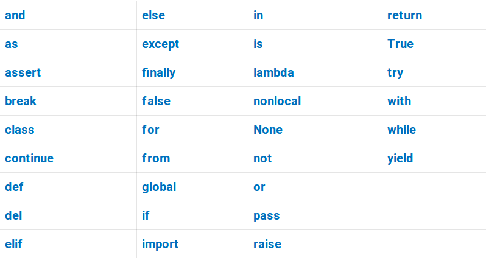

# Модель даних  Python

Потрібно відмовитись від уявлення про змінні як про "коробочки", які зберігають якесь значення - це хибне упередження.

Насправді змінні в Python потрібно сприймати як "стікери" (або посилання) на таких "коробочках"

```
❌  НЕПРАВИЛЬНО (Box model):
x = 5
┌─────┐
│  5  │  ← змінна x містить значення
└─────┘

✅  ПРАВИЛЬНО (Label model):
x = 5
      ┌─────┐
x ───→│  5  │  ← змінна x посилається на об'єкт
      └─────┘
```

Самі обʼєкти в Python існують окремо, змінні якими ми оперуємо - слугують посиланнями на ці обʼєкти.

Коли ми бачимо вираз присваювання , його портібно читати справа наліво, а саме:
```python
a = some_function()
```
1.  Спочатку виконується деяка функція (в прикладі `some_function`)
2. Вона створює деякий  обʼєкт, повертає його
3. Створюється зміннa `a` 
4. Створюється посилання цієї змінної на обʼєкт, який повернула функція.

Якщо функція на якомусь етапі викликала помилку, не буде її результата, то і змінна не буде створена

# Collections - Колекції

Основні типи колекцій:
```  
  - list        список                          [1,2,3,4,5]
  - tuple       кортеж       Незмінний тип      (1,2,3,4,5)
  - set         множина                         {1,2,3,4,5}
  - dict        словарь                         {1: "A", 2: "B", 3: "C"}
```

## Comprehensions - включення

Comprehensions – Елегантний спосіб створення колекцій


## List compehension - Спискові включення
```
list_functions = [f for f in dir([]) if not f.startswith('__')]

[expression(v) for v in <iterable> if <condition>]
```

## Set comprehension - Включення в множину

```
ids = {f"{random.choices("ABCDEF", k=2)} {random.randint(1000, 9999)}"}

{ expression()        for v in <iterable>      if <condition>}
```

## Dict comprehension

```
{ key : expression(v)        for v in <iterable>      if <condition>}
```

Як влаштований dict дивись [тут](README.md).

##  Чи існує tuple comprehension?

 Коротко :  Ні.
 
Хоча здавалося б, якщо кожен з типів колекцій можна створити за схожим патерном - квадратні дужки для списку, фігурні дужки для множини і словаря, то за допомогою круглих дужок створити tuple?

```
(expression()      for v in <iterable>    if <condition>)
```

  Насправді так створити tuple (кортеж) не можна, такий вираз створює **генератор**
  
```python
>>> t = (i**2 for i in range(100))
>>> t
<generator object <genexpr> at 0x106141220>
```

 Що таке генератори дивись приклад [тут](../3%20-%20Generators/README.md).
 

# Ключові слова Python



#  Вбудовані функції

Багато їх, але найбільш часті  нижче.

Головна особливість - ви не можете створити змінну (клас, функцію) яка співпадає із ключовим словом - Ви отримаєте **SyntaxError**:
```python
a = class        # SyntaxError
b = return       # SyntaxError
def = 42         # SyntaxError
```

 Ви можете створити змінну чи функцію, яка співпадає із вбудованю функцією. Це не буде помилка, але не робіть так:
 ```python
 hash = 42
 sum = 0
 print = {}
 ```

Таким чином ви перевизначаєте потрібну вбудовану функцію і не зможете її використовувати надалі

**Перелік найбільш вживаних вбудованих функцій Python**

| Функція | Опис |
|---------|------|
| **print()** | Виводить об'єкт на екран |
| **len()** | Повертає довжину об'єкта |
| **type()** | Повертає тип об'єкта |
| **isinstance()** | Перевіряє, чи є об'єкт екземпляром певного типу |
| **int()** | Перетворює значення на ціле число |
| **float()** | Перетворює значення на число з плаваючою точкою |
| **str()** | Перетворює значення на рядок |
| **bool()** | Перетворює значення на булеве |
| **bytes()** | Створює об'єкт байтів |
| **list()** | Створює список або перетворює об'єкт на список |
| **dict()** | Створює словник |
| **tuple()** | Створює кортеж |
| **set()** | Створює множину |
| **frozenset()** | Створює незмінну множину |
| **range()** | Створює послідовність чисел |
| **input()** | Зчитує введення користувача |
| **max()** | Повертає найбільший елемент |
| **min()** | Повертає найменший елемент |
| **sum()** | Повертає суму елементів |
| **abs()** | Повертає абсолютне значення числа |
| **round()** | Округлює число |
| **pow()** | Піднесення до степеня |
| **divmod()** | Повертає частку та залишок від ділення |
| **hash()** | Повертає хеш-значення об'єкта |
| **sorted()** | Повертає відсортований список |
| **reversed()** | Повертає обернений ітератор |
| **enumerate()** | Повертає пронумеровані елементи |
| **zip()** | Об'єднує кілька ітераторів |
| **map()** | Застосовує функцію до кожного елемента |
| **filter()** | Фільтрує елементи за умовою |
| **any()** | Повертає True, якщо хоча б один елементістинний |
| **all()** | Повертає True, якщо всі елементи істинні |
| **iter()** | Створює ітератор з об'єкта |
| **next()** | Повертає наступний елемент з ітератора |
| **ord()** | Повертає ASCII-код символу |
| **chr()** | Повертає символ за ASCII-кодом |
| **bin()** | Перетворює число у двійкову систему |
| **oct()** | Перетворює число у вісімкову систему |
| **hex()** | Перетворює число у шістнадцяткову систему |
| **callable()** | Перевіряє, чи можна викликати об'єкт як функцію |
| **hasattr()** | Перевіряє, чи має об'єкт певний атрибут |
| **getattr()** | Отримує значення атрибута об'єкта |
| **setattr()** | Встановлює значення атрибута об'єкта |
| **delattr()** | Видаляє атрибут об'єкта |
| **vars()** | Повертає словник атрибутів об'єкта |
| **globals()** | Повертає глобальний простір імен |
| **locals()** | Повертає локальний простір імен |
| **eval()** | Виконує рядок як Python-код |
| **exec()** | Виконує блок Python-коду |
| **compile()** | Компілює код у об'єкт коду |
| **open()** | Відкриває файл |
| **help()** | Показує довідку про об'єкт |
| **dir()** | Показує атрибути об'єкта |
| **id()** | Повертає унікальний ідентифікатор об'єкта |
| **repr()** | Повертає "офіційне" рядкове представлення об'єкта |
| **format()** | Форматує значення |
| **slice()** | Створює об'єкт зрізу |
| **complex()** | Створює комплексне число |
