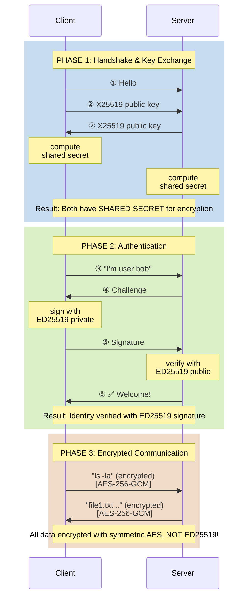

# 🔐 Як працює SSH з ED25519

## ❓ Питання: Якщо ED25519 не може шифрувати, як працює SSH?

**Коротка відповідь:** SSH використовує ED25519 тільки для **автентифікації** (підпису), а не для шифрування з'єднання!

---

## 🔑 SSH використовує 3 різних алгоритми одночасно:

```
┌─────────────────────────────────────────────────────────┐
│  SSH Connection = Key Exchange + Encryption + Auth      │
├─────────────────────────────────────────────────────────┤
│  1️⃣  KEY EXCHANGE    → X25519 / DH-GEX                  │
│      (встановити shared secret)                         │
│                                                         │
│  2️⃣  ENCRYPTION      → AES-256-GCM / ChaCha20-Poly1305  │
│      (зашифрувати дані)                                 │
│                                                         │
│  3️⃣  AUTHENTICATION  → ED25519 / RSA                    │
│      (довести identity)                                 │
└─────────────────────────────────────────────────────────┘
```

---

## 📋 Що відбувається коли ви підключаєтесь через SSH

### Крок 1: Key Exchange (Diffie-Hellman / X25519)
```
Client: "Привіт, сервер! Ось мій публічний ключ для key exchange"
Server: "Привіт! Ось мій публічний ключ"

→ Обидва обчислюють SHARED SECRET
→ Цей secret використається для симетричного шифрування
```

**Алгоритм:** `curve25519-sha256` або `diffie-hellman-group-exchange-sha256`

### Крок 2: Symmetric Encryption (AES / ChaCha20)
```
Тепер у нас є shared secret!

Client та Server використовують його для:
  - Encryption key
  - MAC key
  - IV (initialization vector)

→ Все подальше спілкування зашифроване AES або ChaCha20
```

**Алгоритм:** `aes256-gcm@openssh.com` або `chacha20-poly1305@openssh.com`

### Крок 3: Authentication (ED25519 підпис)
```
Server: "Доведи що ти справжній користувач!"
Client: "Ось мій публічний ключ ED25519"
Server: "Підпиши це повідомлення (challenge)"
Client: → підписує challenge своїм приватним ключем ED25519
Server: → перевіряє підпис публічним ключем
Server: "✅ Verified! Welcome!"
```

**Алгоритм:** `ssh-ed25519`

---

## 💡 Важливо розуміти:

### ❌ ED25519 НЕ шифрує SSH трафік!
Ваш ED25519 ключ використовується ТІЛЬКИ для:
- Підпису challenge під час автентифікації
- Доведення що саме ВИ підключаєтесь

### ✅ SSH трафік шифрується симетричним алгоритмом
Фактичне шифрування робить:
- **AES-256-GCM** (найпоширеніше)
- **ChaCha20-Poly1305** (швидше на мобільних пристроях)

### ✅ Session key створюється через key exchange
За допомогою:
- **X25519** (сучасний, швидкий)
- **Diffie-Hellman** (старший алгоритм)

---

## 🔍 Як побачити які алгоритми використовуються

### Показати які алгоритми підтримує SSH
```bash
ssh -Q kex        # Key exchange algorithms
ssh -Q cipher     # Encryption algorithms
ssh -Q mac        # MAC algorithms
ssh -Q key        # Authentication key types
```

### Підключитись з verbose mode
```bash
ssh -vv user@server
```

Ви побачите щось таке:
```
debug1: kex: algorithm: curve25519-sha256          ← KEY EXCHANGE
debug1: kex: host key algorithm: ssh-ed25519       ← YOUR KEY TYPE
debug1: kex: server->client cipher: aes256-gcm     ← ENCRYPTION
debug1: kex: client->server cipher: aes256-gcm     ← ENCRYPTION
```

---

## 📊 Візуалізація SSH Connection



---

## 🔐 Типи SSH ключів

Коли ви створюєте SSH ключ:

```bash
# ED25519 - найкращий вибір
ssh-keygen -t ed25519 -C "your_email@example.com"
# ✅ Маленький, швидкий, безпечний
# 📝 Використовується ТІЛЬКИ для автентифікації (підпису)

# RSA - старший, але працює скрізь
ssh-keygen -t rsa -b 4096 -C "your_email@example.com"
# ✅ Широка підтримка
# 📝 Теж тільки для автентифікації (підпису)
# ⚠️  Великий розмір

# ECDSA - не рекомендується
ssh-keygen -t ecdsa -b 521 -C "your_email@example.com"
# ⚠️  Можливі backdoors у random number generator
```

**Важливо:** Незалежно від типу ключа (ED25519, RSA, ECDSA), він використовується ТІЛЬКИ для **автентифікації**, а НЕ для шифрування з'єднання!

---

## 📝 ~/.ssh/config - Вибір алгоритмів

Ви можете налаштувати які алгоритми використовувати:

```bash
# ~/.ssh/config

Host example.com
    User bob
    IdentityFile ~/.ssh/id_ed25519

    # Key exchange - використати X25519
    KexAlgorithms curve25519-sha256

    # Encryption - використати ChaCha20
    Ciphers chacha20-poly1305@openssh.com,aes256-gcm@openssh.com

    # Authentication - ED25519
    PubkeyAcceptedKeyTypes ssh-ed25519
```

---

## 🎯 Підсумок

### ED25519 в SSH:
```
ED25519 ключ:
  ✅ Підписує challenge для автентифікації
  ❌ НЕ шифрує з'єднання
  ❌ НЕ передає дані

X25519/DH:
  ✅ Key exchange для встановлення shared secret
  ❌ НЕ автентифікує користувача

AES-256-GCM:
  ✅ Шифрує ВСІ дані в з'єднанні
  ❌ НЕ автентифікує користувача
```

### Всі три разом:
```
1. X25519        → встановити shared secret (key exchange)
2. AES-256-GCM   → зашифрувати з'єднання (encryption)
3. ED25519       → довести identity (authentication)

= Безпечне SSH з'єднання! 🔐
```

---

## 🧪 Експеримент: Подивитись самому

```bash
# Підключитись з verbose logging
ssh -vv user@server 2>&1 | grep -E "kex|cipher|ssh-ed25519"
```

Ви побачите:
```
debug1: kex: algorithm: curve25519-sha256          ← Key exchange (X25519)
debug1: kex: host key algorithm: ssh-ed25519       ← Authentication (ED25519)
debug1: kex: server->client cipher: aes256-gcm     ← Encryption (AES)
debug1: Host 'server' is known and matches the ED25519 host key
```

**Три різних алгоритми = три різних цілі!**

---

## 💡 Аналогія

Уявіть SSH як **двері з замком**:

- **ED25519** = ваш **ключ** (доводить що це саме ви)
- **X25519** = **обмін секретом** з охоронцем (домовились як шифрувати)
- **AES** = **шифр для розмови** (все що ви кажете зашифровано)

Ви не використовуєте свій ключ для шифрування розмови - він тільки відкриває двері! 🚪🔑

---

## 📚 Корисні команди

```bash
# Які алгоритми підтримує ваш SSH клієнт
ssh -Q cipher
ssh -Q kex
ssh -Q key
ssh -Q mac

# Подивитись конфігурацію
cat ~/.ssh/config

# Тестування з'єднання
ssh -T git@github.com

# Verbose logging (побачити всі алгоритми)
ssh -vvv user@server
```

---

**Висновок:** ED25519 в SSH використовується ТІЛЬКИ для автентифікації (підпису challenge), а НЕ для шифрування з'єднання. Шифрування робить AES/ChaCha20, а ключ для нього встановлюється через X25519 key exchange. Три різних алгоритми, три різних завдання! 🔐