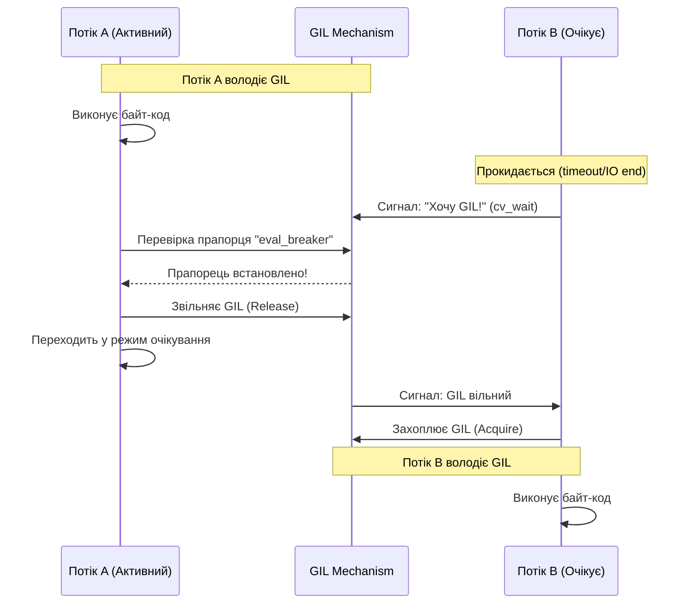
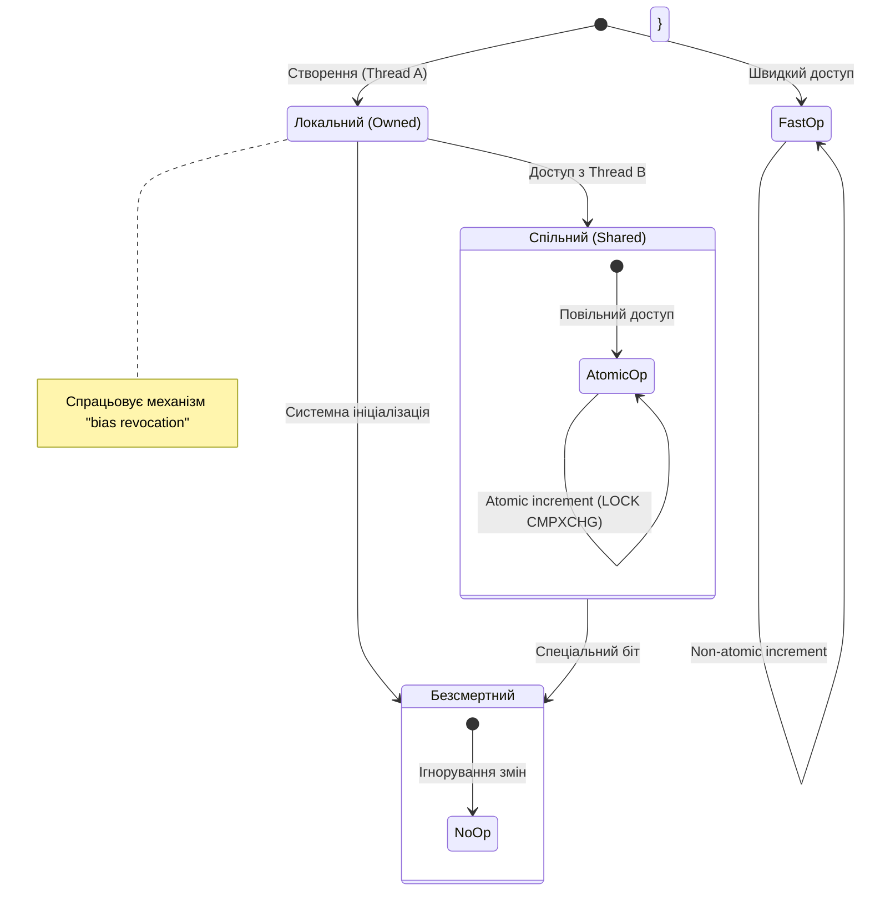
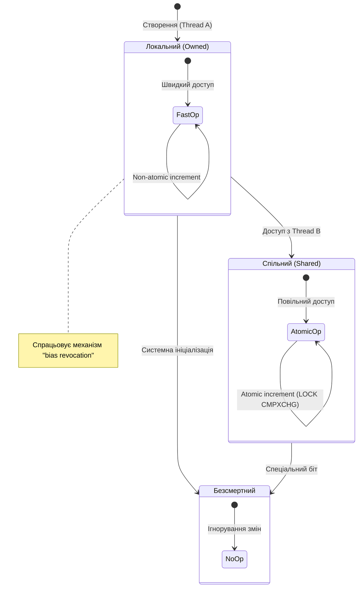

# РЕФЕРАТ: Архітектура, Еволюція та Майбутнє Глобального Блокувальника Інтерпретатора (GIL) у Python

**Виконав:** *БОЛЬБОТ А. О., група 345 Н.Г*

> **Анотація**
> Глобальний блокувальник інтерпретатора (Global Interpreter Lock, або GIL) є, мабуть, найбільш дискусійною та визначальною архітектурною особливістю еталонної реалізації мови програмування Python — CPython. Протягом понад трьох десятиліть GIL слугував фундаментом, що забезпечував стабільність керування пам’яттю та простоту інтеграції з C-бібліотеками, водночас виступаючи головним обмежувачем паралелізму на сучасних багатоядерних архітектурах. Цей звіт пропонує глибоке дослідження природи GIL, починаючи від історичних передумов його виникнення у 1990-х роках та закінчуючи революційними змінами, запропонованими у PEP 703 для Python 3.13 та наступних версій. Дослідження охоплює низькорівневу механіку планування потоків, взаємодію з операційною системою, проблеми "ефекту конвою", стратегії обходу обмежень, а також детальний аналіз нових механізмів, таких як "упереджений підрахунок посилань" (Biased Reference Counting) та "безсмертні об'єкти" (Immortal Objects), що прокладають шлях до Python без GIL.

---

## Зміст

1. [Розділ 1. Генезис та Архітектурна Необхідність](#розділ-1-генезис-та-архітектурна-необхідність)
    - [1.1 Історичний контекст початку 1990-х](#11-історичний-контекст-початку-1990-х)
    - [1.2 Парадигма Керування Пам'яттю: Підрахунок Посилань](#12-парадигма-керування-памяттю-підрахунок-посилань)
    - [1.3 Дилема Блокування: Fine-grained vs Coarse-grained](#13-дилема-блокування-fine-grained-vs-coarse-grained)
2. [Розділ 2. Анатомія та Механіка Роботи GIL](#розділ-2-анатомія-та-механіка-роботи-gil)
    - [2.1 Цикл Інтерпретатора (ceval.c)](#21-цикл-інтерпретатора-cevalc)
    - [2.2 Еволюція Механізму Перемикання: Від "Тіків" до Часу](#22-еволюція-механізму-перемикання-від-тіків-до-часу)
    - [2.3 Візуалізація Конкуренції за GIL](#23-візуалізація-конкуренції-за-gil)
    - [2.4 Проблема "Ефекту Конвою" та "Битви за GIL"](#24-проблема-ефекту-конвою-convoy-effect-та-битви-за-gil)
3. [Розділ 3. Вплив на Продуктивність: Типологія Завдань](#розділ-3-вплив-на-продуктивність-типологія-завдань)
    - [3.1 I/O-bound Сценарії](#31-io-bound-сценарії)
    - [3.2 CPU-bound Сценарії](#32-cpu-bound-сценарії)
    - [3.3 Візуалізація Розподілу Часу (Gantt Chart)](#33-візуалізація-розподілу-часу-gantt-chart)
4. [Розділ 4. Стратегії Обходу та Альтернативи](#розділ-4-стратегії-обходу-та-альтернативи)
    - [4.1 Багатопроцесність (Multiprocessing)](#41-багатопроцесність-multiprocessing)
    - [4.2 C-Extensions та Екосистема NumPy](#42-c-extensions-та-екосистема-numpy)
    - [4.3 Асинхронність (Asyncio)](#43-асинхронність-asyncio)
5. [Розділ 5. Революція PEP 703: Шлях до Python Без GIL](#розділ-5-революція-pep-703-шлях-до-python-без-gil)
    - [5.1 Чому це стало можливим саме зараз?](#51-чому-це-стало-можливим-саме-зараз)
    - [5.2 Ключові технології PEP 703](#52-ключові-технології-pep-703)
    - [5.3 Візуалізація Нової Моделі Посилань](#53-візуалізація-нової-моделі-посилань)
6. [Розділ 6. Майбутнє: Python 3.13 і Далі](#розділ-6-майбутнє-python-313-і-далі)
    - [6.1 Як спробувати?](#61-як-спробувати)
    - [6.2 Дорожня Карта Переходу](#62-дорожня-карта-переходу)
    - [6.3 Результати Бенчмарків](#63-результати-бенчмарків)
7. [Висновки](#висновки)

---

## Розділ 1. Генезис та Архітектурна Необхідність

### 1.1 Історичний контекст початку 1990-х
Щоб зрозуміти, чому **Python**, одна з найпопулярніших мов світу, має таке суттєве обмеження як GIL, необхідно повернутися до моменту її створення. У 1992 році, коли Гвідо ван Россум імплементував підтримку потоків у Python, комп’ютерний ландшафт кардинально відрізнявся від сучасного. Багатоядерні процесори були екзотикою, доступною лише для суперкомп'ютерів або спеціалізованих серверів. Переважна більшість персональних комп'ютерів та робочих станцій працювала на одноядерних чіпах.

У цьому середовищі поняття "паралелізм" (parallelism) часто плутали з "конкурентністю" (concurrency). Для одноядерного процесора ці поняття були фактично тотожними з точки зору спостерігача: операційна система створювала ілюзію одночасної роботи, швидко перемикаючись між завданнями. Тому архітектурне рішення, яке дозволяло виконувати лише один потік байт-коду Python за раз, не розглядалося як суттєвий недолік. Головною метою було додавання можливості обробляти фонові завдання (наприклад, I/O операції) без блокування основного інтерфейсу програми.

### 1.2 Парадигма Керування Пам'яттю: Підрахунок Посилань
Фундаментальною причиною існування GIL є модель керування пам'яттю в CPython. На відміну від мов, що покладаються виключно на трасуючі збирачі сміття (як Java або Go), Python використовує **підрахунок посилань** (reference counting) як основний механізм.

Кожен об'єкт у пам'яті Python (який є структурою `PyObject` на рівні C) містить поле `ob_refcnt`.
Це поле зберігає кількість активних посилань на цей об'єкт.
- Коли створюється змінна `x = 10`, створюється об'єкт `int(10)` і його лічильник стає рівним 1.
- При присвоєнні `y = x`, лічильник зростає до 2.
- Коли змінна виходить з області видимості або видаляється (`del x`), лічильник зменшується.
- Як тільки `ob_refcnt` досягає нуля, пам'ять миттєво звільняється (викликається деструктор `__del__`, а потім `free()`).

Ця система є детермінованою та ефективною, але вона надзвичайно вразлива у багатопотоковому середовищі. Розглянемо сценарій "стану гонитви" (race condition), який міг би виникнути без глобального блокування:

1.  **Потік А** збирається зменшити лічильник посилань об'єкта `obj` (поточне значення 2). Він зчитує значення 2 у свій регістр.
2.  У цей же момент відбувається перемикання контексту.
3.  **Потік Б** також зменшує посилання на `obj`. Він зчитує значення 2, зменшує його до 1 і записує назад у пам'ять.
4.  Керування повертається до **Потоку А**. Він використовує своє "старе" значення 2, зменшує його до 1 і записує в пам'ять.

**Результат:** Реальна кількість посилань має бути 0 (обидва потоки відмовилися від об'єкта), але в пам'яті записано 1. Об'єкт ніколи не буде видалений — це класичний витік пам'яті. Гірший сценарій виникає, коли лічильник помилково стає нулем, поки на об'єкт ще є посилання, що призводить до звільнення пам'яті, яку все ще використовує інша частина програми (use-after-free), і, як наслідок, до аварійного завершення процесу (segmentation fault).

### 1.3 Дилема Блокування: Fine-grained vs Coarse-grained
Перед розробниками CPython стояла дилема захисту цих лічильників. Існувало два основних підходи:

| Стратегія | Опис | Переваги | Недоліки |
| :--- | :--- | :--- | :--- |
| **Дрібнозернисте блокування** (Fine-grained locking) | Кожен об'єкт (або група об'єктів) має власний м'ютекс. Потік блокує об'єкт перед зміною його лічильника. | Дозволяє справжній паралелізм: потоки, що працюють з різними об'єктами, не блокують один одного. | Величезні накладні витрати пам'яті (кожен об'єкт стає більшим) та процесорного часу (постійне захоплення/звільнення замків). Високий ризик взаємних блокувань (deadlocks). |
| **Великозернисте блокування** (Coarse-grained locking / GIL) | Один глобальний м'ютекс на весь інтерпретатор. | Простота реалізації. Відсутність ризику взаємних блокувань між внутрішніми компонентами. Висока швидкість однопотокового виконання. | Унеможливлює виконання байт-коду Python на кількох ядрах одночасно в межах одного процесу. |

У 1990-х роках вибір на користь GIL був прагматичним і правильним. Він дозволив Python залишатися швидким для однопотокових сценаріїв (які складали 99% задач скриптової мови) і значно спростив інтеграцію сторонніх бібліотек на C, які не були потокобезпечними.

---

## Розділ 2. Анатомія та Механіка Роботи GIL

GIL — це не просто абстрактна концепція, а конкретна структура даних у коді CPython. Його реалізація еволюціонувала, але суть залишається незмінною: це булева змінна (замкнено/відімкнено), захищена м'ютексом та умовними змінними (condition variables) бібліотеки `pthreads` (на POSIX-системах) або відповідними примітивами Windows.

### 2.1 Цикл Інтерпретатора (ceval.c)
Серцем віртуальної машини **Python** є функція *`PyEval_EvalFrameEx`* (у сучасних версіях `_PyEval_EvalFrameDefault`), розташована у файлі `ceval.c`. Це гігантський цикл `for` з перемикачем `switch`, який послідовно виконує опкоди (opcodes) байт-коду.

У спрощеному вигляді логіка роботи інтерпретатора з GIL виглядає так:
1.  **Захоплення GIL:** Перед входом у цикл виконання потік повинен отримати GIL.
2.  **Виконання:** Потік виконує певну кількість інструкцій байт-коду.
3.  **Перевірка:** Періодично потік призупиняє виконання, щоб перевірити, чи не потрібно звільнити GIL для інших потоків або обробити системні сигнали (наприклад, `KeyboardInterrupt`).
4.  **Звільнення:** Якщо час вийшов або потрібна операція I/O, GIL звільняється.

### 2.2 Еволюція Механізму Перемикання: Від "Тіків" до Часу
Механізм, за яким інтерпретатор вирішує, коли звільнити GIL, зазнав радикальних змін у версії Python 3.2 (2011 рік), завдяки роботі Антуана Пітру (Antoine Pitrou).

**Стара модель (Python 2.x): Підрахунок "Тіків"**
У ранніх версіях використовувався лічильник інструкцій, так званих "тіків" (ticks). За замовчуванням `sys.getcheckinterval()` дорівнював 100.
* **Проблема:** Інструкції байт-коду неоднорідні за часом виконання. Проста операція додавання (`ADD`) займає наносекунди, тоді як інструкція виклику складної функції може тривати мілісекунди. Це призводило до непередбачуваної поведінки планувальника.

**Нова модель (Python 3.2+): Часові інтервали**
Новий GIL використовує таймер. Змінна `sys.getswitchinterval()` (за замовчуванням 0.005 секунди, тобто 5 мс) визначає, як довго потік може утримувати GIL без конкуренції.
* Інтерпретатор не перевіряє час після кожної інструкції (це було б надто дорого).
* Замість цього, основний потік захоплює GIL. Якщо інший потік хоче виконатися, він встановлює прапорець (request flag) і чекає на умовній змінній (condition variable) з таймаутом.
* Коли основний потік бачить цей запит (під час перевірки, яка відбувається регулярно), він зобов'язаний звільнити GIL ("drop the GIL").

### 2.3 Візуалізація Конкуренції за GIL
Наведена нижче діаграма демонструє часову шкалу (Sequence Diagram) взаємодії двох потоків, що конкурують за виконання на одному ядрі логічного процесора інтерпретатора.

Ця схема ідеалізована. У реальності на багатоядерних системах процес перемикання є набагато хаотичнішим через втручання планувальника операційної системи.

### 2.4 Проблема "Ефекту Конвою" (Convoy Effect) та "Битви за GIL"
Однією з найскладніших проблем, виявлених Девідом Бізлі (David Beazley), є так звані "GIL Battles" на багатоядерних машинах. Операційна система (ОС) бачить два потоки Python і намагається запустити їх на двох різних фізичних ядрах для максимальної ефективності.

- Потік А працює на Ядрі 1 і тримає GIL.
- Потік Б прокидається на Ядрі 2 і намагається захопити GIL.
- Оскільки GIL зайнятий, Потік Б блокується і засинає.
- Через деякий час Потік А звільняє GIL (наприклад, через I/O або вичерпання інтервалу).
- Він надсилає сигнал Потоку Б.

**Критичний момент** Поки сигнал доходить до Ядра 2 і ОС будить Потік Б, Потік А (який все ще активний на Ядрі 1) встигає знову захопити GIL, оскільки він вже знаходиться в контексті виконання ("гарячий" кеш).

*Потік Б прокидається, бачить, що GIL знову зайнятий, і знову засинає.*

Цей цикл може повторюватися тисячі разів, створюючи величезну кількість системних викликів і перемикань контексту без реального просування Потоку Б. Це явище називається "ефектом конвою" або "голодуванням" (starvation), особливо коли I/O-потоки конкурують з CPU-інтенсивними потоками. CPU-потоки "забивають" канал, не даючи I/O-потокам швидко обробити події.

У Python 3.2 цю проблему частково вирішили, змусивши потік, що щойно звільнив GIL, чекати підтвердження (ACK) від іншого потоку про те, що той успішно захопив GIL, перш ніж знову претендувати на нього.

---

## Розділ 3 Вплив GIL на продуктивність програми не є однозначно негативним; він радикально залежить від характеру навантаження. Розробники зазвичай поділяють завдання на дві категорії: I/O-bound (обмежені введенням/виведенням) та CPU-bound (обмежені процесором).

### 3.1 I/O-bound Сценарії
Для завдань, де програма більшу частину часу очікує відповіді від зовнішніх систем (мережеві запити, запити до баз даних, читання з диска), GIL не є проблемою.

**Механізм роботи наступний:**
- Коли потік Python виконує системний виклик (наприклад, socket.recv() або os.read()), інтерпретатор автоматично звільняє GIL до того, як передати керування операційній системі.
- Потік переходить у стан блокування на рівні ОС. У цей час GIL вільний, і інший потік може виконувати Python-код.
- Коли дані отримані, ОС будить перший потік. Він чекає на звільнення GIL, захоплює його і продовжує обробку даних.

Завдяки цьому Python чудово підходить для написання мережевих серверів, веб-скрейперів та ботів. Модуль threading у таких випадках забезпечує реальну конкурентність, навіть попри наявність GIL.

### 3.2 CPU-bound Сценарії
Для завдань, що вимагають інтенсивних математичних обчислень, обробки зображень у чистому Python, криптографії або складних алгоритмів на графах, GIL стає вузьким місцем (bottleneck).

Якщо запустити два CPU-bound потоки на 2-ядерному процесорі:

Очікування: 100% завантаження обох ядер, прискорення в 2 рази.

Реальність з GIL: Завантаження ядер сумарно не перевищує 100% (по 50% на кожне, або стрибки між ядрами). Час виконання часто зростає порівняно з послідовним виконанням через накладні витрати на перемикання контексту (context switching overhead).

### 3.3 Візуалізація Розподілу Часу (Gantt Chart)
Діаграма Ганта нижче показує, як GIL серіалізує виконання CPU-завдань, перетворюючи потенційний паралелізм на послідовне чергування ("time slicing").

**Фрагмент коду**

**Зверніть увагу: у секції "With GIL" у будь-який момент часу активний лише один блок. У секції "No GIL" обидва потоки активні одночасно.**

---

## Розділ 4. Стратегії Обходу та Альтернативи
Враховуючи обмеження GIL, спільнота Python розробила надійні патерни для їх обходу.

### 4.1 Багатопроцесність (Multiprocessing)
Стандартний модуль multiprocessing дозволяє створювати нові процеси замість потоків. Кожен процес має власний екземпляр Python інтерпретатора, власну пам'ять і, що найважливіше, власний незалежний GIL. Це дозволяє повною мірою використовувати всі ядра процесора.

Недоліки: Створення процесів важче для ОС, ніж створення потоків. Обмін даними між процесами вимагає серіалізації (pickle), що може бути повільним для великих обсягів даних.

### 4.2 C-Extensions та Екосистема NumPy
Це **"секретна зброя"** Python. Бібліотеки на кшталт NumPy, SciPy, TensorFlow, PyTorch написані на C/C++. C-API Python надає макроси Py_BEGIN_ALLOW_THREADS та Py_END_ALLOW_THREADS. 

**Коли NumPy виконує важку матричну операцію (наприклад, множення матриць 1000x1000), він:**
- Звільняє GIL.
- Запускає обчислення на чистому C/Fortran (часто використовуючи OpenMP для внутрішнього розпаралелювання).
- По завершенню знову захоплює GIL, щоб повернути результат у Python. Це дозволяє Python бути повільним "клеєм" для надзвичайно швидких обчислювальних ядер.

### 4.3 Асинхронність (Asyncio)
Модуль asyncio (введений у Python 3.4) пропонує альтернативну модель — кооперативну багатозадачність. Тут немає потоків ОС. Є один потік ("Event Loop"), який швидко перемикається між корутинами (coroutines). Оскільки потік лише один, GIL ніколи не є проблемою конкуренції. Це ідеально підходить для I/O-bound задач з тисячами з'єднань (наприклад, WebSocket-сервери), де накладні витрати на системні потоки були б завеликими.

---

## Розділ 5. Революція PEP 703: Шлях до Python Без GIL
Довгий час вважалося, що видалити GIL неможливо без катастрофічного падіння продуктивності однопотокових програм. Проте у 2023 році стався прорив. Сем Гросс (Sam Gross) представив доказовий концепт (proof-of-concept) під назвою nogil, який згодом оформився у PEP 703 — Making the Global Interpreter Lock Optional in CPython.

Ця пропозиція була офіційно прийнята Керівною Радою Python (Steering Council) з метою зробити GIL опціональним, а в перспективі — повністю його видалити.

### 5.1 Чому це стало можливим саме зараз?
Попередні спроби видалення GIL (наприклад, патч Грега Стейна 1996 року або проект "Gilectomy" Ларрі Гастінгса) замінювали GIL на безліч дрібних блокувань. Це сповільнювало однопотоковий Python на 30-50% через накладні витрати на атомарні операції. PEP 703 пропонує комплексне інженерне рішення, яке мінімізує це падіння (до ~1-8% у Python 3.13).

### 5.2 Ключові технології PEP 703
Для заміни GIL використовуються три інноваційні механізми:

### 5.2.1 Упереджений Підрахунок Посилань (Biased Reference Counting)
Замість того, щоб робити кожну зміну лічильника посилань атомарною (що дорого), система використовує спостереження, що більшість об'єктів доступні лише одному потоку.

Локальний лічильник: Змінюється лише потоком-власником. Це швидка, неатомарна операція.

Спільний лічильник: Використовується, якщо інші потоки намагаються отримати доступ до об'єкта.

Лічильник посилань об'єднується лише тоді, коли це дійсно необхідно. Це дозволяє зберегти швидкість для однопотокового коду.

### 5.2.2 Безсмертні Об'єкти (Immortal Objects - PEP 683)
Об'єкти, такі як None, True, False, малі цілі числа, використовуються постійно. Раніше кожен доступ до них викликав запис у пам'ять (зміну refcount), що спричиняло "бруднення" кеш-ліній (cache invalidation) у багатоядерних процесорах. Тепер ці об'єкти позначаються спеціальним бітом як "безсмертні". Їх лічильник ніколи не змінюється. Це усуває потребу в синхронізації для найпоширеніших об'єктів.

### 5.2.3 Новий Алокатор Пам'яті (Mimalloc)
Стандартний алокатор Python (pymalloc) був розроблений під захистом GIL і не є потокобезпечним без нього. PEP 703 інтегрує mimalloc — високопродуктивний алокатор від Microsoft, який ефективно працює у багатопотоковому середовищі без глобальних блокувань.

### 5.2.4 Відкладений Підрахунок Посилань (Deferred Reference Counting)
Для деяких об'єктів (функції, модулі) підрахунок посилань взагалі відкладається до моменту запуску збирача сміття (GC cycle). Це дозволяє уникнути конкуренції при доступі до глобальних об'єктів.

### 5.3 Візуалізація Нової Моделі Посилань
Діаграма станів (State Diagram) нижче ілюструє, як об'єкт переходить між станами в новій моделі пам'яті без GIL.

Фрагмент коду

---

## Розділ 6. Майбутнє: Python 3.13 і Далі
З виходом Python 3.13 (жовтень 2024 року) розробники отримали доступ до експериментального режиму вільної багатопотоковості (free-threading).

### 6.1 Як спробувати?
Це не зміна за замовчуванням. Необхідно завантажити спеціальну версію Python або скомпілювати її з прапорцем: ./configure --disable-gil

**У такій збірці:**

- Визначено макрос Py_GIL_DISABLED.

- Бінарні файли мають суфікс t (наприклад, python3.13t).

- розширення повинні бути перекомпільовані спеціально для цієї версії ABI.

### 6.2 Дорожня Карта Переходу
**План переходу розрахований на 5+ років:**

- Експериментальна фаза (3.13): GIL опціональний, доступний для тестування авторами бібліотек.

- Фаза підтримки (3.14-3.15): Покращення стабільності, адаптація екосистеми (NumPy, Pandas, Cython вже активно працюють над підтримкою).

- Фаза за замовчуванням: Коли No-GIL версія стане стабільною і швидкою, вона може стати стандартною. Можливо, GIL буде видалено назавжди.

### 6.3 Результати Бенчмарків
Перші тести показують вражаючі результати:

Однопотоковий код: Уповільнення близько 5-8% (планується зменшити до <2%).

Багатопотоковий код: Майже лінійне масштабування. Програма на 10 потоків на 10 ядрах працює в 9.5-9.8 разів швидше, ніж на одному, чого було неможливо досягти з GIL.

---

## Висновки
Глобальний блокувальник інтерпретатора (GIL) не був помилкою. Це було геніальне інженерне рішення свого часу, яке дозволило Python стати тим, чим він є сьогодні — простою, надійною мовою з величезною бібліотекою C-розширень. Однак в епоху, коли навіть мобільні телефони мають 8-ядерні процесори, обмеження GIL стало надто високою ціною.

Революція, започаткована PEP 703, є найбільшою зміною в архітектурі CPython за останні 20 років. Перехід до моделі без GIL (No-GIL) відкриває двері для справжнього паралелізму, роблячи Python конкурентом Go та Java у сфері високопродуктивних багатопотокових серверів та обчислень, не втрачаючи при цьому простоти синтаксису. Хоча повний перехід займе роки, технологічний фундамент вже закладено.

Для розробника сьогодні це означає необхідність розуміти обидві парадигми: класичну (де threading тільки для I/O) і нову (де threading зможе використовувати всі ядра CPU). Ера однопотокового Python добігає кінця.

Примітка: Цей звіт базується на аналізі технічної документації Python, PEP (Python Enhancement Proposals) та матеріалів розробників CPython Core станом на початок 2026 року.
