# Глибоке занурення в багатопотоковість Python

## Зміст
1. [Що таке потоки і процеси?](#що-таке-потоки-і-процеси)
2. [Потоки vs Процеси: фундаментальні відмінності](#потоки-vs-процеси-фундаментальні-відмінності)
3. [Як працюють потоки в Python](#як-працюють-потоки-в-python)
4. [Global Interpreter Lock (GIL)](#global-interpreter-lock-gil)
5. [Чому Python повільніший за інші мови в багатопотоковості](#чому-python-повільніший-за-інші-мови-в-багатопотоковості)
6. [Коли використовувати потоки, а коли процеси](#коли-використовувати-потоки-а-коли-процеси)
7. [Типові проблеми та їх рішення](#типові-проблеми-та-їх-рішення)
8. [Альтернативи та майбутнє](#альтернативи-та-майбутнє)

---

## Що таке потоки і процеси?

### Процес (Process)

**Процес** - це незалежна програма, що виконується в операційній системі. Уявіть собі процес як повністю ізольований простір, де працює ваш код.

Кожен процес має:

**1. Власний адресний простір пам'яті**
   - Процес отримує від операційної системи виділену область пам'яті (наприклад, 100 MB чи 2 GB)
   - Цей простір повністю ізольований від інших процесів
   - Процес A не може прочитати або змінити пам'ять процесу B
   - Наприклад: якщо у вас відкрито 3 вкладки браузера Chrome, кожна працює в окремому процесі з власною пам'яттю. Якщо одна вкладка "зависне", інші продовжують працювати

**2. Власні змінні та ресурси**
   - Всі глобальні змінні існують незалежно в кожному процесі
   - Відкриті файли, мережеві з'єднання, системні ресурси - все унікальне
   - Наприклад: якщо ви змінюєте глобальну змінну `counter = 5` в одному процесі, в іншому процесі вона залишається без змін

**3. Власний інтерпретатор Python**
   - Кожен процес запускає повну копію Python інтерпретатора
   - Це означає власний Global Interpreter Lock (GIL) для кожного процесу
   - Завантажує всі необхідні модулі та бібліотеки заново
   - Приклад: якщо у вас є скрипт з `import numpy`, кожен процес завантажить numpy у свою пам'ять окремо

**4. Власний стек викликів**
   - Стек зберігає інформацію про виклики функцій (де ми зараз в коді, звідки викликали)
   - Повністю ізольований від інших процесів
   - Наприклад: якщо процес A викликав функцію `calculate()`, а процес B викликав `process_data()`, їхні стеки викликів не перетинаються

**Практичні приклади процесів:**
- Кожна вкладка в браузері Chrome - окремий процес (тому одна зависла вкладка не впливає на інші)
- Кожен відкритий документ Word - часто окремий процес
- Кожна запущена програма в диспетчері задач - окремий процес
- Веб-сервер Nginx створює worker-процеси для обробки запитів

### Потік (Thread)

**Потік** - це легковагова одиниця виконання всередині процесу. Подумайте про потоки як про працівників однієї команди, які працюють над спільним проектом.

Усі потоки одного процесу поділяють:

**1. Спільний адресний простір пам'яті**
   - Всі потоки бачать і можуть змінювати одні й ті самі змінні
   - Це як кілька людей, які працюють з одним документом Google Docs - всі бачать зміни одразу
   - Плюс: швидка комунікація між потоками
   - Мінус: потрібна обережність, щоб не зіпсувати дані одночасними змінами
   - Наприклад: якщо у вас є список `data = []`, всі потоки працюють з ОДНИМ і ТИМ САМИМ списком

**2. Спільні змінні та об'єкти**
   - Глобальна змінна `counter` буде однією і тією ж для всіх потоків
   - Зміни, зроблені одним потоком, негайно видимі іншим
   - Приклад: якщо Потік 1 встановлює `config['timeout'] = 30`, Потік 2 відразу бачить це значення

**3. Один інтерпретатор Python**
   - Всі потоки використовують один екземпляр Python інтерпретатора
   - Спільний Global Interpreter Lock (GIL) - тільки один потік може виконувати Python код одночасно
   - Модулі завантажуються один раз для всіх потоків
   - Це як одна кухня, де працює кілька кухарів, але використовувати плиту може тільки один за раз

**4. Спільні файлові дескриптори**
   - Якщо один потік відкрив файл, інші потоки можуть використовувати той самий дескриптор
   - Мережеві з'єднання, бази даних - все спільне
   - Наприклад: можна відкрити з'єднання з базою даних один раз і використовувати його в різних потоках

**Що унікального у кожного потоку:**
- Власний стек виконання (де зараз виконується код, які функції викликані)
- Власний програмний лічильник (на якій інструкції ми зараз)
- Власні локальні змінні функцій

**Практичні приклади потоків:**
- Веб-браузер: один потік завантажує зображення, інший обробляє JavaScript, третій рендерить сторінку
- Текстовий редактор: один потік перевіряє орфографію, інший обробляє введення з клавіатури
- Програма завантаження файлів: кожен потік завантажує окремий файл, але всі використовують спільний список завантажень


### Візуальне порівняння

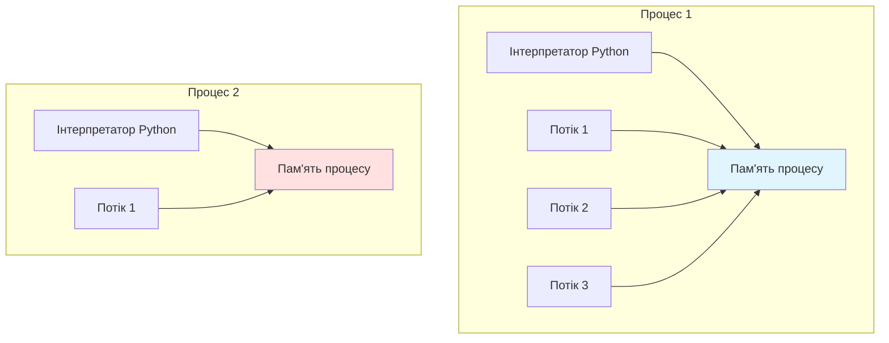

---

## Потоки vs Процеси: фундаментальні відмінності

### Порівняльна таблиця

| Характеристика | Потоки (Threads) | Процеси (Processes) |
|----------------|------------------|---------------------|
| **Пам'ять** | Спільна | Ізольована |
| **Комунікація** | Проста (спільні змінні) | Складна (IPC, Queue, Pipe) |
| **Створення** | Швидке (~1-2 мс) | Повільне (~10-100 мс) |
| **Накладні витрати** | Низькі (~1-2 MB на потік) | Високі (~10-50 MB на процес) |
| **Безпека даних** | Потребує синхронізації (Lock, Mutex) | Природно ізольовані |
| **Паралелізм CPU** | Обмежений (GIL в Python) | Справжній паралелізм |
| **Використання** | I/O-bound задачі (мережа, файли) | CPU-bound задачі (обчислення) |
| **Стабільність** | Падіння одного = падіння всіх | Ізольовані збої |
| **Масштабованість** | До ~1000 потоків | До ~100 процесів |
| **Складність коду** | Проста (але потрібна синхронізація) | Складніша (комунікація між процесами) |

#### Детальне пояснення відмінностей

**1. Пам'ять: Спільна vs Ізольована**

*Потоки (Спільна пам'ять):*
```python
# Всі потоки бачать і можуть змінювати одну змінну
shared_list = []

def thread_worker():
    shared_list.append(1)  # Доступ до спільного списку
    print(len(shared_list))  # Бачимо зміни від інших потоків

# Обидва потоки працюють з ОДНИМ списком
t1 = threading.Thread(target=thread_worker)
t2 = threading.Thread(target=thread_worker)
t1.start(); t2.start()
t1.join(); t2.join()
print(shared_list)  # [1, 1] - обидва потоки додали елементи
```

*Процеси (Ізольована пам'ять):*
```python
shared_list = []

def process_worker():
    shared_list.append(1)  # Змінює ЛОКАЛЬНУ копію
    print(len(shared_list))  # Бачить тільки свої зміни

# Кожен процес має ВЛАСНУ копію списку
p1 = multiprocessing.Process(target=process_worker)
p2 = multiprocessing.Process(target=process_worker)
p1.start(); p2.start()
p1.join(); p2.join()
print(shared_list)  # [] - головний процес не бачить змін!
```

**2. Комунікація: Проста vs Складна**

*Потоки - просто використовують змінні:*
```python
result = None
lock = threading.Lock()

def thread_task():
    global result
    with lock:
        result = "готово"  # Прямий доступ до змінної

t = threading.Thread(target=thread_task)
t.start()
t.join()
print(result)  # "готово" - легко!
```

*Процеси - потрібні спеціальні механізми:*
```python
from multiprocessing import Queue

def process_task(queue):
    queue.put("готово")  # Передаємо через Queue

queue = Queue()  # Спеціальний об'єкт для комунікації
p = multiprocessing.Process(target=process_task, args=(queue,))
p.start()
result = queue.get()  # Отримуємо результат
p.join()
print(result)  # "готово" - але складніше
```

**3. Створення: Швидке vs Повільне**

*Чому потоки створюються швидше:*
- Потрібно тільки виділити стек (~1 MB)
- Не потрібно копіювати пам'ять процесу
- Не потрібно запускати новий інтерпретатор
- Приклад: створення 100 потоків займає ~100-200 мс

*Чому процеси створюються повільніше:*
- Потрібно скопіювати весь адресний простір батьківського процесу (fork)
- Запуск нового інтерпретатора Python (~10-30 MB)
- Завантаження всіх модулів заново
- Ініціалізація системних ресурсів
- Приклад: створення 100 процесів може зайняти 1-5 секунд

**4. Накладні витрати: Низькі vs Високі**

*Потоки (1-2 MB на потік):*
- Основні витрати: стек виконання (~1 MB)
- Спільний heap, код, глобальні дані
- Приклад: 100 потоків ≈ 100-200 MB

*Процеси (10-50 MB на процес):*
- Повна копія інтерпретатора (~15 MB)
- Копії завантажених модулів (numpy, pandas тощо)
- Власний heap для кожного процесу
- Приклад: 100 процесів ≈ 1-5 GB

**5. Безпека даних**

*Потоки - потрібна синхронізація:*
```python
counter = 0

def unsafe_increment():
    global counter
    counter += 1  # Race condition! Не атомарна операція

# Результат непередбачуваний без Lock
```

*Процеси - природна ізоляція:*
```python
counter = 0

def safe_increment():
    global counter
    counter += 1  # Безпечно - це ЛОКАЛЬНА копія

# Кожен процес має власний counter
```

**6. Паралелізм CPU**

*Потоки - обмежені GIL:*
```python
# Навіть на 8-ядерному CPU використовується тільки 1 ядро для Python коду
def cpu_task():
    sum(i**2 for i in range(10_000_000))

# 4 потоки НЕ прискорять виконання через GIL
threads = [threading.Thread(target=cpu_task) for _ in range(4)]
```

*Процеси - справжній паралелізм:*
```python
# Кожен процес працює на окремому ядрі CPU
def cpu_task():
    return sum(i**2 for i in range(10_000_000))

# 4 процеси = в ~4 рази швидше (якщо є 4+ ядра)
with multiprocessing.Pool(4) as pool:
    results = pool.map(cpu_task, range(4))
```

**7. Стабільність**

*Потоки - спільна доля:*
```python
def buggy_thread():
    x = 1 / 0  # Exception!

t = threading.Thread(target=buggy_thread)
t.start()
# Якщо не обробити, може впасти вся програма
```

*Процеси - ізольовані збої:*
```python
def buggy_process():
    x = 1 / 0  # Exception!

p = multiprocessing.Process(target=buggy_process)
p.start()
p.join()
# Головний процес продовжує роботу, упав тільки дочірній процес
print("Я все ще працюю!")
```

Ці відмінності критично важливі при виборі між потоками та процесами!

### Детальна візуалізація архітектури

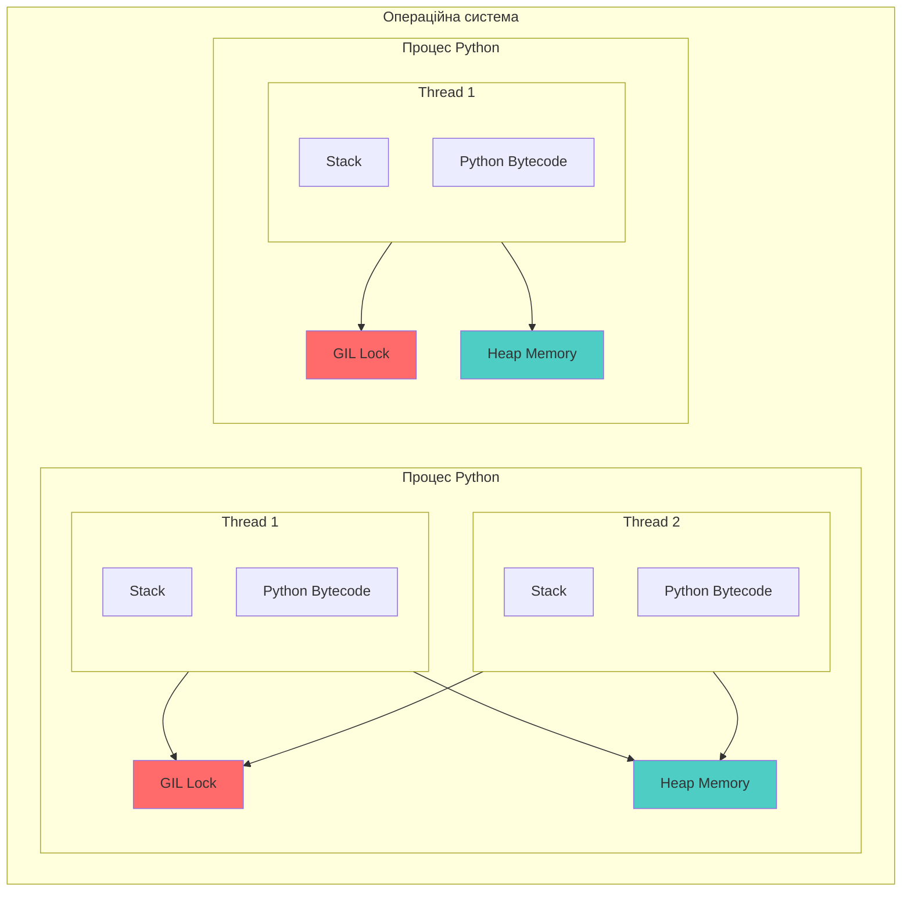


### Приклад: Спільна пам'ять у потоках vs ізоляція у процесах

```python
import threading
import multiprocessing
import time

# Глобальна змінна
counter = 0

# ============= ПОТОКИ: СПІЛЬНА ПАМ'ЯТЬ =============
def thread_worker():
    global counter
    for _ in range(100000):
        counter += 1

threads = [threading.Thread(target=thread_worker) for _ in range(2)]
for t in threads:
    t.start()
for t in threads:
    t.join()

print(f"Потоки - результат: {counter}")  # Непередбачуваний результат!
# Очікували: 200000, отримали: ~150000 (race condition)

# ============= ПРОЦЕСИ: ІЗОЛЬОВАНА ПАМ'ЯТЬ =============
counter = 0

def process_worker():
    global counter  # Це ЛОКАЛЬНА копія в кожному процесі!
    for _ in range(100000):
        counter += 1
    print(f"Локальний counter в процесі: {counter}")  # 100000

if __name__ == "__main__":
    processes = [multiprocessing.Process(target=process_worker) for _ in range(2)]
    for p in processes:
        p.start()
    for p in processes:
        p.join()
    
    print(f"Процеси - глобальний counter: {counter}")  # 0 (не змінився!)
```


---

## Як працюють потоки в Python

### Життєвий цикл потоку

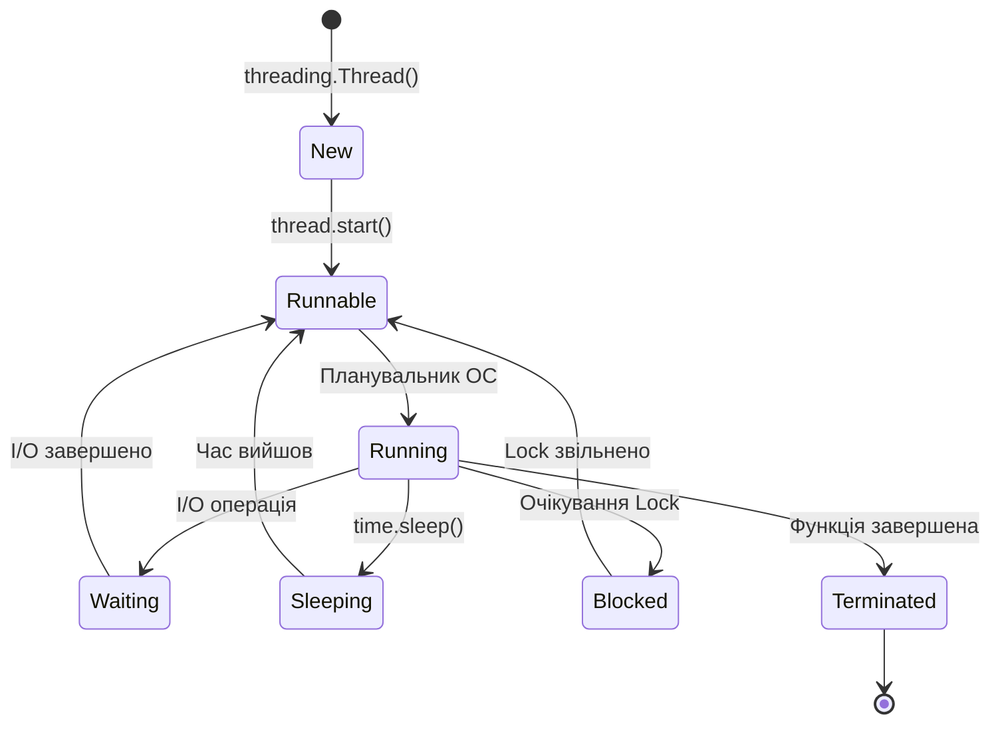

### Внутрішня робота потоків

Коли ви створюєте потік у Python, відбувається складний процес взаємодії між Python і операційною системою. Розглянемо кожен крок детально:

#### 1. Створення об'єкта Thread (`threading.Thread(target=func)`)

На цьому етапі відбувається підготовка, але сам потік ще НЕ запущений:

**Python створює обгортку навколо системного потоку ОС**
   - Створюється Python-об'єкт класу `Thread`
   - Він містить посилання на функцію, яку потрібно виконати (`target`)
   - Зберігаються аргументи (`args` та `kwargs`), які будуть передані функції
   - На цьому етапі операційна система ще не знає про потік - це чиста Python структура даних

**Ініціалізуються внутрішні структури даних**
   - Створюється унікальний ідентифікатор потоку (поки що тимчасовий)
   - Встановлюється початковий стан: `_started = False`
   - Ініціалізуються прапорці: `daemon=False`, `name="Thread-N"`
   - Створюються внутрішні блокування для синхронізації стану потоку
   - Приклад: коли ви пишете `t = threading.Thread(target=download_file, args=('data.csv',))`, Python просто готує "інструкцію", але нічого не запускає

#### 2. Запуск потоку (`thread.start()`)

Тут відбувається справжня магія - взаємодія з операційною системою:

**Python викликає системний виклик для створення нативного потоку ОС**
   - На Linux: викликається `pthread_create()` - стандартна функція POSIX для створення потоків
   - На Windows: викликається `CreateThread()` - API Windows для потоків
   - На macOS: теж використовується `pthread_create()` (POSIX-сумісна система)
   - ОС виділяє ресурси для нового потоку: дескриптор потоку, системні структури
   - Python отримує назад реальний ідентифікатор потоку від ОС (PID)
   - Приклад: `thread.start()` перетворює Python об'єкт у справжній системний потік, якому ОС виділяє час процесора

**Новий потік отримує власний стек виконання**
   - ОС виділяє пам'ять для стеку потоку (типово 1-8 MB залежно від системи)
   - Стек зберігає локальні змінні функцій, адреси повернення, параметри функцій
   - Кожен виклик функції додає новий "кадр" (frame) у стек
   - Коли функція завершується, її кадр видаляється зі стеку
   - Приклад: якщо ваш потік викликає `func1() → func2() → func3()`, стек містить інформацію про всі три виклики

**Потік додається до планувальника ОС**
   - Операційна система реєструє новий потік у своєму планувальнику (scheduler)
   - Планувальник вирішує, коли і скільки часу CPU отримає кожен потік
   - Потік переходить у стан "готовий до виконання" (Runnable)
   - ОС може почати виконувати потік у будь-який момент (не обов'язково негайно)
   - Приклад: якщо у вас 4 ядра CPU і 10 потоків, планувальник розподіляє процесорний час між ними

#### 3. Виконання коду

Після запуску потік переходить у фазу виконання:

**Планувальник ОС розподіляє процесорний час між потоками**
   - Кожен потік отримує "часовий слот" (time slice) - зазвичай 5-100 мілісекунд
   - По завершенні слоту ОС може переключити CPU на інший потік (context switch)
   - Переключення контексту: зберігаються регістри CPU, вказівник стеку, програмний лічильник
   - Це дозволяє створити ілюзію одночасного виконання навіть на одному ядрі
   - Приклад: якщо у вас один CPU і два потоки, ОС швидко перемикається між ними (тисячі разів за секунду), створюючи враження паралельної роботи

**У Python всі потоки змагаються за GIL**
   - Global Interpreter Lock (GIL) - це mutex, який дозволяє тільки одному потоку виконувати Python байт-код
   - Потік захоплює GIL → виконує ~100 інструкцій → звільняє GIL
   - Інші потоки чекають своєї черги на GIL
   - Під час I/O операцій (читання файлу, мережевий запит) GIL звільняється автоматично
   - Приклад: Потік 1 виконує `data.append(5)`, тримаючи GIL. Потік 2 чекає. Коли Потік 1 робить `requests.get(url)`, він звільняє GIL, і Потік 2 може почати виконання

#### 4. Завершення

Коли робота потоку завершена:

**Потік завершує виконання функції**
   - Функція `target` досягає `return` або кінця коду
   - Всі локальні змінні функції знищуються
   - Стек очищається
   - Потік переходить у стан "Terminated" (завершений)

**Ресурси звільняються**
   - Пам'ять стеку повертається операційній системі
   - Дескриптор потоку закривається
   - Python позначає об'єкт Thread як завершений (`_is_stopped = True`)
   - Потік видаляється зі списку активних потоків
   - Приклад: якщо потік використовував 2 MB стеку, ця пам'ять тепер доступна для інших потреб

**Батьківський потік може дочекатися завершення через `join()`**
   - `thread.join()` блокує поточний потік до завершення дочірнього
   - Без `join()` головний потік може завершитися раніше, ніж дочірні
   - Daemon-потоки (з `daemon=True`) завершуються автоматично при виході з програми
   - `join(timeout=5)` чекає максимум 5 секунд
   - Приклад:
   ```python
   t = threading.Thread(target=long_task)
   t.start()
   # Головний потік продовжує виконання
   print("Потік запущено")
   t.join()  # Чекаємо, поки long_task() завершиться
   print("Потік завершено")
   ```

**Повний життєвий цикл на прикладі:**

```python
import threading
import time

def worker_function(name):
    print(f"[{name}] Потік запущено, ID: {threading.get_ident()}")
    time.sleep(2)  # Імітація роботи
    print(f"[{name}] Потік завершує роботу")
    return "Результат"

# 1. Створення (thread ще НЕ запущений)
t = threading.Thread(target=worker_function, args=("Worker-1",), name="MyThread")
print(f"Створено об'єкт Thread, але ОС ще не знає про нього")
print(f"Alive: {t.is_alive()}")  # False - потік не запущений

# 2. Запуск (тут відбувається pthread_create)
t.start()
print(f"Викликано start(), ОС створила реальний потік")
print(f"Alive: {t.is_alive()}")  # True - потік виконується

# 3. Виконання (потік працює в фоні)
time.sleep(0.5)
print(f"Головний потік продовжує роботу, поки worker виконується")

# 4. Очікування завершення
t.join()
print(f"Потік завершено, ресурси звільнено")
print(f"Alive: {t.is_alive()}")  # False - потік завершився
```

Це детальний опис того, що відбувається "під капотом" при роботі з потоками в Python!


### Планування потоків

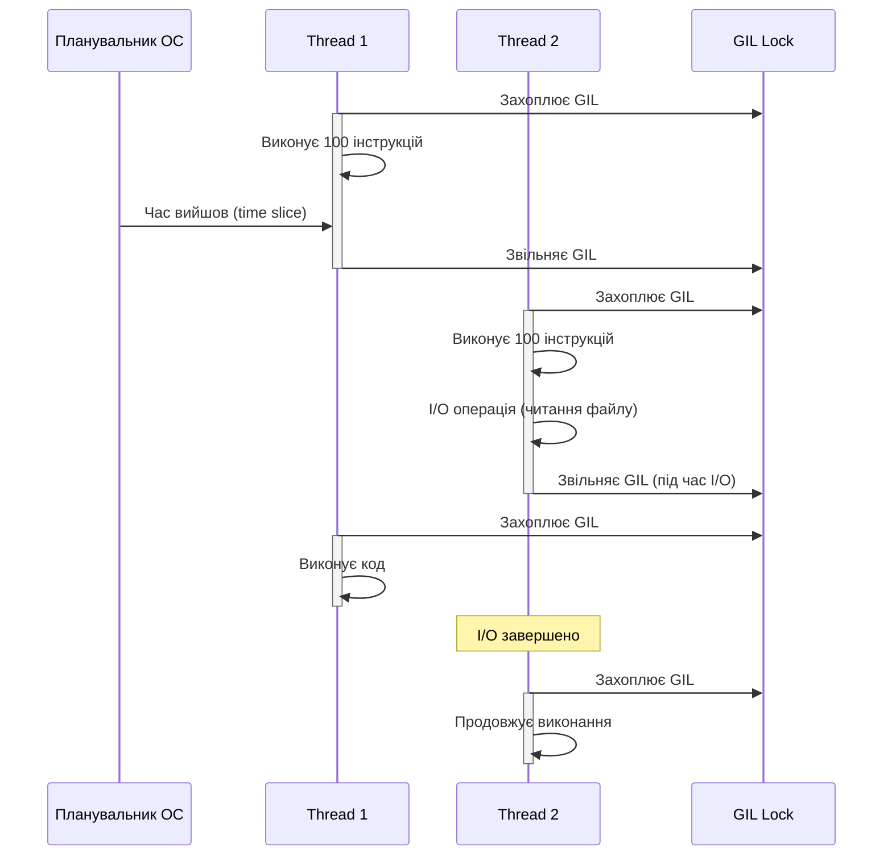

---

## Global Interpreter Lock (GIL)

### Що таке GIL?

**Global Interpreter Lock (GIL)** - це mutex (блокування), який захищає доступ до об'єктів Python, запобігаючи одночасному виконанню Python байт-коду кількома потоками.

**Простими словами:** Тільки один потік може виконувати Python код у будь-який момент часу, навіть на багатоядерному процесорі.


### Навіщо потрібен GIL?

GIL існує з кількох критично важливих причин:

#### 1. **Управління пам'яттю в CPython**

CPython (стандартна реалізація Python) використовує підрахунок посилань (reference counting) для управління пам'яттю. Це означає, що кожен об'єкт Python зберігає лічильник - скільки змінних посилаються на нього.

**Як працює підрахунок посилань:**

```python
import sys

# Створюємо об'єкт
x = []  # refcount = 1 (тільки змінна x)
print(sys.getrefcount(x))  # 2 (x + тимчасове посилання в getrefcount)

y = x  # Ще одне посилання на той самий об'єкт
print(sys.getrefcount(x))  # 3 (x, y, + getrefcount)

z = x  # Ще одне
print(sys.getrefcount(x))  # 4 (x, y, z + getrefcount)

del y  # Зменшуємо лічильник
print(sys.getrefcount(x))  # 3 (залишились x, z + getrefcount)

del z
print(sys.getrefcount(x))  # 2 (залишився тільки x + getrefcount)

# Коли refcount стає 0, Python автоматично видаляє об'єкт
```

**Що відбувається під капотом:**
- Кожен об'єкт має поле `ob_refcnt` (лічильник посилань)
- При створенні посилання: `ob_refcnt++`
- При видаленні посилання: `ob_refcnt--`
- Коли `ob_refcnt == 0`: об'єкт видаляється, пам'ять звільняється

**Проблема без GIL - RACE CONDITION:**

Уявімо, що GIL немає, і два потоки одночасно працюють з лічильником:

```python
# Початковий стан: x = [1, 2, 3], refcount = 1

# === Потік 1 === виконує: y = x
# Крок 1: Читає refcount = 1
# Крок 2: Обчислює: 1 + 1 = 2
# <-- Переривання, переключення на Потік 2 -->

# === Потік 2 === виконує: z = x
# Крок 1: Читає refcount = 1 (!)  <- Проблема! Має бути 2
# Крок 2: Обчислює: 1 + 1 = 2
# Крок 3: Записує refcount = 2

# === Повернення до Потік 1 ===
# Крок 3: Записує refcount = 2  <- Втратили одне посилання!

# Результат: refcount = 2, але насправді є 3 посилання (x, y, z)!
# Це катастрофа - об'єкт може бути видалений передчасно
```

**Що станеться при передчасному видаленні:**

```python
# Реальна ситуація (без GIL, гіпотетично):

x = [1, 2, 3]  # refcount = 1
y = x          # refcount має бути 2, але помилково = 1

# Потік 1: видаляє x
del x  # refcount стає 0 -> Python ВИДАЛЯЄ об'єкт!

# Потік 2: намагається використати y
print(y)  # SEGMENTATION FAULT! Пам'ять вже звільнена
```

**Як GIL розв'язує проблему:**

```python
# З GIL: тільки один потік може виконувати Python код одночасно

# Потік 1 захоплює GIL
y = x  # Атомарно: refcount 1 -> 2
# Потік 1 звільняє GIL

# Тепер Потік 2 захоплює GIL
z = x  # Атомарно: refcount 2 -> 3
# Потік 2 звільняє GIL

# Результат завжди правильний: refcount = 3
```

**Чому це так важливо:**
- CPython виконує мільйони операцій з лічильниками за секунду
- Кожна операція з об'єктом змінює refcount
- Без GIL треба було б блокувати КОЖЕН об'єкт окремо
- Це зробило б Python надзвичайно повільним (навіть в однопотоковому режимі)


#### 2. **Простота інтеграції C-бібліотек**

Python - це "клей" між швидкими C-бібліотеками. Більшість популярних бібліотек написані на C для швидкості, але НЕ всі з них потокобезпечні. GIL робить безпечним використання таких бібліотек.

**Приклад: NumPy**

```python
import numpy as np
import threading

# NumPy написано на C (для швидкості)
# Внутрішні структури даних NumPy не мають власних блокувань

def numpy_operation():
    # Без GIL ця операція могла б пошкодити внутрішній стан NumPy
    array = np.array([1, 2, 3, 4, 5])
    result = np.sum(array)  # C-код всередині
    squared = np.square(array)  # Ще більше C-коду
    return result

# Завдяки GIL: тільки один потік виконує NumPy код одночасно
threads = [threading.Thread(target=numpy_operation) for _ in range(10)]
for t in threads: t.start()
for t in threads: t.join()
# Все працює безпечно!
```

**Що відбувається під капотом:**

1. **Python викликає C-функцію**
   ```c
   // Всередині NumPy (спрощено):
   PyObject* np_sum(PyArrayObject* array) {
       // Тут ми в C-коді, без захисту
       double sum = 0;
       for (int i = 0; i < array->size; i++) {
           sum += array->data[i];  // Прямий доступ до пам'яті
       }
       return PyFloat_FromDouble(sum);
   }
   ```

2. **GIL захищає під час виконання**
   - Потік A захоплює GIL
   - Викликає `np_sum()` - C-код виконується
   - Потік B чекає на GIL (не може перервати C-код)
   - Потік A звільняє GIL після завершення
   - Тепер Потік B може захопити GIL

**Приклад без GIL (гіпотетична проблема):**

```python
# Уявімо, що GIL немає:

import numpy as np

shared_array = np.array([1, 2, 3, 4, 5])

def modify_array():
    # Потік 1: збільшує всі елементи
    for i in range(len(shared_array)):
        shared_array[i] += 1
        # <-- Переключення контексту може статися ТУТ

def read_array():
    # Потік 2: читає масив
    total = np.sum(shared_array)  # Може прочитати частково оновлений масив!
    return total

# Без GIL: непередбачувані результати
```

**Чому більшість C-бібліотек не потокобезпечні:**

1. **Складність і продуктивність**
   - Додавання блокувань уповільнює код
   - Складно правильно реалізувати для всіх функцій
   - Багато бібліотек створювалися для однопотокового використання

2. **Приклади непотокобезпечних C-функцій:**
   ```c
   // Стандартна бібліотека C
   char* strtok(char* str, const char* delim);  // НЕ потокобезпечна!
   struct tm* localtime(const time_t* timer);   // НЕ потокобезпечна!
   
   // Використовують статичні буфери, які може пошкодити інший потік
   ```

**Як GIL допомагає:**

```python
import ctypes
import threading

# Припустимо, ми використовуємо C-бібліотеку через ctypes
libc = ctypes.CDLL('libc.so.6')

def call_c_function():
    # GIL автоматично захищає виклик
    result = libc.some_unsafe_function()  # Безпечно завдяки GIL
    return result

# Багато потоків можуть викликати C-код без проблем
threads = [threading.Thread(target=call_c_function) for _ in range(100)]
```

**Важливо:** Деякі C-бібліотеки ЯВНО звільняють GIL для паралелізму:

```python
# NumPy, при роботі з великими масивами, ЗВІЛЬНЯЄ GIL:
import numpy as np

# Для великих операцій NumPy звільняє GIL всередині C-коду
big_array = np.random.rand(10_000_000)
result = np.sum(big_array)  # GIL звільняється всередині np.sum!

# Це дозволяє іншим потокам виконувати Python код
# поки NumPy рахує суму в C
```

**Підсумок:**
- GIL дозволяє безпечно використовувати тисячі C-розширень без їх модифікації
- Без GIL довелося б переписати величезну кількість коду
- Це одна з причин, чому Python став таким популярним - легка інтеграція з C

#### 3. **Продуктивність однопотокових програм**

Парадоксально, але GIL робить однопотокові програми ШВИДШИМИ. Це здається дивним, але давайте розберемося чому.

**Що GIL дає однопотоковим програмам:**

GIL - це ОДИН глобальний mutex. Альтернатива - мати окреме блокування для КОЖНОГО об'єкта. Подивімося на різницю:

**З GIL (поточна реалізація):**
```python
# Кожна операція з об'єктом - проста і швидка

x = [1, 2, 3]
# Створення списку:
# 1. Виділити пам'ять
# 2. Встановити refcount = 1
# 3. Ініціалізувати елементи
# НІЯКИХ блокувань!

y = x
# Збільшення refcount:
# 1. ob_refcnt++
# Одна проста операція!

x.append(4)
# Додавання елемента:
# 1. Перевірити розмір
# 2. Додати елемент
# 3. Оновити довжину
# Без блокувань - GIL вже захищає
```

**Без GIL (гіпотетична реалізація):**
```python
# Кожна операція потребує блокувань

x = [1, 2, 3]
# Створення списку:
# 1. Виділити пам'ять
# 2. LOCK(x) - захопити блокування об'єкта
# 3. Встановити refcount = 1
# 4. Ініціалізувати елементи
# 5. UNLOCK(x) - звільнити блокування
# Набагато складніше!

y = x
# Збільшення refcount:
# 1. LOCK(x) - захопити блокування
# 2. ob_refcnt++
# 3. UNLOCK(x) - звільнити блокування
# Вже 3 операції замість 1!

x.append(4)
# Додавання елемента:
# 1. LOCK(x) - захопити блокування
# 2. Перевірити розмір
# 3. LOCK(internal_buffer) - блокування внутрішнього масиву
# 4. Додати елемент
# 5. UNLOCK(internal_buffer)
# 6. Оновити довжину
# 7. UNLOCK(x)
# Велика кількість операцій блокування!
```

**Конкретний приклад - словник:**

```python
# З GIL:
data = {'a': 1, 'b': 2}
data['c'] = 3  # Просто встановити значення

# Без GIL (треба було б):
# 1. LOCK(data) - блокування словника
# 2. LOCK(hash_table) - блокування хеш-таблиці
# 3. Обчислити хеш ключа 'c'
# 4. LOCK(hash_bucket) - блокування конкретного bucket
# 5. Вставити пару ключ-значення
# 6. UNLOCK(hash_bucket)
# 7. Оновити розмір словника
# 8. UNLOCK(hash_table)
# 9. UNLOCK(data)
# Десятки додаткових операцій!
```

**Чому блокування об'єктів дороге:**

1. **Накладні витрати на блокування:**
   ```python
   # Кожне блокування - це системний виклик
   import threading
   import time
   
   lock = threading.Lock()
   
   # Вимірюємо час простого блокування
   start = time.perf_counter()
   for _ in range(1_000_000):
       lock.acquire()
       # Нічого не робимо
       lock.release()
   duration = time.perf_counter() - start
   print(f"1M блокувань: {duration:.2f}s")  # ~0.5-1 секунда
   
   # Без блокувань - майже миттєво
   start = time.perf_counter()
   for _ in range(1_000_000):
       x = 1  # Проста операція
   duration = time.perf_counter() - start
   print(f"1M присвоєнь: {duration:.2f}s")  # ~0.02 секунди
   ```

2. **Пам'ять на блокування:**
   - Кожен lock - це додаткові 16-24 байти
   - Для мільйонів об'єктів це гігабайти пам'яті!
   - Приклад: список з 10 млн елементів потребував би 160+ MB тільки на блокування

3. **Складність коду:**
   - Треба правильно упорядкувати блокування (щоб уникнути deadlock)
   - Кожна функція стає складнішою
   - Більше шансів на помилки

**Бенчмарк: GIL vs Fine-grained locks**

```python
# Симуляція: порівняємо швидкість з і без додаткових блокувань

import threading
import time

# Версія 1: З GIL (без додаткових блокувань)
def with_gil():
    data = []
    for i in range(100_000):
        data.append(i)
        data[i // 2] = i * 2  # Читання/запис
        len(data)  # Перевірка розміру
    return data

# Версія 2: Симуляція без GIL (з блокуваннями кожної операції)
def without_gil_simulation():
    data = []
    lock = threading.Lock()
    for i in range(100_000):
        with lock:
            data.append(i)
        with lock:
            data[i // 2] = i * 2
        with lock:
            len(data)
    return data

# Тестування
start = time.perf_counter()
with_gil()
time_with_gil = time.perf_counter() - start

start = time.perf_counter()
without_gil_simulation()
time_without_gil = time.perf_counter() - start

print(f"З GIL: {time_with_gil:.3f}s")
print(f"Без GIL (симуляція): {time_without_gil:.3f}s")
print(f"Різниця: {time_without_gil / time_with_gil:.1f}x повільніше")
# Результат: ~3-5x повільніше без GIL!
```

**Висновок:**
- GIL дозволяє Python бути швидким у однопотоковому режимі
- Без нього довелося б платити за блокування навіть якщо потоки не використовуються
- Це trade-off: простота і швидкість в однопоточному режимі vs обмеження в багатопоточному

### Візуалізація проблеми GIL

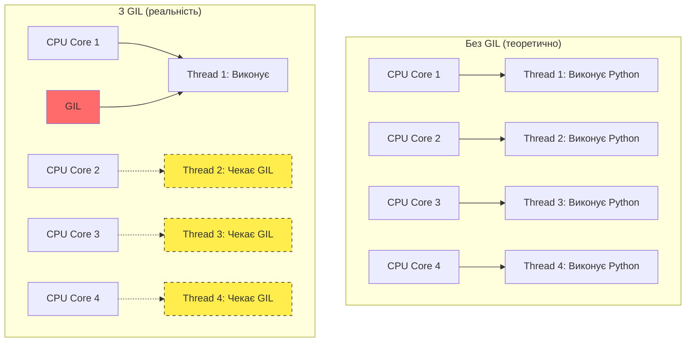


### Коли GIL звільняється?

GIL автоматично звільняється в наступних випадках:

1. **I/O операції** (читання/запис файлів, мережеві запити)
2. **Виклики C-функцій**, які явно звільняють GIL
3. **Після N інструкцій** (за замовчуванням 100 байт-кодів)
4. **time.sleep()**

```python
import threading
import time
import requests

def cpu_bound_task():
    """Тримає GIL весь час"""
    total = 0
    for i in range(10_000_000):
        total += i
    return total

def io_bound_task():
    """Звільняє GIL під час I/O"""
    response = requests.get('https://api.github.com')
    return response.status_code

# CPU-bound: потоки не допомагають
start = time.time()
threads = [threading.Thread(target=cpu_bound_task) for _ in range(4)]
for t in threads: t.start()
for t in threads: t.join()
print(f"CPU-bound з потоками: {time.time() - start:.2f}s")

# I/O-bound: потоки значно прискорюють
start = time.time()
threads = [threading.Thread(target=io_bound_task) for _ in range(4)]
for t in threads: t.start()
for t in threads: t.join()
print(f"I/O-bound з потоками: {time.time() - start:.2f}s")
```


### Експеримент: вплив GIL на продуктивність

```python
import threading
import multiprocessing
import time

def fibonacci(n):
    """CPU-intensive обчислення"""
    if n <= 1:
        return n
    return fibonacci(n-1) + fibonacci(n-2)

def benchmark_sequential():
    """Послідовне виконання"""
    start = time.time()
    results = [fibonacci(35) for _ in range(4)]
    return time.time() - start

def benchmark_threading():
    """З потоками (обмежено GIL)"""
    start = time.time()
    threads = [threading.Thread(target=fibonacci, args=(35,)) for _ in range(4)]
    for t in threads: t.start()
    for t in threads: t.join()
    return time.time() - start

def benchmark_multiprocessing():
    """З процесами (без GIL)"""
    start = time.time()
    with multiprocessing.Pool(4) as pool:
        pool.map(fibonacci, [35] * 4)
    return time.time() - start

if __name__ == "__main__":
    print(f"Послідовно:        {benchmark_sequential():.2f}s")
    print(f"Threading (GIL):   {benchmark_threading():.2f}s")  # ~така ж швидкість
    print(f"Multiprocessing:   {benchmark_multiprocessing():.2f}s")  # ~в 4 рази швидше
```

**Результати на 4-ядерному процесорі:**
- Послідовно: 12.5s
- Threading: 12.8s (навіть трохи повільніше!)
- Multiprocessing: 3.4s (справжній паралелізм)


---

## Чому Python повільніший за інші мови в багатопотоковості

### Порівняння з іншими мовами

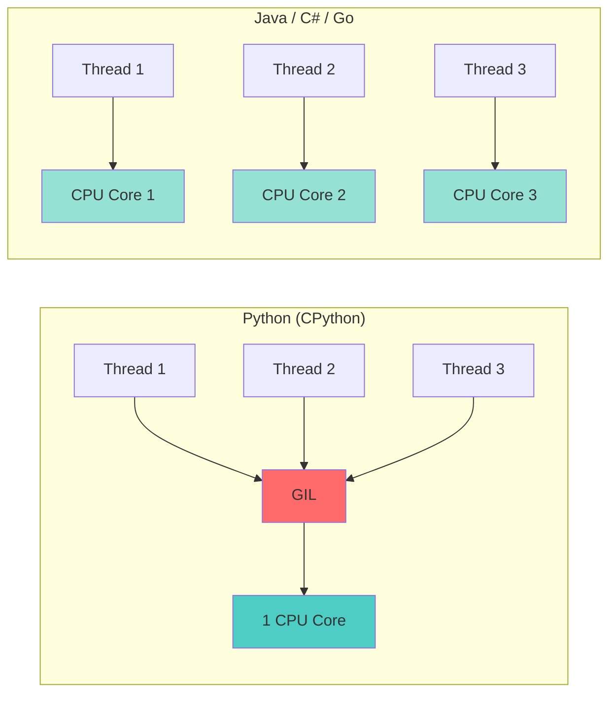

### Детальне порівняння

| Особливість | Python (CPython) | Java | Go | C++ |
|-------------|------------------|------|-------|-----|
| **GIL** | ✅ Є | ❌ Немає | ❌ Немає | ❌ Немає |
| **Справжня багатопотоковість** | ❌ Тільки I/O | ✅ Так | ✅ Так | ✅ Так |
| **Управління пам'яттю** | Reference counting | Garbage collector | Garbage collector | Manual/Smart pointers |
| **Швидкість створення потоку** | Швидко | Повільніше | Дуже швидко (goroutines) | Швидко |
| **Накладні витрати GIL** | Високі для CPU | - | - | - |


### Чому інші мови не мають GIL?

#### Java
```java
// Java використовує складний Garbage Collector
// Кожен об'єкт має заголовок з метаданими для GC
// Синхронізація на рівні об'єктів через synchronized

public class Counter {
    private int count = 0;
    
    public synchronized void increment() {
        count++;  // Атомарна операція завдяки synchronized
    }
}
```

#### Go
```go
// Go використовує goroutines (легковагові потоки)
// Конкурентна збірка сміття
// Канали для безпечної комунікації

func worker(ch chan int) {
    for i := 0; i < 1000; i++ {
        ch <- i  // Безпечна передача через канал
    }
}

func main() {
    ch := make(chan int)
    go worker(ch)  // Goroutine без GIL!
    go worker(ch)
}
```


#### C++
```cpp
// C++ дає повний контроль програмісту
// Ручне управління пам'яттю або smart pointers
// std::mutex для синхронізації

#include <thread>
#include <mutex>

std::mutex mtx;
int counter = 0;

void increment() {
    std::lock_guard<std::mutex> lock(mtx);
    counter++;  // Захищено mutex
}

int main() {
    std::thread t1(increment);
    std::thread t2(increment);
    // Справжній паралелізм без GIL!
}
```

### Основні причини повільності Python

1. **GIL обмежує паралелізм CPU**
   - Тільки один потік виконує Python код
   - Не використовує всі ядра процесора

2. **Інтерпретована мова**
   - Байт-код виконується віртуальною машиною
   - Java JIT компілює часто виконуваний код
   - C++/Go компілюються в нативний машинний код

3. **Динамічна типізація**
   - Перевірка типів у runtime
   - Додаткові операції при кожній дії

4. **Reference counting overhead**
   - Кожна операція змінює лічильники посилань
   - Додаткові атомарні операції з GIL


### Бенчмарк: Python vs інші мови

```python
# Python - обчислення 10M чисел Фібоначчі
import time
import threading

def fib(n):
    if n <= 1: return n
    return fib(n-1) + fib(n-2)

start = time.time()
threads = [threading.Thread(target=fib, args=(30,)) for _ in range(4)]
for t in threads: t.start()
for t in threads: t.join()
print(f"Python: {time.time() - start:.2f}s")  # ~5.2s
```

**Порівняльні результати:**
- Python (threads): 5.2s
- Python (processes): 1.4s
- Java (threads): 1.1s
- Go (goroutines): 0.9s
- C++ (threads): 0.7s

---

## Коли використовувати потоки, а коли процеси

### Дерево рішень

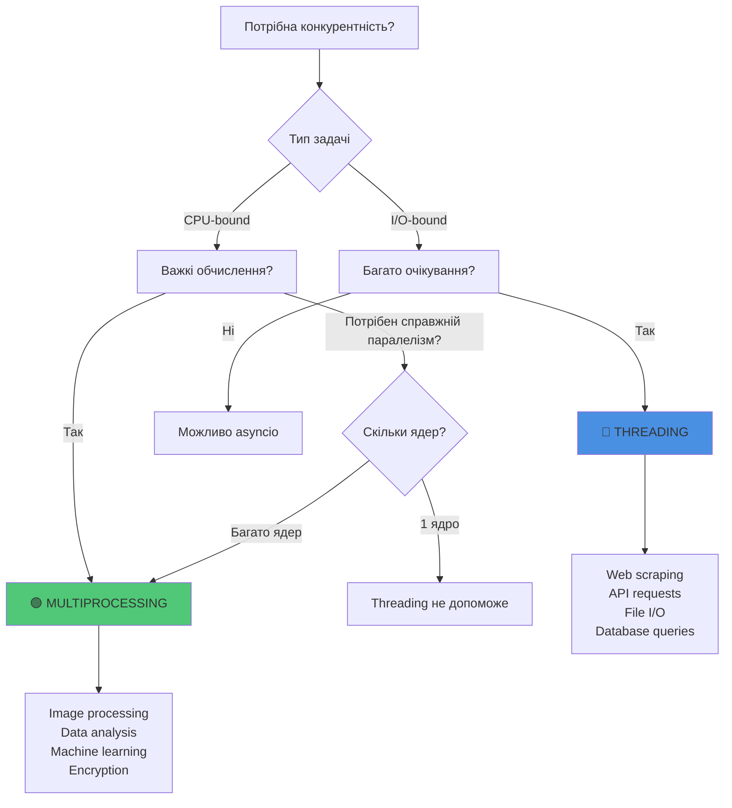


### Використовуйте Threading для:

✅ **I/O-bound операцій**
- Мережеві запити (HTTP, API)
- Читання/запис файлів
- Робота з базами даних
- Web scraping

```python
import threading
import requests

def download_page(url):
    response = requests.get(url)
    print(f"Downloaded {len(response.content)} bytes from {url}")

urls = ['https://example.com', 'https://python.org', 'https://github.com']
threads = [threading.Thread(target=download_page, args=(url,)) for url in urls]

for t in threads: t.start()
for t in threads: t.join()
```

✅ **Коли потрібна спільна пам'ять**
- Спільний кеш
- Координація між задачами
- Швидка комунікація

✅ **Багато коротких задач**
- Низькі накладні витрати на створення
- Швидкий старт

### Використовуйте Multiprocessing для:

✅ **CPU-bound операцій**
- Обчислення
- Обробка зображень
- Машинне навчання
- Криптографія
- Стиснення даних


```python
import multiprocessing
from PIL import Image
import numpy as np

def process_image(image_path):
    """CPU-intensive операція"""
    img = Image.open(image_path)
    data = np.array(img)
    # Складна обробка...
    grayscale = data.mean(axis=2)
    return grayscale

if __name__ == "__main__":
    images = ['img1.jpg', 'img2.jpg', 'img3.jpg', 'img4.jpg']
    
    with multiprocessing.Pool(4) as pool:
        results = pool.map(process_image, images)
```

✅ **Ізоляція**
- Незалежні задачі
- Потреба в стабільності (crash isolation)

✅ **Обхід GIL**
- Потреба в справжньому паралелізмі
- Використання всіх ядер CPU

### Практичні приклади

#### Приклад 1: Web Scraping (Threading)

```python
import threading
import requests
from bs4 import BeautifulSoup
from queue import Queue
import time

class WebScraper:
    def __init__(self, num_threads=5):
        self.queue = Queue()
        self.results = []
        self.lock = threading.Lock()
        self.num_threads = num_threads
    
    def worker(self):
        while True:
            url = self.queue.get()
            if url is None:
                break
            
            try:
                response = requests.get(url, timeout=5)
                soup = BeautifulSoup(response.content, 'html.parser')
                title = soup.find('title')
                
                with self.lock:
                    self.results.append({
                        'url': url,
                        'title': title.text if title else 'No title'
                    })
            except Exception as e:
                print(f"Error scraping {url}: {e}")
            finally:
                self.queue.task_done()
    
    def scrape(self, urls):
        # Створюємо потоки
        threads = []
        for _ in range(self.num_threads):
            t = threading.Thread(target=self.worker)
            t.start()
            threads.append(t)
        
        # Додаємо URL в чергу
        for url in urls:
            self.queue.put(url)
        
        # Чекаємо завершення
        self.queue.join()
        
        # Зупиняємо потоки
        for _ in range(self.num_threads):
            self.queue.put(None)
        for t in threads:
            t.join()
        
        return self.results

# Використання
urls = [f'https://example.com/page{i}' for i in range(50)]
scraper = WebScraper(num_threads=10)
results = scraper.scrape(urls)
```


#### Приклад 2: Обробка зображень (Multiprocessing)

```python
import multiprocessing
from PIL import Image, ImageFilter
import os

def apply_filters(image_path):
    """CPU-intensive обробка зображення"""
    try:
        img = Image.open(image_path)
        
        # Застосовуємо різні фільтри
        blurred = img.filter(ImageFilter.GaussianBlur(5))
        sharpened = img.filter(ImageFilter.SHARPEN)
        edges = img.filter(ImageFilter.FIND_EDGES)
        
        # Зберігаємо результати
        base_name = os.path.basename(image_path)
        name, ext = os.path.splitext(base_name)
        
        blurred.save(f'{name}_blurred{ext}')
        sharpened.save(f'{name}_sharpened{ext}')
        edges.save(f'{name}_edges{ext}')
        
        return f"Processed {image_path}"
    except Exception as e:
        return f"Error processing {image_path}: {e}"

if __name__ == "__main__":
    # Список зображень для обробки
    images = ['photo1.jpg', 'photo2.jpg', 'photo3.jpg', 'photo4.jpg']
    
    # Використовуємо всі доступні ядра
    num_processes = multiprocessing.cpu_count()
    
    with multiprocessing.Pool(num_processes) as pool:
        results = pool.map(apply_filters, images)
    
    for result in results:
        print(result)
```

---

## Типові проблеми та їх рішення

### 1. Race Condition (Перегони)

**Проблема:** Два потоки одночасно змінюють спільну змінну

```python
import threading

counter = 0

def increment():
    global counter
    for _ in range(100000):
        counter += 1  # НЕ атомарна операція!

threads = [threading.Thread(target=increment) for _ in range(2)]
for t in threads: t.start()
for t in threads: t.join()

print(counter)  # Очікували 200000, отримали ~150000
```

**Чому це відбувається:**

```python
# counter += 1 насправді це:
# 1. LOAD counter (прочитати значення)
# 2. ADD 1 (додати 1)
# 3. STORE counter (записати назад)

# Потік 1: LOAD counter (0)
# Потік 2: LOAD counter (0)  <- Обидва прочитали 0!
# Потік 1: ADD 1 -> 1
# Потік 2: ADD 1 -> 1
# Потік 1: STORE (1)
# Потік 2: STORE (1)  <- Втратили одну операцію!
```


**Рішення 1: Lock**

```python
import threading

counter = 0
lock = threading.Lock()

def increment_safe():
    global counter
    for _ in range(100000):
        with lock:  # Або lock.acquire() ... lock.release()
            counter += 1

threads = [threading.Thread(target=increment_safe) for _ in range(2)]
for t in threads: t.start()
for t in threads: t.join()

print(counter)  # Завжди 200000!
```

**Рішення 2: Atomic операції**

```python
import threading
from collections import deque

# deque.append() є потокобезпечним в CPython
safe_list = deque()

def add_items():
    for i in range(100000):
        safe_list.append(i)

threads = [threading.Thread(target=add_items) for _ in range(2)]
for t in threads: t.start()
for t in threads: t.join()

print(len(safe_list))  # Завжди 200000
```

### 2. Deadlock (Взаємне блокування)

**Проблема:** Два потоки чекають один на одного

```python
import threading

lock1 = threading.Lock()
lock2 = threading.Lock()

def thread1():
    with lock1:
        print("Thread 1: захопив lock1")
        time.sleep(0.1)
        with lock2:  # Чекає lock2, але його тримає thread2
            print("Thread 1: захопив lock2")

def thread2():
    with lock2:
        print("Thread 2: захопив lock2")
        time.sleep(0.1)
        with lock1:  # Чекає lock1, але його тримає thread1
            print("Thread 2: захопив lock1")

t1 = threading.Thread(target=thread1)
t2 = threading.Thread(target=thread2)
t1.start()
t2.start()
# Програма зависне назавжди!
```


**Візуалізація Deadlock:**

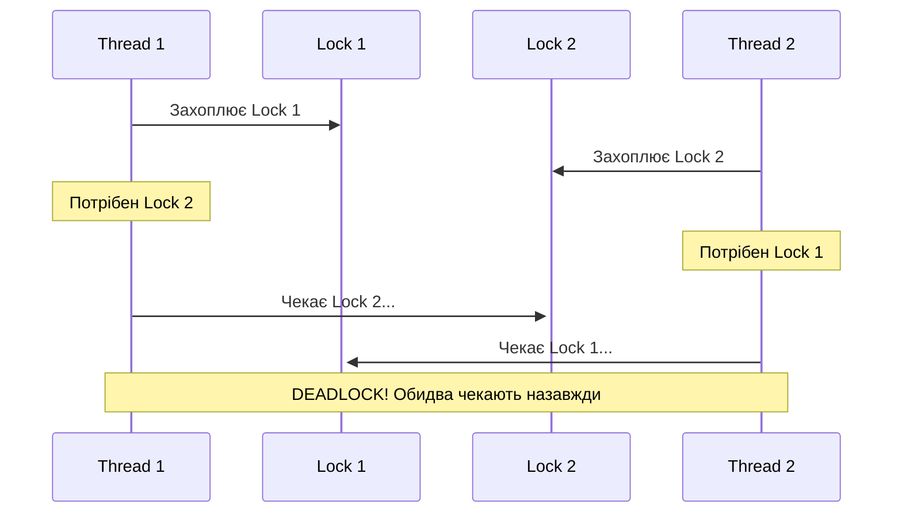

**Рішення 1: Порядок захоплення локів**

```python
import threading

lock1 = threading.Lock()
lock2 = threading.Lock()

def safe_thread1():
    with lock1:  # Завжди спочатку lock1
        with lock2:  # Потім lock2
            print("Thread 1: обидва локи")

def safe_thread2():
    with lock1:  # Такий самий порядок!
        with lock2:
            print("Thread 2: обидва локи")
```

**Рішення 2: Timeout**

```python
import threading
import time

def thread_with_timeout():
    while True:
        acquired1 = lock1.acquire(timeout=1)
        if not acquired1:
            continue
        
        try:
            acquired2 = lock2.acquire(timeout=1)
            if not acquired2:
                lock1.release()
                continue
            
            try:
                # Робота з обома локами
                print("Got both locks!")
                break
            finally:
                lock2.release()
        finally:
            lock1.release()
```


### 3. Memory Leaks в потоках

**Проблема:** Потоки не завершуються і утримують ресурси

```python
import threading
import time

def leaky_worker():
    large_data = [0] * 10_000_000  # 80 MB
    while True:  # Нескінченний цикл!
        time.sleep(1)

# Створюємо 10 потоків
for i in range(10):
    t = threading.Thread(target=leaky_worker)
    t.start()
    # Не викликаємо t.join() - потоки працюють у фоні
    # Не зберігаємо посилання на потік

# Потоки ніколи не завершаться, пам'ять не звільниться!
# Використання пам'яті: 800 MB+
```

**Рішення: Daemon потоки + правильне завершення**

```python
import threading
import time

shutdown_event = threading.Event()

def clean_worker():
    large_data = [0] * 10_000_000
    while not shutdown_event.is_set():
        time.sleep(1)
    print("Worker shutdown cleanly")

threads = []
for i in range(10):
    t = threading.Thread(target=clean_worker)
    t.daemon = True  # Потік завершиться при виході з програми
    t.start()
    threads.append(t)

# Коли треба завершити
shutdown_event.set()
for t in threads:
    t.join(timeout=5)
```

### 4. GIL Thrashing (Конфлікт за GIL)

**Проблема:** Занадто багато потоків конкурують за GIL

```python
import threading

def cpu_intensive():
    total = 0
    for i in range(10_000_000):
        total += i
    return total

# 100 потоків конкурують за GIL - катастрофічно повільно!
threads = [threading.Thread(target=cpu_intensive) for _ in range(100)]
for t in threads: t.start()
for t in threads: t.join()
```


**Візуалізація GIL Thrashing:**

```mermaid
gantt
    title GIL Thrashing: 4 потоки змагаються за GIL
    dateFormat X
    axisFormat %S
    
    section Thread 1
    Виконання     :active, 0, 1
    Чекає GIL     :crit, 1, 3
    Виконання     :active, 3, 1
    Чекає GIL     :crit, 4, 2
    
    section Thread 2
    Чекає GIL     :crit, 0, 1
    Виконання     :active, 1, 1
    Чекає GIL     :crit, 2, 2
    Виконання     :active, 4, 1
    
    section Thread 3
    Чекає GIL     :crit, 0, 2
    Виконання     :active, 2, 1
    Чекає GIL     :crit, 3, 3
    
    section Thread 4
    Чекає GIL     :crit, 0, 4
    Виконання     :active, 4, 2
```

**Рішення: ThreadPoolExecutor з обмеженою кількістю потоків**

```python
from concurrent.futures import ThreadPoolExecutor
import multiprocessing

# Оптимальна кількість потоків
num_workers = min(32, (multiprocessing.cpu_count() or 1) + 4)

with ThreadPoolExecutor(max_workers=num_workers) as executor:
    futures = [executor.submit(cpu_intensive) for _ in range(100)]
    results = [f.result() for f in futures]
```

---

## Альтернативи та майбутнє

### 1. AsyncIO (для I/O-bound)

AsyncIO - це альтернатива потокам для I/O операцій без накладних витрат GIL:

```python
import asyncio
import aiohttp

async def fetch_url(session, url):
    async with session.get(url) as response:
        return await response.text()

async def main():
    urls = [f'https://example.com/page{i}' for i in range(100)]
    
    async with aiohttp.ClientSession() as session:
        tasks = [fetch_url(session, url) for url in urls]
        results = await asyncio.gather(*tasks)
    
    return results

# Один потік, але тисячі конкурентних запитів!
asyncio.run(main())
```


**Порівняння Threading vs AsyncIO:**

| Характеристика | Threading | AsyncIO |
|----------------|-----------|---------|
| **Модель** | Preemptive multitasking | Cooperative multitasking |
| **Переключення контексту** | ОС (автоматично) | Програміст (await) |
| **Накладні витрати** | Високі (~1-2 MB на потік) | Низькі (~50 KB на корутину) |
| **Масштабованість** | ~1000 потоків | ~100000 корутин |
| **Складність** | Проста | Складніша (async/await) |
| **Use case** | I/O з блокуючими бібліотеками | I/O з async бібліотеками |

### 2. Python 3.13+ - PEP 703 (No-GIL Python)

У Python 3.13 (очікується 2024-2025) планується **опціональне відключення GIL**!

```python
# Python 3.13+ (експериментально)
# Запуск без GIL:
# python -X gil=0 script.py

import threading

def cpu_bound():
    total = sum(i*i for i in range(10_000_000))
    return total

# З вимкненим GIL - справжній паралелізм!
threads = [threading.Thread(target=cpu_bound) for _ in range(4)]
for t in threads: t.start()
for t in threads: t.join()
```

**Що зміниться:**

✅ Справжня багатопотоковість для CPU-bound задач
✅ Використання всіх ядер CPU
⚠️ Потенційні проблеми сумісності з C-розширеннями
⚠️ Можлива повільніша однопотокова продуктивність


### 3. Альтернативні реалізації Python

#### PyPy
```python
# PyPy - JIT компілятор без GIL для деяких операцій
# Швидше у 3-5 разів для CPU-bound коду
# pypy3 script.py
```

#### Jython / IronPython
```python
# Jython - Python на JVM (без GIL!)
# IronPython - Python на .NET (без GIL!)
# Але застарілі та не підтримують Python 3.9+
```

### 4. Гібридний підхід

Найкраща стратегія - комбінувати різні підходи:

```python
import asyncio
import multiprocessing
from concurrent.futures import ProcessPoolExecutor
import aiohttp

async def fetch_and_process(url):
    """Гібрид: AsyncIO для I/O + Processes для CPU"""
    
    # I/O через AsyncIO
    async with aiohttp.ClientSession() as session:
        async with session.get(url) as response:
            data = await response.json()
    
    # CPU-intensive через ProcessPool
    with ProcessPoolExecutor() as executor:
        result = await asyncio.get_event_loop().run_in_executor(
            executor, process_data, data
        )
    
    return result

def process_data(data):
    """CPU-intensive обробка в окремому процесі"""
    # Важкі обчислення...
    return processed_result

async def main():
    urls = ['https://api.example.com/data1', 'https://api.example.com/data2']
    results = await asyncio.gather(*[fetch_and_process(url) for url in urls])

asyncio.run(main())
```


---

## Підсумкова таблиця рішень

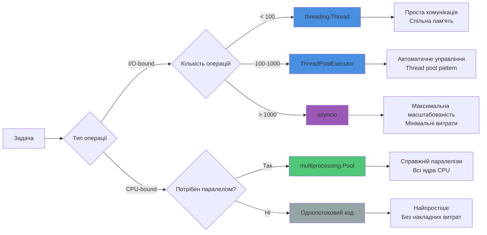

## Найкращі практики

### ✅ DO (Робіть так):

1. **Використовуйте context managers**
```python
with lock:
    # Критична секція
    shared_data.append(item)
# Lock автоматично звільниться
```

2. **Обмежуйте кількість потоків**
```python
from concurrent.futures import ThreadPoolExecutor

# Не більше ніж потрібно
max_workers = min(32, (os.cpu_count() or 1) + 4)
with ThreadPoolExecutor(max_workers=max_workers) as executor:
    results = executor.map(func, items)
```

3. **Використовуйте Queue для комунікації**
```python
from queue import Queue

queue = Queue()
# Потокобезпечна комунікація
queue.put(item)
item = queue.get()
```


4. **Встановлюйте timeout**
```python
thread.join(timeout=5)
if thread.is_alive():
    print("Thread didn't finish in time")
```

5. **Логуйте помилки в потоках**
```python
import logging
import threading

logging.basicConfig(level=logging.INFO)

def worker():
    try:
        # Робота...
        pass
    except Exception as e:
        logging.error(f"Error in thread {threading.current_thread().name}: {e}")
```

### ❌ DON'T (Не робіть так):

1. **Не використовуйте глобальні змінні без Lock**
```python
# ❌ ПОГАНО
counter = 0
def increment():
    global counter
    counter += 1  # Race condition!
```

2. **Не створюйте занадто багато потоків**
```python
# ❌ ПОГАНО - 10000 потоків!
for i in range(10000):
    threading.Thread(target=work).start()

# ✅ ДОБРЕ - обмежений pool
with ThreadPoolExecutor(max_workers=50) as executor:
    executor.map(work, range(10000))
```

3. **Не ігноруйте daemon threads**
```python
# ❌ ПОГАНО - daemon потоки можуть обірватися
t = threading.Thread(target=important_work)
t.daemon = True  # Завершиться при виході, навіть якщо не закінчив роботу!
t.start()

# ✅ ДОБРЕ
t.start()
t.join()  # Дочекаємося завершення
```


4. **Не блокуйте потоки надовго**
```python
# ❌ ПОГАНО
def worker():
    while True:
        time.sleep(10)  # Блокує потік
        check_queue()

# ✅ ДОБРЕ
def worker():
    while not shutdown_event.wait(timeout=10):  # Можна перервати
        check_queue()
```

5. **Не використовуйте threading для CPU-bound**
```python
# ❌ ПОГАНО для CPU-intensive
import threading
def heavy_computation():
    return sum(i*i for i in range(10_000_000))

threads = [threading.Thread(target=heavy_computation) for _ in range(4)]
# GIL обмежить продуктивність!

# ✅ ДОБРЕ - використовуйте multiprocessing
import multiprocessing
with multiprocessing.Pool(4) as pool:
    results = pool.map(heavy_computation, [None]*4)
```

---

## Debugging та профілювання

### Виявлення race conditions

```python
import threading
import time

# Інструмент для виявлення race conditions
class RaceDetector:
    def __init__(self):
        self.accesses = {}
        self.lock = threading.Lock()
    
    def track_access(self, variable_name, is_write=False):
        thread_id = threading.get_ident()
        
        with self.lock:
            if variable_name not in self.accesses:
                self.accesses[variable_name] = []
            
            self.accesses[variable_name].append({
                'thread': thread_id,
                'write': is_write,
                'time': time.time()
            })
    
    def analyze(self):
        for var, accesses in self.accesses.items():
            writes = [a for a in accesses if a['write']]
            if len(writes) > 1:
                print(f"⚠️ Potential race condition on '{var}'")
                print(f"   Multiple writes detected: {len(writes)}")

# Використання
detector = RaceDetector()

counter = 0

def worker():
    global counter
    detector.track_access('counter', is_write=True)
    counter += 1

threads = [threading.Thread(target=worker) for _ in range(10)]
for t in threads: t.start()
for t in threads: t.join()

detector.analyze()
```


### Профілювання потоків

```python
import threading
import cProfile
import pstats
from io import StringIO

def profile_thread(func):
    """Декоратор для профілювання потоків"""
    def wrapper(*args, **kwargs):
        profiler = cProfile.Profile()
        profiler.enable()
        
        result = func(*args, **kwargs)
        
        profiler.disable()
        
        # Виведення результатів
        s = StringIO()
        ps = pstats.Stats(profiler, stream=s)
        ps.sort_stats('cumulative')
        ps.print_stats(10)
        
        print(f"\n=== Profile for {func.__name__} ===")
        print(s.getvalue())
        
        return result
    return wrapper

@profile_thread
def worker_task():
    total = sum(i*i for i in range(1_000_000))
    return total

thread = threading.Thread(target=worker_task)
thread.start()
thread.join()
```

### Моніторинг активних потоків

```python
import threading
import time

def monitor_threads():
    """Моніторинг всіх активних потоків"""
    print(f"\n=== Active Threads: {threading.active_count()} ===")
    for thread in threading.enumerate():
        print(f"Thread: {thread.name}")
        print(f"  ID: {thread.ident}")
        print(f"  Daemon: {thread.daemon}")
        print(f"  Alive: {thread.is_alive()}")
        print()

# Запускаємо кілька потоків
def worker(name, duration):
    time.sleep(duration)

threads = [
    threading.Thread(target=worker, args=(f"Worker-{i}", i), name=f"Worker-{i}")
    for i in range(5)
]

for t in threads:
    t.start()

# Моніторинг
while threading.active_count() > 1:
    monitor_threads()
    time.sleep(2)
```


---

## Висновки

### Ключові поняття для запам'ятовування

1. **GIL** - це не баг, а архітектурне рішення
   - Захищає управління пам'яттю CPython
   - Спрощує інтеграцію C-бібліотек
   - Робить однопотокові програми швидшими

2. **Потоки vs Процеси**
   - Потоки: спільна пам'ять, I/O-bound, швидке створення
   - Процеси: ізольовані, CPU-bound, справжній паралелізм

3. **Threading найкращий для:**
   - Мережевих запитів
   - Роботи з файлами
   - Очікування I/O
   - Коли потрібна спільна пам'ять

4. **Multiprocessing найкращий для:**
   - Важких обчислень
   - Обробки даних
   - Коли потрібно використати всі ядра CPU

5. **Типові помилки:**
   - Race conditions → використовуйте Lock
   - Deadlocks → дотримуйтесь порядку захоплення
   - GIL thrashing → обмежуйте кількість потоків
   - Memory leaks → правильно завершуйте потоки

### Стратегія вибору підходу

```python
# Швидкий гайд для вибору
if task_type == "I/O":
    if num_operations < 100:
        use_threading()
    elif num_operations < 1000:
        use_threadpool()
    else:
        use_asyncio()
elif task_type == "CPU":
    if need_true_parallelism:
        use_multiprocessing()
    else:
        optimize_algorithm()  # Можливо, потоки не потрібні
```


### Корисні ресурси

- **Офіційна документація:** https://docs.python.org/3/library/threading.html
- **PEP 703 (No-GIL):** https://peps.python.org/pep-0703/
- **Understanding the Python GIL:** David Beazley's talk
- **Concurrent Programming in Python:** книга від O'Reilly

### Майбутнє багатопотоковості в Python

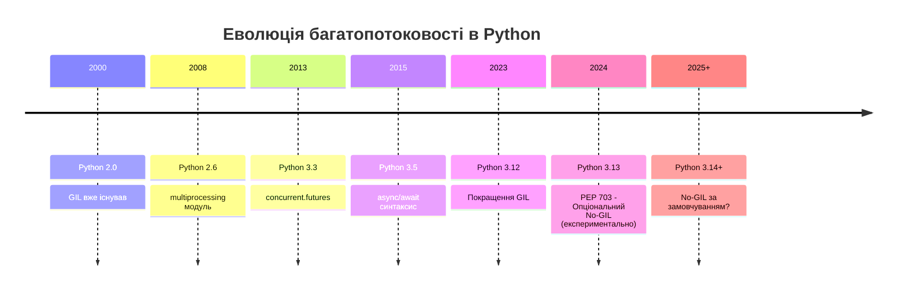

---

## Практичні завдання

### Завдання 1: Виправте race condition
```python
import threading

counter = 0

def increment():
    global counter
    for _ in range(100000):
        counter += 1

threads = [threading.Thread(target=increment) for _ in range(5)]
for t in threads: t.start()
for t in threads: t.join()

print(f"Counter: {counter}")  # Не завжди 500000!
# TODO: Виправте використовуючи Lock
```

### Завдання 2: Порівняйте продуктивність
```python
# TODO: Напишіть програму, яка порівнює:
# 1. Послідовне виконання
# 2. Threading
# 3. Multiprocessing
# 4. AsyncIO
# Для завантаження 50 веб-сторінок
```

### Завдання 3: Реалізуйте Worker Pool
```python
# TODO: Створіть власну реалізацію ThreadPool
# з Queue для задач і обробкою помилок
```

---

**Автор:** Дмитро Устинов  
**Дата:** 2026  
**Версія Python:** 3.12+

