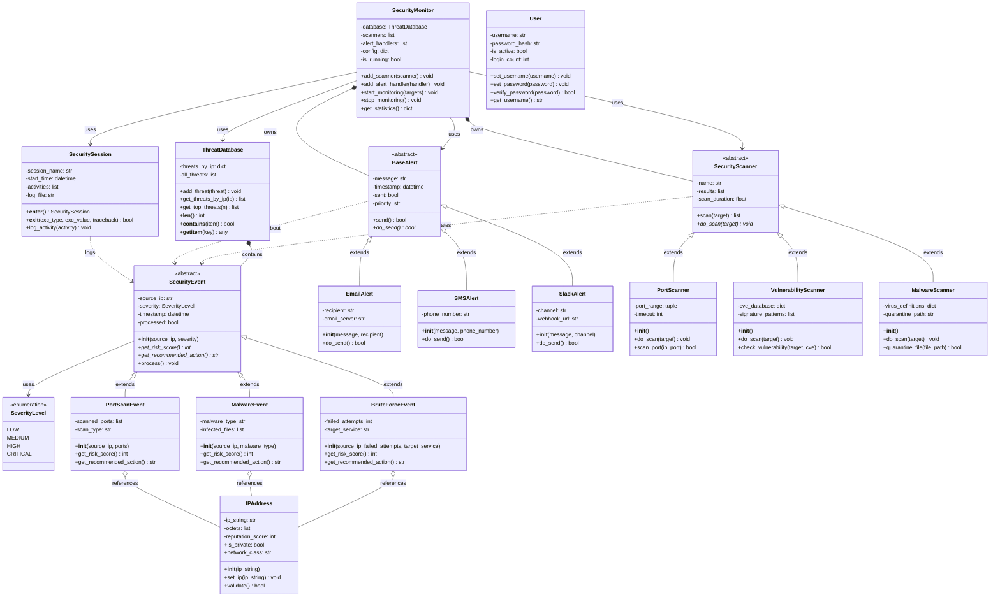
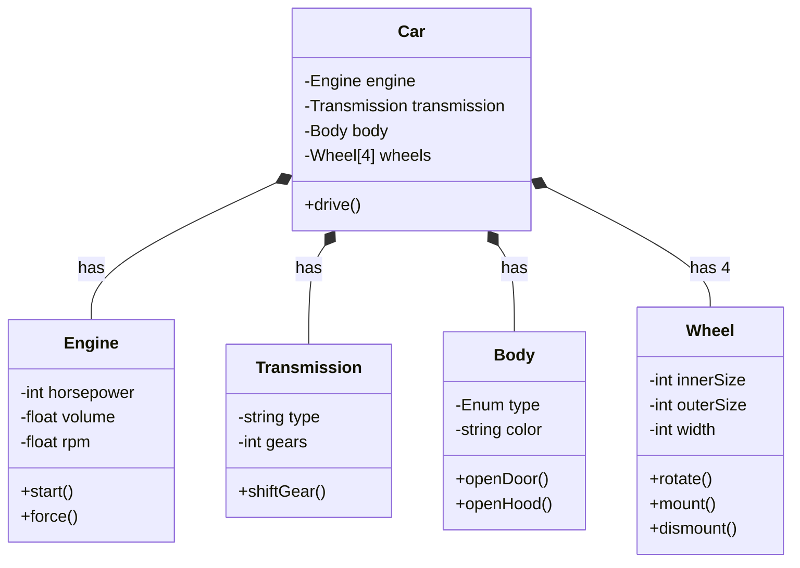

# 🔗 Взаємозв'язки об'єктів в системі безпеки

## UML діаграма класів системи моніторингу безпеки



## 📋 Пояснення типів взаємозв'язків

### **1. Наслідування (Inheritance) - "is-a"**
```python
# BruteForceEvent є різновидом SecurityEvent
class SecurityEvent:
    def __init__(self, source_ip, severity):
        self.source_ip = source_ip
        self.severity = severity

class BruteForceEvent(SecurityEvent):  # ← Наслідування
    def __init__(self, source_ip, failed_attempts):
        super().__init__(source_ip, SeverityLevel.HIGH)  # Викликає батьківський конструктор
        self.failed_attempts = failed_attempts
    
    # Перевизначає абстрактний метод батька
    def get_risk_score(self):
        return min(self.failed_attempts * 5, 100)
```

**Коли використовувати:**
- Коли клас є спеціалізованою версією іншого класу
- Коли потрібно розширити функціональність базового класу
- Для створення сімейства споріднених класів

### **2. Композиція (Composition) - "owns/contains"**
```python
# SecurityMonitor ВОЛОДІЄ ThreatDatabase
class SecurityMonitor:
    def __init__(self):
        # Створюємо власну базу даних - вона належить тільки цьому монітору
        self.database = ThreatDatabase()  # ← Композиція
        self.scanners = []               # ← Композиція
    
    def add_threat(self, threat):
        # Використовуємо нашу базу даних
        self.database.add_threat(threat)
```

**Характеристики:**
- Сильний зв'язок: якщо SecurityMonitor знищується, ThreatDatabase теж знищується
- Внутрішній об'єкт не може існувати без зовнішнього
- Зазвичай створюється всередині класу-власника

### **3. Агрегація (Aggregation) - "uses/references"**
```python
# BruteForceEvent використовує IPAddress, але не володіє нею
class BruteForceEvent(SecurityEvent):
    def __init__(self, ip_address, failed_attempts):
        self.ip_address = ip_address    # ← Агрегація
        self.failed_attempts = failed_attempts
    
    def is_from_private_network(self):
        # Використовуємо методи IP адреси
        return self.ip_address.is_private

# Використання
ip = IPAddress("192.168.1.100")  # IP існує незалежно
event = BruteForceEvent(ip, 15)  # Подія посилається на IP
del event  # IP продовжує існувати
```

**Характеристики:**
- Слабший зв'язок: об'єкти можуть існувати незалежно
- Зовнішній об'єкт може використовуватися багатьма іншими
- Зазвичай передається як параметр

### **4. Залежність (Dependency) - "depends on"**
```python
class SecurityScanner:
    def scan(self, target):
        results = self.do_scan(target)
        
        # Створюємо події на основі результатів - тимчасова залежність
        for result in results:
            if result.severity == "HIGH":
                # Залежимо від SecurityEvent, але не зберігаємо її
                event = SecurityEvent(target, result.severity)  # ← Залежність
                self.report_event(event)
```

**Характеристики:**
- Найслабший зв'язок
- Один клас використовує інший тимчасово (створює, передає як параметр)
- Зміни в залежному класі можуть вплинути на клас, що використовує

## 🎯 Практичний приклад взаємодії

```python
def demonstrate_object_relationships():
    """Демонстрація взаємозв'язків між об'єктами"""
    
    print("🔗 Демонстрація взаємозв'язків об'єктів")
    print("=" * 50)
    
    # 1. Створюємо головну систему (композиція)
    monitor = SecurityMonitor()  # Автоматично створює ThreatDatabase
    
    # 2. Додаємо сканери (композиція)
    port_scanner = PortScanner()      # SecurityScanner ← PortScanner (наслідування)
    malware_scanner = MalwareScanner() # SecurityScanner ← MalwareScanner (наслідування)
    
    monitor.add_scanner(port_scanner)
    monitor.add_scanner(malware_scanner)
    
    # 3. Створюємо IP адресу незалежно (агрегація)
    suspicious_ip = IPAddress("185.220.101.47")
    
    # 4. Створюємо події, що посилаються на IP (агрегація)
    brute_force = BruteForceEvent(suspicious_ip, 25)  # SecurityEvent ← BruteForceEvent
    malware_detection = MalwareEvent(suspicious_ip, "Trojan.Win32")
    
    # 5. Додаємо події до системи
    monitor.database.add_threat(brute_force)    # ThreatDatabase містить SecurityEvent
    monitor.database.add_threat(malware_detection)
    
    # 6. Створюємо систему оповіщень (наслідування + композиція)
    email_alert = EmailAlert("Critical threat detected", "admin@company.com")
    slack_alert = SlackAlert("Security incident", "#security-team")
    
    monitor.add_alert_handler(email_alert)
    monitor.add_alert_handler(slack_alert)
    
    # 7. Демонстрація поліморфізму
    print("\n📊 Обробка подій (поліморфізм):")
    for threat in monitor.database.get_all_threats():
        # Кожна подія знає, як обчислити свій ризик (поліморфізм)
        risk = threat.get_risk_score()
        action = threat.get_recommended_action()
        print(f"  {threat.__class__.__name__}: ризик {risk}, дія: {action}")
    
    # 8. Демонстрація залежності
    print("\n🔍 Сканування створює нові події (залежність):")
    with SecuritySession("Demo Scan") as session:  # Контекстний менеджер
        session.log_activity("Starting port scan")
        
        # Сканер створює події на основі результатів
        scan_results = port_scanner.scan("192.168.1.200")
        
        for result in scan_results:
            if result.severity in ["HIGH", "CRITICAL"]:
                # Тимчасове створення події (залежність)
                scan_event = PortScanEvent("192.168.1.200", [22, 80, 443])
                monitor.database.add_threat(scan_event)
                session.log_activity(f"Created event: {scan_event}")
    
    print(f"\n📈 Фінальна статистика:")
    print(f"  Загальна кількість загроз: {len(monitor.database)}")
    print(f"  Активних сканерів: {len(monitor.scanners)}")
    print(f"  Обробників оповіщень: {len(monitor.alert_handlers)}")

if __name__ == "__main__":
    demonstrate_object_relationships()
```

## 🧩 Переваги правильних взаємозв'язків

### **1. Наслідування дає:**
- **Повторне використання коду** - загальна логіка в батьківському класі
- **Поліморфізм** - однаковий інтерфейс для різних типів
- **Розширюваність** - легко додавати нові типи подій/сканерів

### **2. Композиція дає:**
- **Сильну інкапсуляцію** - внутрішні об'єкти захищені
- **Контрольоване життя об'єктів** - власник керує створенням/знищенням
- **Цільність системи** - всі частини працюють разом

### **3. Агрегація дає:**
- **Гнучкість** - об'єкти можуть використовуватися в різних контекстах
- **Незалежність** - об'єкти існують самостійно
- **Ефективність пам'яті** - один об'єкт може використовуватися багато разів

### **4. Залежність дає:**
- **Слабке зв'язування** - класи менше залежать один від одного
- **Тестованість** - легше створювати mock об'єкти
- **Підтримуваність** - зміни в одному класі менше впливають на інші

## 🎓 Вправи для студентів

### **Вправа 1: Визначення типу зв'язку**
Для кожного прикладу коду визначте тип взаємозв'язку:

```python
# A
class Car:
    def __init__(self):
        self.engine = Engine()  # ?

# B  
class Driver:
    def drive(self, car: Car):  # ?
        car.start()

# C
class SportsCar(Car):  # ?
    def turbo_boost(self):
        pass

# D
class Garage:
    def __init__(self):
        self.cars = []  # ?
    
    def add_car(self, car):
        self.cars.append(car)
```

**Відповіді:** A - Композиція, B - Залежність, C - Наслідування, D - Агрегація

### **Вправа 2: Проектування системи**
Створіть UML діаграму для системи онлайн банкінгу з класами:
- `Account`, `SavingsAccount`, `CheckingAccount`
- `Customer`, `Bank`, `Transaction`
- `ATM`, `CreditCard`

Визначте правильні типи взаємозв'язків між ними.

Це допоможе студентам краще зрозуміти, як об'єкти взаємодіють у реальних системах і чому важливо правильно проектувати ці взаємозв'язки.





```python
from enum import Enum
from typing import List


class BodyType(Enum):
    """Енумерація типів кузова"""
    SEDAN = "sedan"
    HATCHBACK = "hatchback"
    SUV = "suv"
    COUPE = "coupe"
    CONVERTIBLE = "convertible"
    WAGON = "wagon"


class Engine:
    """Клас двигуна автомобіля"""
    
    def __init__(self, horsepower: int, volume: float):
        self._horsepower = horsepower  # Потужність в к.с.
        self._volume = volume          # Об'єм в літрах
        self._rpm = 0.0               # Оберти в хвилину
        self._is_running = False
    
    def start(self) -> bool:
        """Запустити двигун"""
        if not self._is_running:
            self._is_running = True
            self._rpm = 800.0  # Холостий хід
            print(f"🚗 Engine started! RPM: {self._rpm}")
            return True
        else:
            print("⚠️ Engine is already running")
            return False
    
    def stop(self) -> bool:
        """Зупинити двигун"""
        if self._is_running:
            self._is_running = False
            self._rpm = 0.0
            print("🛑 Engine stopped")
            return True
        else:
            print("⚠️ Engine is already stopped")
            return False
    
    def force(self, throttle_position: float = 0.5) -> float:
        """Обчислити силу двигуна залежно від положення педалі газу"""
        if not self._is_running:
            print("❌ Cannot generate force - engine is not running")
            return 0.0
        
        # Обмежуємо положення педалі від 0 до 1
        throttle_position = max(0.0, min(1.0, throttle_position))
        
        # Розраховуємо RPM залежно від газу
        max_rpm = 6000
        self._rpm = 800 + (max_rpm - 800) * throttle_position
        
        # Розраховуємо силу (спрощена формула)
        force = self._horsepower * throttle_position * 0.8
        
        print(f"⚡ Engine force: {force:.1f} HP at {self._rpm:.0f} RPM")
        return force
    
    @property
    def horsepower(self) -> int:
        return self._horsepower
    
    @property
    def volume(self) -> float:
        return self._volume
    
    @property
    def rpm(self) -> float:
        return self._rpm
    
    @property
    def is_running(self) -> bool:
        return self._is_running
    
    def __str__(self):
        status = "running" if self._is_running else "stopped"
        return f"Engine({self._horsepower}HP, {self._volume}L, {status})"


class Transmission:
    """Клас коробки передач"""
    
    def __init__(self, transmission_type: str, gears: int):
        self._type = transmission_type  # "manual", "automatic", "CVT"
        self._gears = gears            # Кількість передач
        self._current_gear = 0         # 0 = Park/Neutral, 1-N = передачі
        
        # Валідація типу
        valid_types = ["manual", "automatic", "CVT"]
        if transmission_type.lower() not in valid_types:
            raise ValueError(f"Invalid transmission type. Must be one of: {valid_types}")
        
        self._type = transmission_type.lower()
    
    def shift_gear(self, target_gear: int) -> bool:
        """Перемкнути передачу"""
        if target_gear < 0 or target_gear > self._gears:
            print(f"❌ Invalid gear: {target_gear}. Available gears: 0-{self._gears}")
            return False
        
        if target_gear == self._current_gear:
            print(f"⚠️ Already in gear {target_gear}")
            return False
        
        old_gear = self._current_gear
        self._current_gear = target_gear
        
        gear_name = "Neutral/Park" if target_gear == 0 else f"Gear {target_gear}"
        print(f"🔄 Shifted from gear {old_gear} to {gear_name}")
        
        return True
    
    def shift_up(self) -> bool:
        """Перемкнути на вищу передачу"""
        if self._current_gear < self._gears:
            return self.shift_gear(self._current_gear + 1)
        else:
            print("❌ Cannot shift up - already in highest gear")
            return False
    
    def shift_down(self) -> bool:
        """Перемкнути на нижчу передачу"""
        if self._current_gear > 1:
            return self.shift_gear(self._current_gear - 1)
        else:
            print("❌ Cannot shift down - already in lowest gear")
            return False
    
    @property
    def type(self) -> str:
        return self._type
    
    @property
    def gears(self) -> int:
        return self._gears
    
    @property
    def current_gear(self) -> int:
        return self._current_gear
    
    def __str__(self):
        gear_display = "N/P" if self._current_gear == 0 else str(self._current_gear)
        return f"Transmission({self._type}, {self._gears} gears, current: {gear_display})"


class Body:
    """Клас кузова автомобіля"""
    
    def __init__(self, body_type: BodyType, color: str):
        self._type = body_type
        self._color = color
        self._doors_open = set()  # Набір відкритих дверей
        self._hood_open = False
        self._trunk_open = False
        
        # Визначаємо кількість дверей залежно від типу кузова
        self._door_count = self._get_door_count(body_type)
    
    def _get_door_count(self, body_type: BodyType) -> int:
        """Визначити кількість дверей за типом кузова"""
        door_counts = {
            BodyType.SEDAN: 4,
            BodyType.HATCHBACK: 4,
            BodyType.SUV: 4,
            BodyType.COUPE: 2,
            BodyType.CONVERTIBLE: 2,
            BodyType.WAGON: 4
        }
        return door_counts.get(body_type, 4)
    
    def open_door(self, door_number: int) -> bool:
        """Відкрити двері за номером"""
        if door_number < 1 or door_number > self._door_count:
            print(f"❌ Invalid door number: {door_number}. This car has {self._door_count} doors")
            return False
        
        if door_number in self._doors_open:
            print(f"⚠️ Door {door_number} is already open")
            return False
        
        self._doors_open.add(door_number)
        print(f"🚪 Door {door_number} opened")
        return True
    
    def close_door(self, door_number: int) -> bool:
        """Закрити двері за номером"""
        if door_number not in self._doors_open:
            print(f"⚠️ Door {door_number} is already closed")
            return False
        
        self._doors_open.remove(door_number)
        print(f"🚪 Door {door_number} closed")
        return True
    
    def open_hood(self) -> bool:
        """Відкрити капот"""
        if self._hood_open:
            print("⚠️ Hood is already open")
            return False
        
        self._hood_open = True
        print("🔧 Hood opened")
        return True
    
    def close_hood(self) -> bool:
        """Закрити капот"""
        if not self._hood_open:
            print("⚠️ Hood is already closed")
            return False
        
        self._hood_open = False
        print("🔧 Hood closed")
        return True
    
    def open_trunk(self) -> bool:
        """Відкрити багажник"""
        if self._trunk_open:
            print("⚠️ Trunk is already open")
            return False
        
        self._trunk_open = True
        print("🎒 Trunk opened")
        return True
    
    @property
    def type(self) -> BodyType:
        return self._type
    
    @property
    def color(self) -> str:
        return self._color
    
    @property
    def doors_open(self) -> set:
        return self._doors_open.copy()
    
    @property
    def hood_open(self) -> bool:
        return self._hood_open
    
    @property
    def door_count(self) -> int:
        return self._door_count
    
    def __str__(self):
        open_doors = len(self._doors_open)
        return f"Body({self._type.value}, {self._color}, {open_doors}/{self._door_count} doors open)"


class Wheel:
    """Клас колеса"""
    
    def __init__(self, inner_size: int, outer_size: int, width: int):
        self._inner_size = inner_size    # Розмір диска (дюйми)
        self._outer_size = outer_size    # Зовнішній діаметр шини (дюйми)
        self._width = width              # Ширина шини (мм)
        self._is_mounted = False         # Чи встановлено колесо
        self._rotation_speed = 0.0       # Швидкість обертання (об/хв)
        
        # Валідація розмірів
        if inner_size <= 0 or outer_size <= 0 or width <= 0:
            raise ValueError("Wheel dimensions must be positive")
        
        if inner_size >= outer_size:
            raise ValueError("Inner size must be smaller than outer size")
    
    def mount(self) -> bool:
        """Встановити колесо"""
        if self._is_mounted:
            print("⚠️ Wheel is already mounted")
            return False
        
        self._is_mounted = True
        print(f"🔧 Wheel mounted ({self._inner_size}\"/{self._outer_size}\" {self._width}mm)")
        return True
    
    def dismount(self) -> bool:
        """Зняти колесо"""
        if not self._is_mounted:
            print("⚠️ Wheel is not mounted")
            return False
        
        if self._rotation_speed > 0:
            print("❌ Cannot dismount wheel while rotating")
            return False
        
        self._is_mounted = False
        print("🔧 Wheel dismounted")
        return True
    
    def rotate(self, speed: float) -> bool:
        """Обертати колесо з заданою швидкістю"""
        if not self._is_mounted:
            print("❌ Cannot rotate unmounted wheel")
            return False
        
        if speed < 0:
            print("❌ Rotation speed cannot be negative")
            return False
        
        old_speed = self._rotation_speed
        self._rotation_speed = speed
        
        if speed == 0 and old_speed > 0:
            print("🛑 Wheel stopped")
        elif speed > 0:
            print(f"🌪️ Wheel rotating at {speed:.1f} RPM")
        
        return True
    
    def stop(self) -> bool:
        """Зупинити обертання колеса"""
        return self.rotate(0.0)
    
    @property
    def inner_size(self) -> int:
        return self._inner_size
    
    @property
    def outer_size(self) -> int:
        return self._outer_size
    
    @property
    def width(self) -> int:
        return self._width
    
    @property
    def is_mounted(self) -> bool:
        return self._is_mounted
    
    @property
    def rotation_speed(self) -> float:
        return self._rotation_speed
    
    def __str__(self):
        status = "mounted" if self._is_mounted else "dismounted"
        return f"Wheel({self._inner_size}\"/{self._outer_size}\" {self._width}mm, {status})"


class Car:
    """Головний клас автомобіля (композиція)"""
    
    def __init__(self, make: str, model: str, year: int):
        self.make = make
        self.model = model
        self.year = year
        
        # Створюємо компоненти автомобіля (композиція)
        # Якщо автомобіль знищується, всі компоненти теж знищуються
        self._engine = Engine(horsepower=200, volume=2.0)
        self._transmission = Transmission("automatic", 6)
        self._body = Body(BodyType.SEDAN, "black")
        
        # Створюємо 4 колеса
        self._wheels: List[Wheel] = []
        for i in range(4):
            wheel = Wheel(inner_size=17, outer_size=25, width=225)
            wheel.mount()  # Встановлюємо колесо
            self._wheels.append(wheel)
        
        self._speed = 0.0  # Поточна швидкість км/год
        self._is_moving = False
    
    def drive(self, throttle: float = 0.3, duration: float = 5.0) -> bool:
        """Поїхати на автомобілі"""
        # Перевірки перед поїздкою
        if not self._engine.is_running:
            print("❌ Cannot drive - engine is not running. Please start the engine first.")
            return False
        
        if self._transmission.current_gear == 0:
            print("❌ Cannot drive - transmission is in neutral/park. Please shift to gear 1.")
            return False
        
        # Перевіряємо, чи всі колеса встановлені
        unmounted_wheels = [i+1 for i, wheel in enumerate(self._wheels) if not wheel.is_mounted]
        if unmounted_wheels:
            print(f"❌ Cannot drive - wheels {unmounted_wheels} are not mounted")
            return False
        
        # Перевіряємо відкриті двері
        if self._body.doors_open:
            print(f"⚠️ Warning: doors {list(self._body.doors_open)} are open!")
        
        print(f"\n🚗 {self.make} {self.model} is driving...")
        
        # Обчислюємо силу двигуна
        force = self._engine.force(throttle)
        
        # Обчислюємо швидкість (спрощена фізика)
        gear_ratio = self._transmission.current_gear / self._transmission.gears
        self._speed = force * gear_ratio * 0.5  # Спрощена формула
        
        # Обертаємо колеса
        wheel_rpm = self._speed * 10  # Спрощений розрахунок
        for i, wheel in enumerate(self._wheels):
            wheel.rotate(wheel_rpm)
        
        self._is_moving = True
        print(f"🏎️ Driving at {self._speed:.1f} km/h for {duration} seconds")
        
        # Імітація завершення поїздки
        import time
        if duration > 0:
            time.sleep(min(duration, 2))  # Максимум 2 секунди для демонстрації
            self.stop()
        
        return True
    
    def stop(self) -> bool:
        """Зупинити автомобіль"""
        if not self._is_moving:
            print("⚠️ Car is already stopped")
            return False
        
        print("🛑 Stopping the car...")
        
        # Зупиняємо колеса
        for wheel in self._wheels:
            wheel.stop()
        
        self._speed = 0.0
        self._is_moving = False
        
        # Перемикаємося на нейтраль
        self._transmission.shift_gear(0)
        
        print("✅ Car stopped")
        return True
    
    def start_engine(self) -> bool:
        """Запустити двигун"""
        return self._engine.start()
    
    def stop_engine(self) -> bool:
        """Зупинити двигун"""
        if self._is_moving:
            print("❌ Cannot stop engine while driving. Stop the car first.")
            return False
        return self._engine.stop()
    
    # Властивості для доступу до компонентів
    @property
    def engine(self) -> Engine:
        return self._engine
    
    @property
    def transmission(self) -> Transmission:
        return self._transmission
    
    @property
    def body(self) -> Body:
        return self._body
    
    @property
    def wheels(self) -> List[Wheel]:
        return self._wheels.copy()  # Повертаємо копію для безпеки
    
    @property
    def speed(self) -> float:
        return self._speed
    
    @property
    def is_moving(self) -> bool:
        return self._is_moving
    
    def get_status(self) -> str:
        """Отримати повний статус автомобіля"""
        status = []
        status.append(f"🚗 {self.make} {self.model} ({self.year})")
        status.append(f"   Engine: {self._engine}")
        status.append(f"   Transmission: {self._transmission}")
        status.append(f"   Body: {self._body}")
        status.append(f"   Speed: {self._speed:.1f} km/h")
        
        # Статус коліс
        for i, wheel in enumerate(self._wheels, 1):
            status.append(f"   Wheel {i}: {wheel}")
        
        return "\n".join(status)
    
    def __str__(self):
        return f"{self.make} {self.model} ({self.year}) - {self._speed:.1f} km/h"


# Демонстрація використання
if __name__ == "__main__":
    print("=== Створення автомобіля ===")
    car = Car("Toyota", "Camry", 2023)
    print(car.get_status())
    
    print("\n=== Запуск двигуна та поїздка ===")
    car.start_engine()
    car.transmission.shift_gear(1)  # Перша передача
    car.drive(throttle=0.4, duration=3)
    
    print("\n=== Робота з кузовом ===")
    car.body.open_door(1)
    car.body.open_hood()
    car.body.close_door(1)
    car.body.close_hood()
    
    print("\n=== Робота з колесами ===")
    wheel = car.wheels[0]
    print(f"Перше колесо: {wheel}")
    
    print("\n=== Фінальний статус ===")
    print(car.get_status())
    
    car.stop_engine()

```