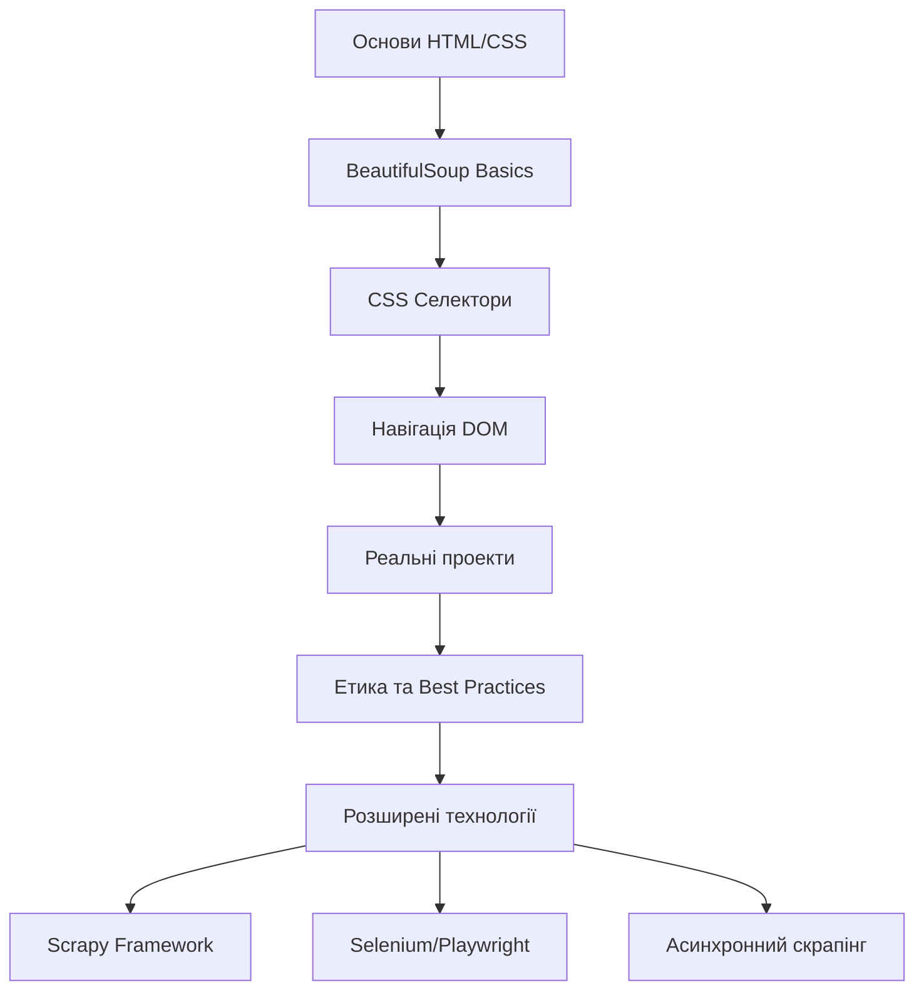

# Модуль 8: Веб-скрапінг для кібербезпеки 🕷️

## 📋 Загальний огляд

Цей модуль присвячений веб-скрапінгу - технології автоматичного збору даних з веб-сайтів. Ви навчитесь парсити HTML, використовувати CSS селектори, працювати з BeautifulSoup та інтегрувати скрапінг з попередніми проектами.

**Попередні знання:**
- Робота з API через requests (Модуль 7)
- Обробка JSON/XML даних
- Основи ООП в Python

---

## 🎯 Цілі модуля

Після завершення цього модуля ви зможете:

✅ Розуміти структуру HTML документів та DOM  
✅ Використовувати CSS селектори для пошуку елементів  
✅ Парсити веб-сторінки за допомогою BeautifulSoup  
✅ Комбінувати дані з API та веб-скрапінгу  
✅ Дотримуватись етичних практик при скрапінгу  
✅ Обробляти помилки та винятки при парсингу  

---

## 📁 Структура модуля

### 📚 Документація

1. **[Lesson_Plan.md](./Lesson_Plan.md)** - Детальний план заняття
   - Розподіл часу (теорія + практика)
   - Покрокові інструкції для викладача
   - Методичні рекомендації
   - Критерії оцінювання

2. **[Theory.md](./Theory.md)** - Теоретичні матеріали
   - Структура HTML та DOM
   - CSS селектори (всі типи)
   - BeautifulSoup API reference
   - Етичні аспекти веб-скрапінгу

### 💻 Практичні приклади

#### 1. Основи BeautifulSoup
**Файл:** [example1_basics.py](./example1_basics.py)

Базові концепції та методи:
- 📄 Парсинг HTML документів
- 🔍 Пошук елементів (find, find_all, select)
- 🧭 Навігація по DOM дереву
- 🏷️ Робота з атрибутами
- 📊 Витягування даних з таблиць

```bash
python example1_basics.py
```

#### 2. Інтеграція з Currency Converter
**Файл:** [example2_currency_scraping.py](./example2_currency_scraping.py)

Розширення проекту з Модуля 7:
- 💱 Парсинг курсів валют з сайту НБУ
- 🔄 Порівняння даних з API та скрапінгу
- 📈 Аналіз різниці між джерелами
- 📋 Генерація порівняльних таблиць

```bash
python example2_currency_scraping.py
```

#### 3. Інтеграція з RSS Aggregator
**Файл:** [example3_rss_scraping.py](./example3_rss_scraping.py)

Розширення RSS агрегатора:
- 📰 Прямий парсинг новинних сайтів
- 🔗 Комбінування RSS та веб-скрапінгу
- 📝 Витягування повного контенту статей
- 📊 Статистика за джерелами даних

```bash
python example3_rss_scraping.py
```

---

## 🚀 Швидкий старт

### 1. Встановлення залежностей

```bash
# Всі необхідні бібліотеки
pip install beautifulsoup4 lxml requests feedparser

# Перевірка встановлення
python -c "import bs4, lxml, requests, feedparser; print('✅ Все встановлено!')"
```

### 2. Запуск прикладів

```bash
# Перейти в папку модуля
cd "8 - Networking: Web scrapping"

# Запустити приклади по черзі
python example1_basics.py              # Основи (5-7 хвилин)
python example2_currency_scraping.py   # Currency + скрапінг (3-5 хвилин)
python example3_rss_scraping.py        # RSS + скрапінг (3-5 хвилин)
```

### 3. Вивчення теорії

Відкрийте [Theory.md](./Theory.md) для детального вивчення:
- HTML структура та DOM
- Всі типи CSS селекторів
- BeautifulSoup методи
- Best practices та етика

---

## 📖 Теоретична частина

### HTML та DOM

HTML документ це дерево елементів:

```html
<div class="container" id="main">
    <h1>Заголовок</h1>
    <p class="text">Параграф</p>
</div>
```

**DOM дерево:**
```
div (class="container", id="main")
├── h1
│   └── текст: "Заголовок"
└── p (class="text")
    └── текст: "Параграф"
```

Детальніше: [Theory.md - HTML структура](./Theory.md#html-структура)

### CSS Селектори

| Тип | Синтаксис | Приклад | Опис |
|-----|-----------|---------|------|
| Тег | `tag` | `div`, `p` | Всі елементи тега |
| Клас | `.class` | `.container` | За класом |
| ID | `#id` | `#main` | За ідентифікатором |
| Атрибут | `[attr]` | `[href]` | З атрибутом |
| Нащадки | `A B` | `div p` | B всередині A |
| Діти | `A > B` | `div > p` | Прямі нащадки |

Всі селектори: [Theory.md - CSS селектори](./Theory.md#css-селектори)

### BeautifulSoup API

```python
from bs4 import BeautifulSoup

# Створення об'єкта
soup = BeautifulSoup(html, 'html.parser')

# Методи пошуку
soup.find('div')                    # Перший div
soup.find_all('p')                  # Всі <p>
soup.find('div', class_='box')      # За класом
soup.find('div', id='main')         # За ID

# CSS селектори
soup.select('div.container')        # Клас
soup.select('#main')                # ID
soup.select('div > p')              # Прямі нащадки

# Навігація
elem.parent                         # Батько
elem.children                       # Діти
elem.next_sibling                   # Наступний
elem.previous_sibling               # Попередній

# Отримання даних
elem.text                           # Текст
elem.get('href')                    # Атрибут
elem.attrs                          # Всі атрибути
```

Повний reference: [Theory.md - BeautifulSoup API](./Theory.md#beautifulsoup-api)

---

## 💡 Ключові концепції

### 1. Парсери

BeautifulSoup підтримує різні парсери:

| Парсер | Установка | Швидкість | Точність |
|--------|-----------|-----------|----------|
| `html.parser` | Вбудований | Середня | Висока |
| `lxml` | `pip install lxml` | Висока | Висока |
| `html5lib` | `pip install html5lib` | Низька | Найвища |

**Рекомендація:** Використовуйте `lxml` для продакшну.

```python
soup = BeautifulSoup(html, 'lxml')  # Швидкий та точний
```

### 2. Обробка помилок

Завжди обробляйте винятки:

```python
from bs4 import BeautifulSoup
import requests

try:
    response = requests.get(url, timeout=10)
    response.raise_for_status()
    
    soup = BeautifulSoup(response.content, 'lxml')
    
    # Парсинг...
    data = soup.find('div', class_='data')
    if data:
        print(data.text)
    else:
        print("Елемент не знайдено")
        
except requests.exceptions.Timeout:
    print("⏱️ Перевищено час очікування")
except requests.exceptions.HTTPError as e:
    print(f"❌ HTTP помилка: {e}")
except Exception as e:
    print(f"❌ Помилка парсингу: {e}")
```

### 3. Етичний веб-скрапінг

#### ✅ Що ПОТРІБНО робити:

1. **Перевіряти robots.txt**
   ```python
   import requests
   robots = requests.get('https://example.com/robots.txt')
   print(robots.text)
   ```

2. **Додавати затримки**
   ```python
   import time
   time.sleep(1)  # Пауза між запитами
   ```

3. **Використовувати User-Agent**
   ```python
   headers = {
       'User-Agent': 'Mozilla/5.0 (educational purpose)'
   }
   response = requests.get(url, headers=headers)
   ```

4. **Поважати авторські права**
   - Не копіювати великі обсяги
   - Посилатись на джерела
   - Не створювати конкуруючі сервіси

#### ❌ Що НЕ ПОТРІБНО робити:

- ❌ Ігнорувати robots.txt
- ❌ Робити тисячі запитів за секунду
- ❌ Використовувати VPN для обходу блокувань
- ❌ Порушувати Terms of Service

Детальніше: [Theory.md - Етичні аспекти](./Theory.md#етичні-аспекти)

---

## 🎓 Практичні завдання

### На занятті (10 хвилин)

#### Завдання 1: Простий скрапер (5 хв)
Створіть скрапер для новинного сайту:
```python
from bs4 import BeautifulSoup
import requests

url = 'https://news-site.com'
response = requests.get(url)
soup = BeautifulSoup(response.content, 'lxml')

# Знайдіть всі заголовки новин
titles = soup.find_all('h2', class_='news-title')
for title in titles:
    print(title.text)
```

#### Завдання 2: Інтеграція (5 хв)
Додайте веб-скрапінг до одного з ваших проектів (weather, currency, або RSS).

### Домашні завдання

#### 📝 Завдання 1: Weather Monitor Extension ⭐⭐
**Складність:** Середня  
**Час:** 2-3 години

Розширте проект `task1_weather.py`:
- Додайте парсинг погоди з sinoptik.ua
- Порівняйте дані з API
- Створіть комплексний звіт з обох джерел

**Критерії оцінювання:**
- Працює парсинг (40%)
- Порівняння даних (30%)
- Обробка помилок (20%)
- Якість коду (10%)

#### 📝 Завдання 2: Price Monitor ⭐⭐⭐
**Складність:** Висока  
**Час:** 4-6 годин

Створіть моніторинг цін:
- Парсіть ціни з 2-3 магазинів (rozetka.ua, foxtrot.ua)
- Зберігайте історію в JSON/CSV
- Відправляйте алерти при зниженні ціни
- Генеруйте графіки порівняння

**Критерії оцінювання:**
- Парсинг кількох сайтів (30%)
- Збереження історії (20%)
- Алерти (20%)
- Візуалізація (20%)
- Якість коду (10%)

#### 📝 Завдання 3: Job Scraper ⭐⭐⭐
**Складність:** Висока  
**Час:** 4-6 годин

Створіть скрапер вакансій:
- Парсіть djinni.co або work.ua
- Фільтруйте за ключовими словами
- Витягуйте вимоги (мови, фреймворки, досвід)
- Генеруйте структурований звіт

**Критерії оцінювання:**
- Парсинг вакансій (30%)
- Фільтрація (20%)
- Витягування вимог (20%)
- Звіт (20%)
- Якість коду (10%)

Детальніше: [Lesson_Plan.md - Домашні завдання](./Lesson_Plan.md#домашні-завдання)

---

## 🔧 Troubleshooting

### Проблема: Елемент не знаходиться

```python
# ❌ Не працює
element = soup.find('div', class_='container')
print(element.text)  # AttributeError: 'NoneType' object has no attribute 'text'

# ✅ Правильно
element = soup.find('div', class_='container')
if element:
    print(element.text)
else:
    print("Елемент не знайдено")
```

### Проблема: Сайт блокує запити

```python
# Додайте User-Agent
headers = {
    'User-Agent': 'Mozilla/5.0 (Windows NT 10.0; Win64; x64) AppleWebKit/537.36'
}
response = requests.get(url, headers=headers)
```

### Проблема: JavaScript контент

```python
# BeautifulSoup не виконує JavaScript
# Використовуйте Selenium або Playwright

from selenium import webdriver
driver = webdriver.Chrome()
driver.get(url)
html = driver.page_source
soup = BeautifulSoup(html, 'lxml')
```

### Проблема: Кодування тексту

```python
# Вкажіть правильне кодування
response = requests.get(url)
response.encoding = 'utf-8'  # або 'windows-1251' для старих сайтів
soup = BeautifulSoup(response.text, 'lxml')
```

Більше рішень: [Theory.md - FAQ](./Theory.md#faq)

---

## 📊 Приклади використання

### Приклад 1: Парсинг таблиці

```python
from bs4 import BeautifulSoup
import requests

url = 'https://example.com/table.html'
response = requests.get(url)
soup = BeautifulSoup(response.content, 'lxml')

# Знайти таблицю
table = soup.find('table', class_='data')

# Парсинг рядків
for row in table.find_all('tr')[1:]:  # Пропустити заголовок
    cols = row.find_all('td')
    name = cols[0].text.strip()
    value = cols[1].text.strip()
    print(f"{name}: {value}")
```

### Приклад 2: Збір посилань

```python
from bs4 import BeautifulSoup
import requests

url = 'https://example.com'
response = requests.get(url)
soup = BeautifulSoup(response.content, 'lxml')

# Всі посилання
links = soup.find_all('a', href=True)

for link in links:
    href = link['href']
    text = link.text.strip()
    print(f"{text}: {href}")
```

### Приклад 3: Витягування метаданих

```python
from bs4 import BeautifulSoup
import requests

url = 'https://example.com/article'
response = requests.get(url)
soup = BeautifulSoup(response.content, 'lxml')

# Витягти метадані
title = soup.find('meta', property='og:title')
description = soup.find('meta', property='og:description')
image = soup.find('meta', property='og:image')

if title:
    print(f"Заголовок: {title['content']}")
if description:
    print(f"Опис: {description['content']}")
if image:
    print(f"Зображення: {image['content']}")
```

Більше прикладів в файлах:
- [example1_basics.py](./example1_basics.py) - 5 детальних прикладів
- [example2_currency_scraping.py](./example2_currency_scraping.py) - Реальне використання
- [example3_rss_scraping.py](./example3_rss_scraping.py) - Інтеграція з RSS

---

## 🔍 Корисні ресурси

### Документація
- 📘 [BeautifulSoup Official Documentation](https://www.crummy.com/software/BeautifulSoup/bs4/doc/)
- 📘 [CSS Selectors Reference](https://www.w3schools.com/cssref/css_selectors.asp)
- 📘 [Requests Library](https://requests.readthedocs.io/)
- 📘 [HTML Reference MDN](https://developer.mozilla.org/en-US/docs/Web/HTML)

### Інструменти розробника
- 🔧 **Chrome DevTools** (F12) - Інспекція HTML
- 🔧 **CSS Selector Tester** - https://try.jsoup.org/
- 🔧 **Regex101** - https://regex101.com/
- 🔧 **JSONLint** - https://jsonlint.com/

### Альтернативні бібліотеки
- **Scrapy** - Потужний framework для скрапінгу
- **Selenium** - Для сайтів з JavaScript
- **Playwright** - Сучасна альтернатива Selenium
- **lxml** - Швидкий XML/HTML парсер

### Навчальні матеріали
- 🎥 [Web Scraping with Python (YouTube)](https://www.youtube.com/results?search_query=web+scraping+python+beautifulsoup)
- 📚 [Real Python - Web Scraping](https://realpython.com/beautiful-soup-web-scraper-python/)
- 📚 [Automate the Boring Stuff - Web Scraping](https://automatetheboringstuff.com/2e/chapter12/)

---

## 📈 Прогресія навчання



### Ваш поточний рівень: **E - Реальні проекти** 🎯

**Наступні кроки:**
1. ✅ Завершіть всі приклади з модуля
2. ✅ Виконайте домашні завдання
3. 📚 Вивчіть [Theory.md](./Theory.md) детально
4. 🚀 Перейдіть до Scrapy (для великих проектів)

---

## ✅ Чеклист виконання модуля

**Теорія:**
- [ ] Прочитано [Theory.md](./Theory.md)
- [ ] Зрозуміло структуру HTML та DOM
- [ ] Вивчено всі типи CSS селекторів
- [ ] Ознайомлено з BeautifulSoup API

**Практика:**
- [ ] Запущено [example1_basics.py](./example1_basics.py)
- [ ] Запущено [example2_currency_scraping.py](./example2_currency_scraping.py)
- [ ] Запущено [example3_rss_scraping.py](./example3_rss_scraping.py)
- [ ] Створено власний простий скрапер

**Домашні завдання:**
- [ ] Виконано Weather Monitor Extension (⭐⭐)
- [ ] Виконано Price Monitor (⭐⭐⭐) *або*
- [ ] Виконано Job Scraper (⭐⭐⭐)

**Додатково:**
- [ ] Прочитано про етичні аспекти
- [ ] Вивчено robots.txt на різних сайтах
- [ ] Протестовано різні парсери (html.parser, lxml)

---

## 🎯 Критерії оцінювання

### Робота на занятті (60%)
- **Розуміння CSS селекторів** (20%)
  - Може пояснити різні типи
  - Використовує правильний селектор для задачі
  
- **Використання BeautifulSoup** (20%)
  - find() vs find_all() vs select()
  - Навігація по DOM
  - Витягування даних
  
- **Інтеграція з проектами** (20%)
  - Успішно додав скрапінг до проекту
  - Обробка помилок
  - Код працює

### Домашнє завдання (40%)
- **Функціональність** (15%)
  - Скрапер працює
  - Витягує потрібні дані
  
- **Обробка помилок** (10%)
  - Try-except блоки
  - Fallback значення
  
- **Структура коду** (10%)
  - Читабельний код
  - Функції/класи
  - Коментарі
  
- **Документація** (5%)
  - README
  - Docstrings
  - Приклади використання

---

## 🤝 Підтримка

**Маєте питання?**
- 📧 Email викладача
- 💬 Чат курсу
- 🐛 Issues в репозиторії

**Знайшли помилку?**
- Створіть issue
- Надішліть pull request
- Напишіть викладачу

---

## 📝 Журнал оновлень

**v1.0.0** (Листопад 2025)
- ✨ Початковий реліз модуля
- 📝 3 практичні приклади
- 📚 Повна документація
- 🎓 3 домашні завдання

---

**Успіхів у вивченні веб-скрапінгу! 🚀**

*Курс "Python для кібербезпеки" | Модуль 8 | 2025*
